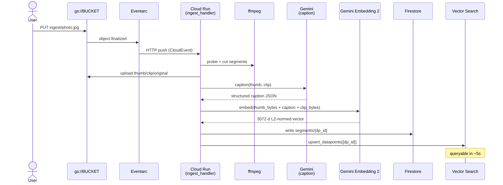
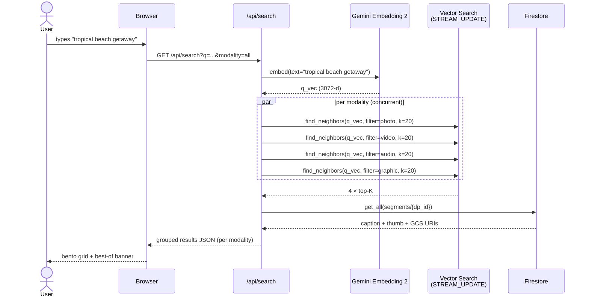

# Replicating Envato Vibe in your own GCP project

> Companion to **[README.md](./README.md)** (architecture & embeddings deep-dive). This guide walks you from an empty GCP project to a fully working multimodal vibe-search demo.

**Estimated time:** ~90 minutes (most of it waiting for `endpoint.deploy_index` to provision serving VMs).

```mermaid
flowchart LR
    A[1. GCP project<br/>+ APIs] --> B[2. Service<br/>account + IAM]
    B --> C[3. GCS bucket<br/>+ Firestore]
    C --> D[4. Vector Search<br/>index + endpoint]
    D --> E[5. Local env<br/>+ API keys]
    E --> F[6. Harvest seed<br/>corpus]
    F --> G[7. Run pipeline_v2<br/>cut/caption/embed]
    G --> H[8. Enrich audio<br/>scene tags]
    H --> I[9. Deploy Cloud Run<br/>app + ingest]
    I --> J[10. Smoke test<br/>+ open UI]

    style D fill:#E8F0FE,stroke:#1A73E8
    style G fill:#FEF7E0,stroke:#F4B400
    style J fill:#E6F4EA,stroke:#0F9D58
```



---

## 1. GCP project + APIs

```bash
export PROJECT_ID="<YOUR_PROJECT_ID>"
export REGION="us-central1"
gcloud config set project "$PROJECT_ID"

gcloud services enable \
  aiplatform.googleapis.com \
  storage.googleapis.com \
  firestore.googleapis.com \
  run.googleapis.com \
  eventarc.googleapis.com \
  cloudbuild.googleapis.com \
  artifactregistry.googleapis.com \
  pubsub.googleapis.com
```

## 2. Service account + IAM

One service account runs **both** the serve app and the ingest worker.

```bash
export SA_NAME="envato-vibe-runner"
export SA_EMAIL="${SA_NAME}@${PROJECT_ID}.iam.gserviceaccount.com"

gcloud iam service-accounts create "$SA_NAME" \
  --display-name "Envato Vibe runner"

for ROLE in \
    roles/aiplatform.user \
    roles/datastore.user \
    roles/storage.objectAdmin \
    roles/run.invoker \
    roles/eventarc.eventReceiver \
    roles/iam.serviceAccountTokenCreator
do
  gcloud projects add-iam-policy-binding "$PROJECT_ID" \
    --member="serviceAccount:${SA_EMAIL}" --role="$ROLE" --condition=None --quiet
done
```

## 3. GCS bucket + Firestore

```bash
export BUCKET="<YOUR_BUCKET_NAME>"          # globally unique
gsutil mb -l "$REGION" -b on "gs://${BUCKET}"

# Lifecycle: keep ingest/ originals for 30 days only
cat > /tmp/lifecycle.json <<EOF
{ "rule": [{ "action": {"type":"Delete"}, "condition": {"age":30, "matchesPrefix":["ingest/"]}}] }
EOF
gsutil lifecycle set /tmp/lifecycle.json "gs://${BUCKET}"

# Firestore in Native mode
gcloud firestore databases create --location="$REGION"
```

The pipeline will create three GCS prefixes on first write — no need to create them by hand:

```
gs://<BUCKET>/originals/<asset_id>.<ext>
gs://<BUCKET>/segments/<asset_id>/seg_NN.{mp4,mp3}
gs://<BUCKET>/thumbnails/<asset_id>/seg_NN.webp
gs://<BUCKET>/ingest/                          (drop-zone for live uploads)
```

## 4. Vector Search index + endpoint

This is the slow leg — the `deploy_index` LRO takes 30–60 minutes. Kick it off early.

```python
# scripts/bootstrap_vs.py
from google.cloud import aiplatform
import os

PROJECT = os.environ["PROJECT_ID"]
REGION  = os.environ["REGION"]
aiplatform.init(project=PROJECT, location=REGION)

# (a) Create the empty STREAM_UPDATE index — IMPORTANT: dimensions=3072
index = aiplatform.MatchingEngineIndex.create_tree_ah_index(
    display_name="envato-vibe-multimodal",
    dimensions=3072,                           # gemini-embedding-2-preview output
    approximate_neighbors_count=150,
    distance_measure_type="COSINE_DISTANCE",
    leaf_node_embedding_count=500,
    leaf_nodes_to_search_percent=10,
    index_update_method="STREAM_UPDATE",       # ← live upserts, no batch refresh
    description="Envato Vibe — Gemini Embedding 2 multimodal demo index",
)
print("INDEX:", index.resource_name)

# (b) Public endpoint (use private endpoint + VPC SC for prod)
ep = aiplatform.MatchingEngineIndexEndpoint.create(
    display_name="envato-vibe-endpoint",
    public_endpoint_enabled=True,
)
print("ENDPOINT:", ep.resource_name)

# (c) Deploy — this is the long one
op = ep.deploy_index(
    index=index,
    deployed_index_id="envato_vibe_multimodal",
)
print("Deploy submitted, poll the index endpoint console.")
```

Run it:

```bash
PROJECT_ID=$PROJECT_ID REGION=$REGION python scripts/bootstrap_vs.py
```

Capture the resource names (you'll set them as env vars below).

## 5. Local env + API keys

```bash
git clone git@github.com:jchavezar/vertex-ai-samples.git
cd vertex-ai-samples/semiautonomous-agents/shutter-vibe-engine

python -m venv .venv && source .venv/bin/activate
pip install -r envato/requirements.app.txt
pip install -r envato/requirements.ingest.txt

# Required env vars (drop into ~/.bashrc or a sourced file)
export GOOGLE_CLOUD_PROJECT="$PROJECT_ID"
export GOOGLE_CLOUD_LOCATION="us-central1"
export GOOGLE_GENAI_USE_VERTEXAI=True
export ENVATO_GCS_BUCKET="$BUCKET"

# From step 4
export VS_INDEX_ID="<from step 4>"            # projects/.../indexes/<id>
export VS_ENDPOINT_ID="<from step 4>"         # projects/.../indexEndpoints/<id>
export VS_DEPLOYED_INDEX_ID="envato_vibe_multimodal"

# Public stock APIs for seed harvest
export PEXELS_API_KEY="<from https://www.pexels.com/api/>"
export PIXABAY_API_KEY="<from https://pixabay.com/api/docs/>"

# Auth
gcloud auth application-default login
```

`ffmpeg` is required for segmenting:

```bash
sudo apt-get install -y ffmpeg
```

## 6. Harvest seed corpus

`backfill.py` and `backfill_sfx.py` pull public-domain assets from Pexels, Pixabay, Internet Archive, and BBC RemArc. Skips anything already on disk — safe to re-run.

```bash
# All modalities, ~75 per modality
python envato/backfill.py --target-per-mod 75

# Top up sound effects (BBC RemArc)
python envato/backfill_sfx.py --per-query 6 --max-new 60
```

Expect ~300 originals in `envato/assets/` (~3 GB). Both `assets/` and the v2 cache `segments_cache/` are gitignored.

## 7. Run pipeline_v2 — cut, caption, embed, upsert

This is where the magic happens. For each asset it:

1. `ffprobe` → plan segments per modality (10 s video / 25 s music / 8 s SFX).
2. `ffmpeg` → cut clip + render thumbnail (waveform for audio).
3. Upload `(clip, thumb, original)` to `gs://$BUCKET/...`.
4. Caption the segment with Gemini (`gemini-3-flash-preview` for video, `gemini-3.1-flash-lite-preview` for audio/photo).
5. Embed `(thumbnail bytes + caption text + clip bytes if audio/video)` with `gemini-embedding-2-preview` → 3072-d L2-normed vector.
6. Write `segments/<dp_id>` doc to Firestore.
7. `index.upsert_datapoints(...)` — queryable in seconds.

```bash
python envato/pipeline_v2.py --modality photo   --workers 6
python envato/pipeline_v2.py --modality video   --workers 4
python envato/pipeline_v2.py --modality graphic --workers 6
python envato/pipeline_v2.py --modality audio   --workers 4
```

Per-segment runtime: ~1.5 s photos, ~6 s video, ~5 s audio. ~1,000 segments total in ~30 minutes wall time on a workstation.

## 8. Enrich audio with scene tags

This is the step that turns *acoustic* audio search into *editorial* audio search. For every audio segment, re-call `gemini-3.1-flash-lite-preview` (global region) with the existing caption JSON + the audio bytes, and ask it to emit 6–10 short scene phrases. Then **re-embed** with the enriched caption text fused with the same audio bytes.

```bash
python envato/enrich_audio_captions.py
```

Idempotent — skips any segment whose `caption.scenes` is already populated. Expect ~10 minutes for ~700 audio segments.

**Before / after** on `"tropical beach getaway"`:

| | Top-1 | Top-2 | Top-3 |
|---|---|---|---|
| Before | cyberpunk synthwave | generic ambient | dark trailer |
| After  | latin acoustic      | **djembe / world percussion** | **congas + shakers tropical** |

Same model. Same index. Same query. Only the **caption text fed into the embedding** changed.

## 9. Deploy Cloud Run — app + ingest

The repo ships two scripts. Both are idempotent.

### Serve layer (the user-facing app)

```bash
./envato/deploy_app.sh
```

Builds `Dockerfile.app` (lives at `shutter-vibe-engine/`), pushes to GCR, deploys `envato-vibe-app` to Cloud Run, returns a public URL.

### Ingest layer (Eventarc-triggered)

```bash
./envato/deploy_ingest.sh
```

Builds `Dockerfile.ingest`, deploys `envato-vibe-ingest` (private), and wires:

```
gs://<BUCKET>  ──object.finalized──►  Eventarc trigger  ──►  envato-vibe-ingest (Cloud Run)
```

Now any file dropped at `gs://<BUCKET>/ingest/<name>.{jpg,png,mp4,mp3,wav}` becomes searchable in seconds.

## 10. Smoke tests

```bash
APP_URL=$(gcloud run services describe envato-vibe-app --region "$REGION" --format 'value(status.url)')

# Health
curl -s "$APP_URL/api/health"

# Stats — should show segments_indexed > 0
curl -s "$APP_URL/api/stats" | jq .

# Strong-match search
curl -s "$APP_URL/api/search?q=tropical+beach+getaway&modality=audio&limit=5" \
  | jq '.results[].caption.scenes // .results[].caption.descriptors'

# Live-ingest test — drop a file, then search for what's in it
gsutil cp ./my-photo.jpg "gs://${BUCKET}/ingest/"
sleep 10
curl -s "$APP_URL/api/uploads/recent?limit=5" | jq .
```

Open the URL in a browser. You should see:

- the Envato-clone landing with a hero search box and a 6-column bento grid of categories
- search results in a packed grid grouped by modality
- a "Build a Kit" button on each result that opens a side panel
- a vibe slider above visual results (warmth / saturation / contrast)
- a small "Live Stats" panel and "Auto-Ingest" panel in the corner (start collapsed)

---

## Architecture diagrams

### Ingest path (one segment from ingestion to queryable)



### Serve path (one query, fanned-out)



---

## Tear-down

The endpoint accrues hourly cost while up. To stop the meter:

```python
from google.cloud import aiplatform
aiplatform.init(project="<PROJECT_ID>", location="us-central1")

for ep in aiplatform.MatchingEngineIndexEndpoint.list(
        filter='display_name="envato-vibe-endpoint"'):
    for d in ep.deployed_indexes:
        ep.undeploy_index(deployed_index_id=d.id)
    ep.delete()

for ix in aiplatform.MatchingEngineIndex.list(
        filter='display_name="envato-vibe-multimodal"'):
    ix.delete()
```

GCS, Firestore, and Cloud Run images stay around — they're cheap at this size. Re-running step 4 + step 7 rebuilds the index in ~30 minutes.

---

## Troubleshooting

| Symptom | Likely cause | Fix |
|---|---|---|
| `404 NOT_FOUND` on `gemini-3-flash-lite-preview` | model id doesn't exist | use `gemini-3.1-flash-lite-preview` (note the **3.1**) |
| Search returns 0 results immediately after pipeline run | endpoint deploy still in progress | wait for `deploy_index` LRO to complete (~30–60 min) |
| Eventarc trigger fires but ingest service 403s | GCS service-agent missing `roles/pubsub.publisher` | `deploy_ingest.sh` now grants this; re-run it |
| Audio results irrelevant to scene queries | `caption.scenes` not populated | run `enrich_audio_captions.py` |
| `ImportError: _client` | running script outside repo root | `cd shutter-vibe-engine && python -m envato.<script>` |

---

➡️ Back to **[README.md](./README.md)** for the architecture deep-dive.
