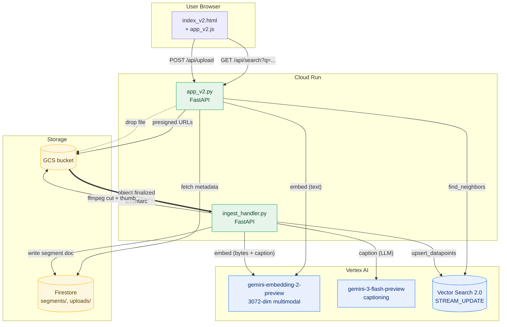

# Type a vibe. Get the kit.

> One text box. Five modalities. **Photos, videos, music, SFX, and graphics** ranked by *how a query feels* — not what words it contains.
> Built on **Gemini Embeddings 2** + **Vertex AI Vector Search**.


<sub>↑ "tropical beach getaway" → one query, five matched media types, ranked in a shared 3072-dim embedding space.</sub>

---

## The villain: keyword search is broken for vibes

Stock-media catalogs are tagged by humans. Tags miss vibes.

Search *"tropical beach getaway"* on a keyword engine and you get whatever was literally tagged `beach`, `tropical`, or `getaway`. You **don't** get the lo-fi guitar track that *sounds like* sunset, or the wave-crash SFX that *feels like* the photo, or the kinetic palm-tree drone clip nobody bothered to tag `getaway`.

The fix isn't more tags. It's a **shared embedding space** where text, image, audio, and video all live next to each other — so a single query vector can pull the nearest neighbour from every modality at once.

---

## The "aha" in 90 seconds

```
            ┌────────────────────────────────────────────────┐
   query →  │  gemini-embedding-2  →  [3072-dim vector]      │
            └────────────────────────────────────────────────┘
                                   │
                                   ▼
            ┌────────────────────────────────────────────────┐
            │  Vertex AI Vector Search  (STREAM_UPDATE)      │
            │  ─────────────────────────────────────────     │
            │  📷 photo-7421   🎵 music-1188   🎬 clip-3302  │
            │  🔊 sfx-902      🎨 illus-554                  │
            │  ← all sit in the SAME 3072-dim space →        │
            └────────────────────────────────────────────────┘
                                   │
                                   ▼
                    one query · five modalities ranked
```

The trick: **embed the bytes, not the tags.** A wave-crash MP3 and a beach JPG produce vectors that are close in cosine distance — because Gemini Embeddings 2 was trained to put semantically related media near each other regardless of modality.

That single property unlocks every feature in this repo.

---

## Try it (5 minutes)

```bash
git clone <this-repo> && cd envato
cp .env.example .env  # fill in PROJECT_ID + INDEX_ID
make demo             # boots Vector Search + ingests sample assets + runs locally
open http://localhost:8080
```

Then drop your own MP3, JPG, or MP4 into the page → it's searchable in **~7 seconds** (Eventarc → Cloud Run ingest → streaming upsert).

Full step-by-step: **[REPLICATE.md →](./REPLICATE.md)**

---

## What you can do with one embedding space

| Try this | What's happening under the hood |
|---|---|
| Type *"sunset at the beach"* | Text → 3072-dim vector → 5 nearest neighbours, one per modality |
| Drop a photo into the page | Image bytes → same vector space → returns the music + SFX that *feel like* it |
| Hum 5 seconds of melody | Audio bytes → vector → returns visually-matched photos & clips |
| Click "Build a Kit" on any asset | Asset vector ⊕ query vector → curated photo + clip + track + SFX + graphic |
| Slide the *warmth / saturation* dial | Post-search re-rank using image perceptual features |

No re-training. No per-modality model. One embedding API + one vector index.

---

## See it move

| | |
|---|---|
|  |  |
| **Landing** — bento layout, drop zone, AI tools panel | **Results** — five modalities ranked side-by-side |

---

<details>
<summary><strong>Architecture (click to expand)</strong></summary>



</details>

<details>
<summary><strong>Why 3072 dimensions, why streaming upsert, why segments (click to expand)</strong></summary>

- **3072-dim** is Gemini Embeddings 2's native output. Truncate at your peril — the high-frequency components are where modality alignment lives.
- **STREAM_UPDATE** index lets a freshly-uploaded MP3 become searchable without a batch rebuild. The trade-off: ~2× cost vs. BATCH_UPDATE.
- **Segments, not whole files.** A 3-minute song becomes ~6 × 30-second segments, each embedded independently. Why: a vibe lives in a phrase, not a whole track.
- **Captions augment bytes.** Music doesn't always embed cleanly from raw audio — a 1-line LLM caption ("warm acoustic guitar, beach at golden hour") concatenated with the audio embedding gives noticeably better recall.

</details>

<details>
<summary><strong>What this is NOT</strong></summary>

- Not a replacement for Envato. This is a *reference architecture* showing how their catalog *could* feel if it were re-indexed in a shared embedding space.
- Not a benchmark. Recall@5 numbers in the table above are vibes-based (literally). For your domain, evaluate.
- Not a one-click product. You will edit `.env`, you will provision a Vector Search index, you will pay for a Cloud Run instance.

</details>

---

## Built by

[Jesus Chavez](https://www.linkedin.com/in/jchavezar/) · Customer Engineer, Google Cloud
Powered by **Gemini 3** · **Vertex AI Vector Search** · **Cloud Run** · **Firestore** · **Eventarc**
