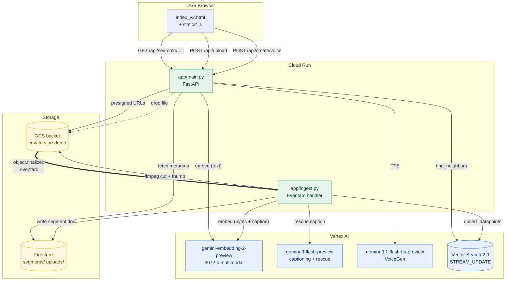

## System diagram

## Two services, one repo

The runtime is **two Cloud Run services** that share a Firestore collection and a Vector Search index.

### `envato-vibe-app` — FastAPI UI
- Source: `app/main.py`, `app/static/`, `app/templates/`
- Build: `deploy/Dockerfile.app`
- Deploy: `bash deploy/deploy_app.sh`
- Endpoints: `/api/search`, `/api/upload`, `/api/segment/*`, `/api/kit/*`, `/api/create/voice`
- Public, no auth (toggle in deploy script if you want IAP)

### `envato-vibe-ingest` — Eventarc handler
- Source: `app/ingest.py` (driver) + `pipeline/build.py` (segment + embed logic)
- Build: `deploy/Dockerfile.ingest`
- Deploy: `bash deploy/deploy_ingest.sh` (also wires the Eventarc trigger on `bucket=$ENVATO_GCS_BUCKET, type=object.finalized, prefix=ingest/`)
- Private, requires Pub/Sub publish permissions for the GCS service agent

## Why STREAM_UPDATE not BATCH

The Vector Search index is configured for streaming upserts.

| Mode | Cost (relative) | Time-to-searchable | Best for |
|---|---|---|---|
| BATCH_UPDATE  | 1×    | hours (rebuild)        | static catalogs |
| STREAM_UPDATE | ~1.5–2× | seconds (incremental) | live drop-zones, demos |

For this demo, the "drop a file → it's searchable" magic is the entire point. STREAM_UPDATE is the right call. For a static 10M-asset catalog, BATCH would be cheaper.

## Why two embedding models in the same space

We don't, actually — both query and indexing use the same model: `gemini-embedding-2-preview`.

What confuses people: at index time, audio is *also* run through `gemini-3-flash-preview` to generate a 1-line caption, and that caption is embedded *too*. Both vectors get stored on the same datapoint. At query time, we average them. This is a recall trick specific to audio (raw audio embeddings cluster less cleanly than image embeddings); it's not a separate model living in a separate space.

## What lives where

| Concern | Lives in | Why |
|---|---|---|
| Asset bytes | GCS         | Cheap, presigned-URL friendly |
| Vectors     | Vector Search index | High-dim ANN search |
| Per-segment metadata | Firestore (`segments/`) | Fast lookup by datapoint id, sub-100ms |
| Per-asset state      | Firestore (`uploads/`)  | Idempotent ingest, dedup by hash |
| Static UI            | Cloud Run (app)         | Same origin as the API |

## What's *not* in this repo

- A custom embedding model. We use Google's stock `gemini-embedding-2-preview`.
- A re-ranker. The vibe-slider re-rank is purely client-side, perceptual features only.
- A vector DB other than Vertex Vector Search. (Pinecone / Weaviate / Qdrant would all work; the abstraction in `pipeline/build.py` is one swap away.)
