# Multimodal Vibe Search on Vertex AI

> Type a vibe → get the photo, the video clip, the music track, the SFX, and the graphic that share that mood. One query, five modalities, ranked in a shared 3072-dim embedding space.

**📖 Full story (hero video, embedding-space viz, architecture deep-dive):**
**→ [`site/`](./site/) · [jchavezar.github.io/vertex-ai-samples/multimodal-search/](https://jchavezar.github.io/vertex-ai-samples/multimodal-search/)**


---

## Two paths, same UI

The same FastAPI app ships with **two interchangeable search backends**. Pick the one that matches your stage:

| | **Path A · Vector Search** | **Path B · BigQuery** |
|---|---|---|
| Folder | [`backends/vector-search/`](./backends/vector-search/) | [`backends/bigquery/`](./backends/bigquery/) |
| Engine | Vertex AI Vector Search (TREE_AH ANN) | BigQuery `VECTOR_SEARCH` (brute force) |
| Best for | Production, > 100 k vectors, < 100 ms | Demos, < 10 k vectors, cost-first |
| p50 latency | **40–80 ms** (single modality) | **700–900 ms** (single modality) |
| Cold start | Always warm (min replicas) | 1–2 s on first BQ slot allocation |
| Monthly cost (this demo) | ~**$137** (24 × 7 e2-standard-2) | ~**$2** (scale-to-zero + 50 MB table) |
| Setup effort | Index build + endpoint deploy (~30 min) | Single SQL `CREATE TABLE` + JSONL load |
| Filters | Restricts (string match) | SQL `WHERE` push-down |
| Live URL | `your-vibe-app` (now on BQ) | `your-vibe-app-bq` |

**Switch in one env var:**

```bash
SEARCH_BACKEND=vector-search   # Path A
SEARCH_BACKEND=bigquery        # Path B
```

The app, ingest pipeline, embeddings, and Firestore hydration are identical. Only the nearest-neighbor lookup changes. See [`app/main.py`](./app/main.py) `vs_find_neighbors()` for the dispatcher.

---

## Architecture



Mermaid source: [`site/src/content/docs/architecture.md`](./site/src/content/docs/architecture.md)

---

## Repository layout

```
multimodal-search/
├── app/                    FastAPI service (UI + ingest endpoints)
│   └── main.py             SEARCH_BACKEND dispatcher lives here
├── backends/
│   ├── vector-search/      Path A: production-grade ANN
│   │   └── README.md
│   └── bigquery/           Path B: cost-optimized brute force
│       ├── backend.py      Drop-in find_neighbors() over BQ VECTOR_SEARCH
│       ├── backfill.py     One-time VS → BQ copy (no re-embedding)
│       ├── sql/schema.sql  Table DDL (CLUSTER BY modality)
│       ├── deploy/         Cloud Run deploy for the BQ-backed service
│       └── README.md
├── pipeline/               Offline indexing & enrichment
├── deploy/                 Shared Dockerfile + Vector Search deploy script
├── docs/                   Cost analysis, demo script, query bank, visuals
├── site/                   Astro Starlight narrative site (GitHub Pages)
└── assets/                 Sample seed assets
```

---

## Quickstart (local)

```bash
gcloud auth application-default login
pip install -r app/requirements.txt

# Point at whichever backend you have data in
export SEARCH_BACKEND=bigquery   # or vector-search
export GOOGLE_CLOUD_PROJECT=vtxdemos
export GOOGLE_CLOUD_LOCATION=us-central1

cd app && uvicorn main:app --reload --port 8080
open http://localhost:8080
```

---

## Replicate from scratch

Pick a path, then follow its README:

- **Production-grade →** [`backends/vector-search/README.md`](./backends/vector-search/README.md)
- **Cost-optimized →** [`backends/bigquery/README.md`](./backends/bigquery/README.md)

Both paths share the same upstream pipeline: `pipeline/build.py` ingests assets and writes (a) embeddings + restricts to the chosen backend, (b) hydration metadata to Firestore, (c) source files to GCS.

---

## Documentation

| Doc | Purpose | Engine-specific? |
|---|---|---|
| [`backends/vector-search/README.md`](./backends/vector-search/README.md) | Path A setup + cost + when to choose | ✅ Vector Search |
| [`backends/bigquery/README.md`](./backends/bigquery/README.md) | Path B setup + cost + when to choose | ✅ BigQuery |
| [`docs/COST_ANALYSIS.md`](./docs/COST_ANALYSIS.md) | Side-by-side monthly cost breakdown | both |
| [`docs/DEMO_SCRIPT.md`](./docs/DEMO_SCRIPT.md) | Live-demo reading script | engine-agnostic |
| [`docs/DEMO_QUESTIONS.md`](./docs/DEMO_QUESTIONS.md) | 50 demo queries with expected hits | engine-agnostic |

---

Built by [Jesus Chavez](https://www.linkedin.com/in/jchavezar/) · Customer Engineer, Google Cloud
