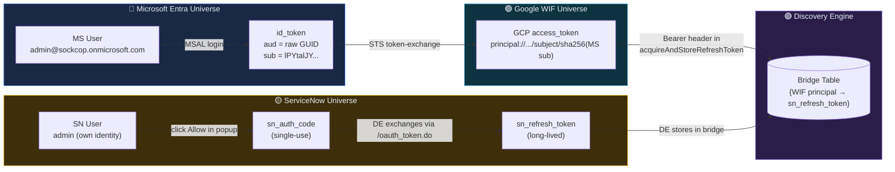

# Authentication Sequence — Mermaid Diagrams

End-to-end auth chain for **Microsoft Entra (WIF)** → **Google Discovery Engine** → **ServiceNow** federated search.

> GitHub renders these mermaid blocks automatically. Click the diagram source to expand.

---

## 1. The full sequence — from MSAL login to grounded ServiceNow answer

```mermaid
sequenceDiagram
    autonumber
    actor User as 👤 User
    participant Browser as 🌐 Browser (tester)
    participant MS as 🔵 Microsoft Entra
    participant STS as 🟢 Google STS (WIF)
    participant DE as 🟣 Discovery Engine
    participant SN as 🟡 ServiceNow

    rect rgba(93,140,247,.08)
    Note over User,MS: PHASE 1 — User identity (every session)
    User->>Browser: Click "Login with Microsoft"
    Browser->>MS: MSAL loginPopup<br/>scopes=[openid profile email]
    MS-->>Browser: id_token (JWT)<br/>aud=&lt;raw GUID&gt;<br/>sub=&lt;MS user&gt;
    end

    rect rgba(109,211,255,.08)
    Note over Browser,STS: PHASE 2 — STS exchange (WIF)
    Browser->>STS: POST /v1/token<br/>subject_token=id_token<br/>audience=//iam.../workforcePools/&lt;pool&gt;/providers/&lt;prov&gt;
    STS->>STS: validate JWT signature<br/>map id_token.sub → WIF principal
    STS-->>Browser: GCP access_token (opaque)<br/>identity = principal://.../subject/&lt;sha256(MS sub)&gt;
    end

    rect rgba(251,191,36,.08)
    Note over User,SN: PHASE 3 — SN consent (one-time per user)
    User->>Browser: Click "Connect ServiceNow"
    Browser->>SN: open popup → /oauth_auth.do<br/>client_id=SN_OAUTH_APP<br/>redirect_uri=vertexaisearch.cloud.google.com/oauth-redirect
    SN-->>User: SN login form (own user table)
    User->>SN: SN credentials (admin / password)
    SN-->>User: consent screen "Allow access?"
    User->>SN: Click Allow
    SN-->>Browser: redirect → vertexaisearch.cloud.google.com/oauth-redirect?code=...
    end

    rect rgba(167,139,250,.08)
    Note over Browser,SN: PHASE 4 — acquireAndStoreRefreshToken — THE BRIDGE
    Browser->>DE: POST .../dataConnector:acquireAndStoreRefreshToken<br/>Authorization: Bearer &lt;GCP token&gt;<br/>body: {fullRedirectUri: "...?code=&lt;sn_code&gt;"}
    DE->>DE: A. decode Bearer → caller = WIF principal
    DE->>SN: B. POST /oauth_token.do<br/>grant_type=authorization_code<br/>code=&lt;sn_code&gt;
    SN-->>DE: sn_refresh_token (for SN user `admin`)
    DE->>DE: C. INSERT bridge row<br/>(WIF principal → sn_refresh_token)
    DE-->>Browser: 200 OK
    end

    rect rgba(74,222,128,.08)
    Note over User,SN: PHASE 5 — streamAssist (every search)
    User->>Browser: Type question → Search
    Browser->>DE: POST .../streamAssist<br/>Authorization: Bearer &lt;SAME GCP token&gt;<br/>body: {query, dataStoreSpecs}
    DE->>DE: decode Bearer → caller = WIF principal
    DE->>DE: SELECT sn_refresh_token<br/>WHERE caller_identity = &lt;WIF principal&gt;
    DE->>SN: POST /oauth_token.do<br/>grant_type=refresh_token
    SN-->>DE: fresh sn_access_token
    DE->>SN: GET /api/now/table/incident<br/>Authorization: Bearer &lt;sn_access_token&gt;
    SN->>SN: ACL check (as user `admin`)
    SN-->>DE: matching records
    DE->>DE: Gemini synthesis → grounded answer
    DE-->>Browser: { answer, sources[] }
    Browser-->>User: render grounded answer + source citations
    end
```

---

## 2. Just the bridge (where the two universes get linked)



---

## 3. After the bridge exists — every search uses the SAME WIF token

```mermaid
sequenceDiagram
    autonumber
    actor User as 👤 User
    participant Browser as 🌐 Browser
    participant DE as 🟣 Discovery Engine
    participant SN as 🟡 ServiceNow

    Note over Browser: gcpToken from STS already in memory<br/>(no re-login needed within token lifetime ~1h)

    User->>Browser: "list open incidents"
    Browser->>DE: POST .../streamAssist<br/>Authorization: Bearer &lt;gcpToken&gt;<br/>body: {query, dataStoreSpecs}

    Note over DE: Server-side, DE does ALL of this transparently:
    DE->>DE: decode Bearer → WIF principal
    DE->>DE: SELECT sn_refresh_token<br/>FROM bridge<br/>WHERE caller = WIF principal

    DE->>SN: POST /oauth_token.do (refresh)
    SN-->>DE: sn_access_token (1h life)

    DE->>SN: GET /api/now/table/incident<br/>Authorization: Bearer sn_access_token
    SN->>SN: ACLs run as user `admin`
    SN-->>DE: visible incidents

    DE->>DE: feed records to Gemini
    DE-->>Browser: grounded answer + sources

    Note over User,SN: Browser never sees any SN tokens.<br/>DE handles the entire SN side server-side.
```

---

## Key takeaways

1. **Two completely separate identity universes**: Microsoft Entra has user `admin@sockcop.onmicrosoft.com`; ServiceNow has its own user `admin`. They are NOT federated to each other. They never know about each other.

2. **Discovery Engine is the bridge**: it stores a `{WIF principal → SN refresh_token}` mapping created during `acquireAndStoreRefreshToken`. This is the *only* place in the world that knows the two are linked.

3. **The browser ONLY ever sends the WIF GCP token** (after the bridge exists). DE looks up the SN refresh_token internally, refreshes it, queries SN — all server-side. No SN tokens ever leave DE.

4. **SN ACLs apply as the SN user that consented**: when admin@sockcop logged in to ServiceNow as `admin` during the consent popup, they implicitly said "act as `admin` against SN whenever I (this WIF principal) ask". Different WIF users could attach to different SN users by consenting differently.

5. **`acquireAndStoreRefreshToken` is per-user, one-time**: each WIF user must do this once per connector. If never done → `acquireAccessToken` returns 404 → streamAssist gets no SN data.
