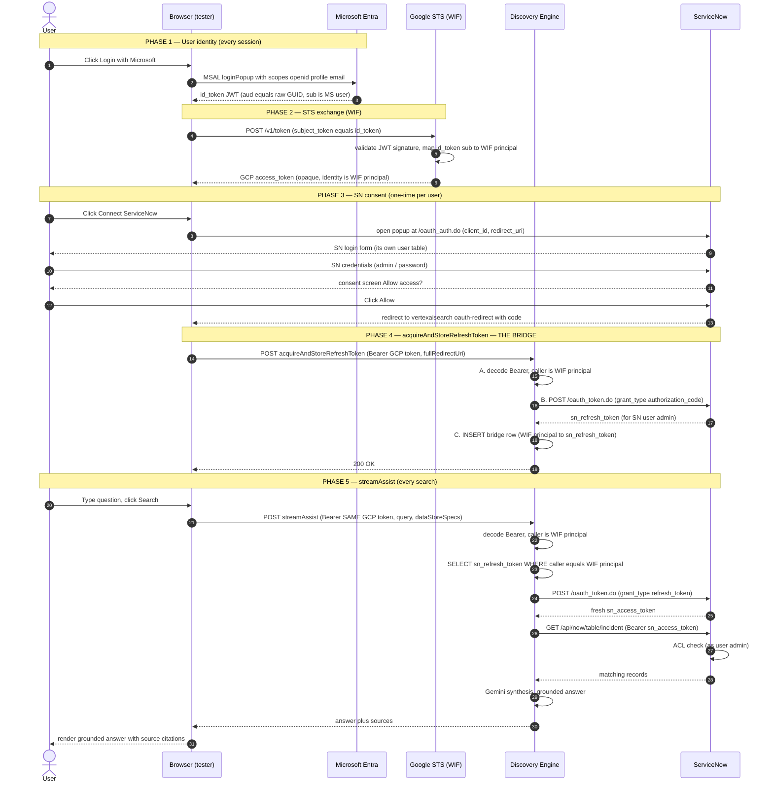
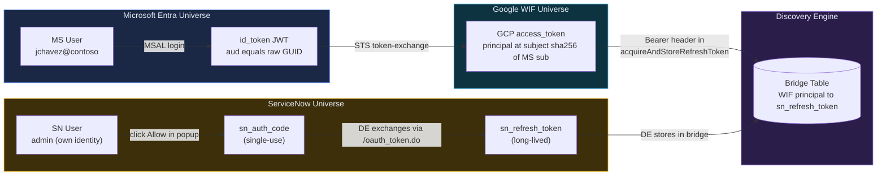
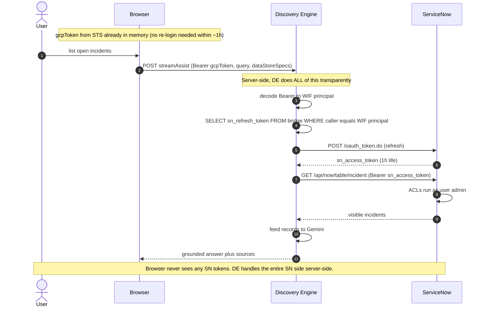

# Authentication Sequence — Mermaid Diagrams

End-to-end auth chain for **Microsoft Entra (WIF)** → **Google Discovery Engine** → **ServiceNow** federated search.

> GitHub renders these mermaid blocks automatically.

---

## 1. The full sequence — from MSAL login to grounded ServiceNow answer

---

## 2. Just the bridge — where the two universes get linked

---

## 3. After the bridge exists — every search uses the SAME WIF token

---

## Key takeaways

1. **Two completely separate identity universes**: Microsoft Entra has a user like `jchavez@contoso.onmicrosoft.com`; ServiceNow has its own user (e.g. `admin`). They are NOT federated to each other. They never know about each other.

2. **Discovery Engine is the bridge**: it stores a `{WIF principal → SN refresh_token}` mapping created during `acquireAndStoreRefreshToken`. This is the *only* place in the world that knows the two are linked.

3. **The browser ONLY ever sends the WIF GCP token** (after the bridge exists). DE looks up the SN refresh_token internally, refreshes it, queries SN — all server-side. No SN tokens ever leave DE.

4. **SN ACLs apply as the SN user that consented**: when the WIF user logged in to ServiceNow as `admin` during the consent popup, they implicitly said "act as `admin` against SN whenever I (this WIF principal) ask". Different WIF users could attach to different SN users by consenting differently.

5. **`acquireAndStoreRefreshToken` is per-user, one-time**: each WIF user must do this once per connector. If never done → `acquireAccessToken` returns 404 → streamAssist gets no SN data.
