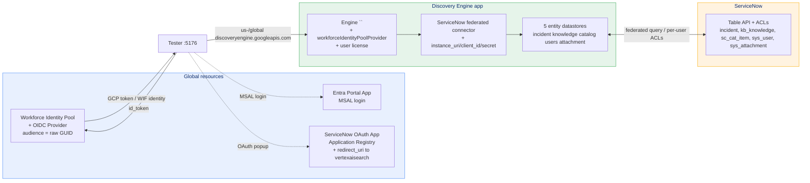
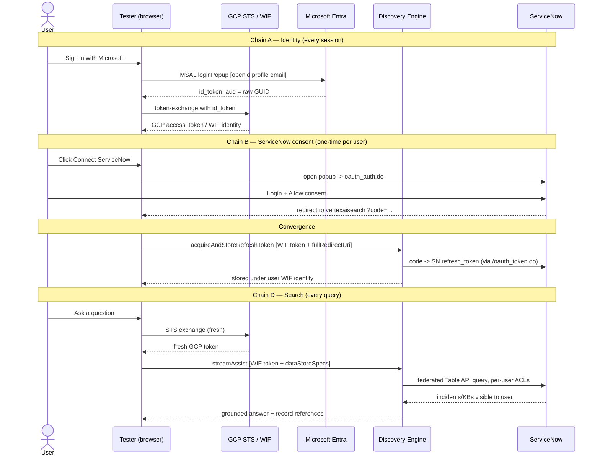

# Gemini Enterprise · ServiceNow · WIF — End-to-End Flow

> A single-file reference for running **Gemini Enterprise streamAssist** + a **federated ServiceNow connector** + **per-user ACLs**, authenticated via **Workforce Identity Federation** with the **raw `client_id`** audience pattern.

---

## TL;DR

If federated search returns **0 results from your ServiceNow connector** — even though every API call returns HTTP 200 — you almost certainly forgot one of these four post-create configurations on the engine:

| # | What | Where | Symptom when missing |
|---|---|---|---|
| 1 | `accessSettings.workforceIdentityPoolProvider` set on the engine | Cloud Console → Set up identity | Generic *"…I couldn't find that information"* |
| 2 | Connector `params.user_account` + `params.password` provided at setUp | `setUpDataConnector` body | `Missing Parameter User Account` 400 |
| 3 | Per-user `acquireAndStoreRefreshToken` for each searcher | Tester → Connect ServiceNow | *"…I couldn't find any incidents"* with empty sources |
| 4 | License seat assigned to the user on the engine | Cloud Console → Manage subscriptions | HTTP 400 `LICENSE_WITHOUT_SUBSCRIPTION_TIER` |

**ServiceNow connector params are simpler than SharePoint** — no `tenant_id`, no `admin_filter.Site`, no `eeeu_enabled`. ACLs are enforced natively by ServiceNow's Table API based on the consenting user's roles.

---

## Table of contents

1. [Why this document exists](#1-why-this-document-exists)
2. [Architecture](#2-architecture)
3. [The full request flow](#3-the-full-request-flow)
4. [The four mandatory configurations](#4-the-four-mandatory-configurations)
5. [ServiceNow OAuth app — Application Registry setup](#5-servicenow-oauth-app--application-registry-setup)
6. [Discovery Engine ServiceNow connector — `setUpDataConnector`](#6-discovery-engine-servicenow-connector--setupdataconnector)
7. [Replication checklist](#7-replication-checklist)
8. [Failure-mode lookup](#8-failure-mode-lookup)
9. [ServiceNow vs SharePoint deltas](#9-servicenow-vs-sharepoint-deltas)

---

## 1. Why this document exists

A customer needed Gemini Enterprise integrated with **ServiceNow** the same way `streamassist-oauth-flow` integrates with SharePoint — Entra-ID-based identity (WIF), per-user ACLs, federated real-time queries (no indexing). This doc captures the differences for ServiceNow so the next engagement doesn't have to discover them by trial and error.

---

## 2. Architecture

### What lives where



### Two parallel chains converge into one search

Same A/B/D pattern as the SharePoint version:



---

## 3. The full request flow

Each step name (`A1`, `B1`, etc.) corresponds to a card or trace in the tester's UI.

### Chain A — Identity *(every session)*

#### A1 · MSAL Login

- User clicks **Login with Microsoft** in the tester
- MSAL opens a popup at `https://login.microsoftonline.com/<TENANT_ID>/oauth2/v2.0/authorize`
- Scopes: `openid profile email` only — **no `api://...` scope**
- Microsoft v2.0 endpoint returns an `id_token` whose `aud` claim is the **raw `<PORTAL_CLIENT_ID>` GUID**

#### A2 · STS Token Exchange (WIF)

- Frontend POSTs to `https://sts.googleapis.com/v1/token` with the id_token as `subject_token`
- `audience`: `//iam.googleapis.com/locations/global/workforcePools/<POOL_ID>/providers/<PROVIDER_ID>`
- Returns a GCP access_token whose principal is `principal://iam.googleapis.com/.../subject/<sub-hash>` — the user's **WIF identity**

### Chain B — ServiceNow consent *(one-time per user per connector)*

#### B1 · Open ServiceNow OAuth popup

- Tester opens `https://<INSTANCE>.service-now.com/oauth_auth.do?response_type=code&client_id=<SN_CLIENT_ID>&redirect_uri=https://vertexaisearch.cloud.google.com/oauth-redirect&state=<base64-json>`
- ServiceNow shows a consent page (or auto-consents if the user already has a session)

#### B2 · User clicks Allow

- ServiceNow records consent and redirects to `https://vertexaisearch.cloud.google.com/oauth-redirect?code=…&state=…`

#### B3 · vertexaisearch postMessage → backend

- The vertexaisearch redirect page captures `code` and `state`, then `postMessage`s `{fullRedirectUrl, code, state}` back to `window.opener`
- Tester catches it and proceeds to convergence

### Convergence

#### C · `acquireAndStoreRefreshToken`

- Tester POSTs to:
  ```
  https://<HOST>/v1alpha/projects/<PROJECT>/locations/<LOC>/collections/<SN_CONNECTOR>/dataConnector:acquireAndStoreRefreshToken
  ```
- Headers: `Authorization: Bearer <user's WIF GCP token>`, `X-Goog-User-Project: <PROJECT_NUMBER>`
- Body: `{"fullRedirectUri": "https://vertexaisearch.cloud.google.com/oauth-redirect?code=…"}`
- Discovery Engine extracts the auth code, calls `https://<INSTANCE>.service-now.com/oauth_token.do` to exchange it for a refresh token, stores it **keyed by the user's WIF identity hash**

> [!IMPORTANT]
> The `Authorization` header **must** be a WIF-exchanged GCP token, not Application Default Credentials. ADC stores the SN token under the service account identity and every later search by the actual user gets `acquireAccessToken` 404.

### Chain D — Search *(every query)*

#### D1 · streamAssist call

```
POST https://<HOST>/v1alpha/projects/<PROJECT>/locations/<LOC>/collections/default_collection/engines/<ENGINE_ID>/assistants/default_assistant:streamAssist
```

Headers:
| Header | Value |
|---|---|
| `Authorization` | `Bearer <WIF GCP token>` |
| `X-Goog-User-Project` | numeric project number |
| `Content-Type` | `application/json` |

Body:
```json
{
  "query": {"text": "list any open incidents in ServiceNow"},
  "toolsSpec": {
    "vertexAiSearchSpec": {
      "dataStoreSpecs": [
        {"dataStore": "projects/<P>/locations/<L>/collections/default_collection/dataStores/<SN_CONNECTOR>_incident"},
        {"dataStore": ".../<SN_CONNECTOR>_knowledge"},
        {"dataStore": ".../<SN_CONNECTOR>_catalog"}
      ]
    }
  }
}
```

> [!IMPORTANT]
> `dataStoreSpecs` **must** be nested in `toolsSpec.vertexAiSearchSpec`. Putting it at the root is silently ignored.

#### D2 · Discovery Engine internals

1. DE reads the WIF principal from `Authorization`
2. DE looks up the stored ServiceNow refresh token by WIF identity hash
3. DE refreshes for an access token at `https://<INSTANCE>.service-now.com/oauth_token.do`
4. DE issues federated Table API queries to ServiceNow (`/api/now/table/incident`, etc.) with the user's access token — ServiceNow ACLs filter results
5. DE feeds matching records into Gemini for grounded synthesis

#### D3 · Response parsing

| Field | What |
|---|---|
| `answer.replies[].groundedContent.content.text` (when `thought` is not `true`) | User-visible answer prose |
| `groundedContent.textGroundingMetadata.references[]` | Source records — parse `ref.content` as JSON to get `title`, `short_description`, `description`, `url` |
| `sessionInfo.session` | Session resource name for follow-up queries |

---

## 4. The four mandatory configurations

If federated search returns 0 documents on a fresh engine, **one of these four is missing**.

### 4·1 &nbsp; Engine-level `workforceIdentityPoolProvider`

Same as the SharePoint flow. Cloud Console → AI Applications → your engine → **Set up identity** → choose third-party provider, enter pool/provider IDs.

> [!CAUTION]
> **Symptom when missing:** streamAssist responds 200 with a generic LLM answer; no source references. No error code.

### 4·2 &nbsp; Connector `params.user_account` + `params.password` at `setUpDataConnector`

ServiceNow's federated connector requires a service-account-like user during setup (typically the same admin user that owns the OAuth app). This is **different from SharePoint**, which uses `tenant_id` + admin OAuth consent only.

```json
"params": {
  "instance_uri": "https://<INSTANCE>.service-now.com",
  "client_id": "<SN_CLIENT_ID>",
  "client_secret": "<SN_CLIENT_SECRET>",
  "user_account": "admin",
  "password": "<ADMIN_PASSWORD>"
}
```

> [!CAUTION]
> **Symptom when missing:** `setUpDataConnector` returns HTTP 400 *"Missing Parameter User Account for ServiceNow data source"*

### 4·3 &nbsp; Per-user `acquireAndStoreRefreshToken`

Each user must consent once. The tester's **Connect ServiceNow** button drives this. Programmatic bootstrap (for testing or scripted setups) is also possible — see the `auth_uri`/`token_uri` ServiceNow OAuth endpoints.

> [!CAUTION]
> **Symptom when missing:** streamAssist returns generic *"I couldn't find any incidents"* with empty `references[]`

### 4·4 &nbsp; User license assigned to the engine

Same as SharePoint. Cloud Console → AI Applications → engine → **Manage subscriptions** → assign user.

> [!CAUTION]
> **Symptom when missing:** HTTP 400 `LICENSE_WITHOUT_SUBSCRIPTION_TIER`

---

## 5. ServiceNow OAuth app — Application Registry setup

You can do this via **Console UI** (System OAuth → Application Registry) or **REST API** (insert into the `oauth_entity` table). Either way, capture `client_id` and `client_secret`.

### Via REST API (one shot)

```bash
SN_INSTANCE="https://<INSTANCE>.service-now.com"
SN_USER="admin"
SN_PASS="<admin-password>"
CLIENT_ID="<32-char-alphanumeric>"
CLIENT_SECRET="<40-char-alphanumeric>"

curl -s -u "$SN_USER:$SN_PASS" -H "Accept: application/json" -H "Content-Type: application/json" \
  -X POST "$SN_INSTANCE/api/now/table/oauth_entity" \
  -d "$(cat <<EOF
{
  "name": "Gemini Enterprise Federated Connector",
  "client_id": "$CLIENT_ID",
  "client_secret": "$CLIENT_SECRET",
  "type": "client",
  "active": "true",
  "redirect_url": "https://vertexaisearch.cloud.google.com/oauth-redirect",
  "refresh_token_lifespan": "8640000",
  "access_token_lifespan": "1800"
}
EOF
)"
```

### Via Console UI

1. ServiceNow → **System OAuth → Application Registry → New → Create an OAuth API endpoint for external clients**
2. **Name:** `Gemini Enterprise Federated Connector`
3. **Redirect URL:** `https://vertexaisearch.cloud.google.com/oauth-redirect`
4. **Refresh Token Lifespan:** `8640000` (100 days)
5. **Auth Scope:** *leave empty*; uncheck "Allow access only to APIs in selected scope"
6. Save → record `client_id` and `client_secret`

### Caveats

- **Client secret should be alphanumeric** — special characters can cause `setUpDataConnector` to fail. Regenerate if ServiceNow auto-generated something with `~`, `&`, etc.
- **Refresh token lifespan ≥ how long you want sessions to last** — 100 days is reasonable; 0 means non-expiring (not recommended)

---

## 6. Discovery Engine ServiceNow connector — `setUpDataConnector`

```bash
TS=$(date +%s)
curl -X POST "https://discoveryengine.googleapis.com/v1alpha/projects/<PROJECT_NUMBER>/locations/global:setUpDataConnector" \
  -H "Authorization: Bearer $(gcloud auth print-access-token)" \
  -H "X-Goog-User-Project: <PROJECT_NUMBER>" \
  -H "Content-Type: application/json" \
  -d @- <<EOF
{
  "collectionId": "servicenow-connector-$TS",
  "collectionDisplayName": "servicenow-connector",
  "dataConnector": {
    "dataSource": "servicenow",
    "connectorModes": ["FEDERATED"],
    "refreshInterval": "86400s",
    "params": {
      "instance_uri": "https://<INSTANCE>.service-now.com",
      "client_id": "<SN_CLIENT_ID>",
      "client_secret": "<SN_CLIENT_SECRET>",
      "user_account": "admin",
      "password": "<ADMIN_PASSWORD>"
    },
    "destinationConfigs": [
      {"key": "host_url", "destinations": [{"host": "https://<INSTANCE>.service-now.com"}]}
    ],
    "entities": [
      {"entityName": "knowledge_base"},
      {"entityName": "knowledge"},
      {"entityName": "incident"},
      {"entityName": "catalog"},
      {"entityName": "users"},
      {"entityName": "attachment"}
    ],
    "actionConfig": {
      "actionParams": {
        "auth_type": "OAUTH",
        "instance_uri": "https://<INSTANCE>.service-now.com",
        "client_id": "<SN_CLIENT_ID>",
        "client_secret": "<SN_CLIENT_SECRET>",
        "auth_uri": "https://<INSTANCE>.service-now.com/oauth_auth.do",
        "token_uri": "https://<INSTANCE>.service-now.com/oauth_token.do"
      },
      "createBapConnection": true
    }
  }
}
EOF
```

Then attach the 5 child datastores (`*_knowledge`, `*_incident`, `*_catalog`, `*_users`, `*_attachment`) to your existing engine via PATCH on `engine.dataStoreIds`.

### Allowed entity names

`knowledge_base`, `knowledge`, `incident`, `catalog`, `users`, `attachment` — these are fixed by Discovery Engine's ServiceNow integration. Trying any other name (`problem`, `change_request`, `task`, …) returns HTTP 400 *"entity type must be one of: …"*.

### Required `params` keys

`instance_uri`, `client_id`, `client_secret`, `user_account`, `password` — plus optional `url_suffix`, `static_ip_enabled`, `sync_since`, `max_qps`. **No `tenant_id`, no `admin_filter`, no `eeeu_enabled`** — those are SharePoint-only.

---

## 7. Replication checklist

### Prerequisites

- [ ] GCP project with Discovery Engine API enabled
- [ ] Workforce Identity Pool + OIDC Provider with raw `client_id` audience (reuse from SharePoint setup)
- [ ] Entra Portal App for MSAL login (reuse)
- [ ] WIF principal IAM bindings (`roles/discoveryengine.editor`, etc.) on the project
- [ ] A licensed user on the target engine

### ServiceNow

- [ ] OAuth app created in Application Registry (§5)
- [ ] Redirect URI = `https://vertexaisearch.cloud.google.com/oauth-redirect`
- [ ] Captured `client_id` and `client_secret`

### Discovery Engine

- [ ] Engine `workforceIdentityPoolProvider` set (§4·1)
- [ ] ServiceNow connector created via `setUpDataConnector` (§6)
- [ ] Engine.dataStoreIds includes the 5 SN datastores (PATCH after connector creation)
- [ ] Connector state = `ACTIVE`
- [ ] License seat assigned to the user

### Per-user

- [ ] User completes the **Connect ServiceNow** flow once
- [ ] Verify with `acquireAccessToken` POST `{}` body — should return `refreshTokenInfo` not 404

### Done

- [ ] Search returns grounded answers with at least one ServiceNow record citation

---

## 8. Failure-mode lookup

| Symptom | Cause | Fix in |
|---|---|---|
| `Missing Parameter User Account` 400 on setUp | `user_account`/`password` missing in `params` | §6 |
| `Missing Parameter Auth URI` 400 on setUp | `auth_uri`/`token_uri` missing in `actionConfig.actionParams` | §6 |
| `entity type must be one of: knowledge_base, catalog, incident, knowledge, users, attachment` | Used invalid entity name (e.g. `problem`) | use only the 6 supported names |
| `Destination config for: host_url not found` | `destinationConfigs[0].key` is wrong (e.g. `url`) | Use `host_url` for ServiceNow (vs `url` for SharePoint) |
| `acquireAccessToken` 404 *authorization not found* | No per-user refresh token stored | §4·3 — run Connect ServiceNow |
| `acquireAndStoreRefreshToken` returns 400 invalid_grant | SN auth code expired or already used (single-use) | Get a fresh code, re-run |
| streamAssist 200 but no sources | Engine `workforceIdentityPoolProvider` missing | §4·1 |
| HTTP 400 `LICENSE_WITHOUT_SUBSCRIPTION_TIER` | User has no license seat on the engine | §4·4 |
| HTTP 401 on streamAssist | WIF principal missing `roles/discoveryengine.editor` | grant on the project |
| HTTP 500 on streamAssist | `X-Goog-User-Project` is project ID, not project number | use the numeric project number |

---

## 9. ServiceNow vs SharePoint deltas

What's the same: **everything in the auth chain.** Same WIF pool, same OIDC provider with raw `client_id` audience, same Entra Portal App for MSAL, same STS exchange, same engine `workforceIdentityPoolProvider`, same `acquireAndStoreRefreshToken` mechanism, same streamAssist payload shape.

What differs:

| | SharePoint | ServiceNow |
|---|---|---|
| `dataSource` | `sharepoint` | `servicenow` |
| destinationConfigs key | `url` | `host_url` |
| Required `params` | `tenant_id`, `instance_uri`, `client_id`, `client_secret`, `refresh_token`, `admin_filter.Site`, `eeeu_enabled` | `instance_uri`, `client_id`, `client_secret`, **`user_account`**, **`password`** |
| Datastore entities | `_file`, `_page`, `_comment`, `_event`, `_attachment` | `_knowledge`, `_incident`, `_catalog`, `_users`, `_attachment`, `knowledge_base` (no datastore) |
| OAuth provider | Microsoft Entra Connector App | ServiceNow Application Registry |
| OAuth scope set | `AllSites.Read`, `Sites.Search.All`, `Files.Read.All`, … (broad) | *(empty — leave Auth Scope blank in Application Registry)* |
| ACL enforcement | SharePoint per-user permissions via Microsoft Graph | ServiceNow ACLs/roles via Table API |
| Site-level filter | `params.admin_filter.Site` (must be set at create) | None — ServiceNow ACLs handle scoping |

Mental model: **same flow, different connector params, simpler.** ServiceNow's connector is genuinely smaller — no admin_filter, no eeeu, no tenant_id — because ServiceNow handles ACLs natively at the API surface.

---

<sub>Validated end-to-end against an existing global Discovery Engine app with a `servicenow` federated connector — grounded answer with 5 incident references returned in &lt;10s.</sub>
