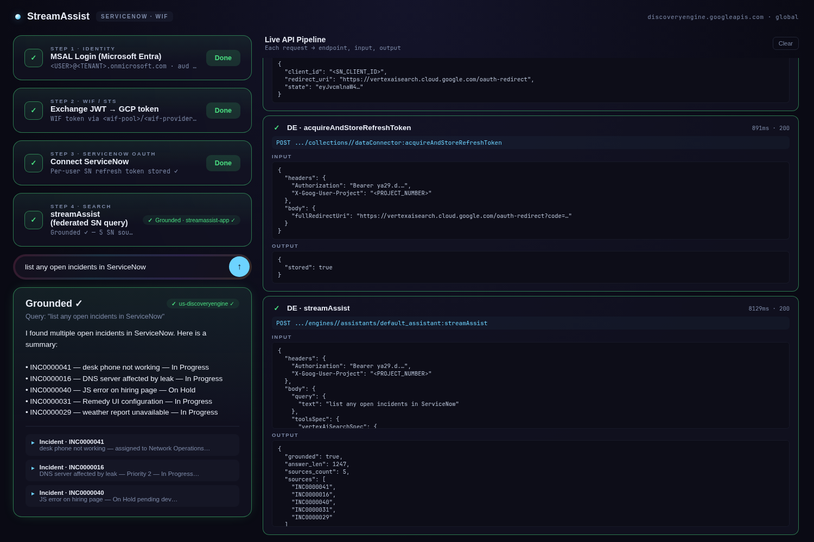

# StreamAssist · ServiceNow · WIF

> *Gemini Enterprise streamAssist + **ServiceNow federated connector** + per-user ACLs, with Entra WIF identity (raw `client_id` audience).*


**Full flow doc:** [FLOW.md](FLOW.md) — end-to-end reference (auth chain, the four mandatory configs, and ServiceNow-vs-SharePoint deltas)

---

## Why this project exists

Sister project to [`streamassist-oauth-flow`](../streamassist-oauth-flow) and [`streamassist-oauth-flow-us`](../streamassist-oauth-flow-us). Same WIF identity chain (Entra → STS → GCP), same Discovery Engine app contract — just **ServiceNow** swapped in for SharePoint as the federated data source.

End-to-end proof: a WIF-authenticated user signs in once with Microsoft Entra, grants ServiceNow consent once, then asks natural-language questions and gets **grounded answers from ServiceNow records** (incidents, knowledge articles, catalog items) with per-user ACLs enforced by ServiceNow's Table API.

## Interactive flow diagram

For a click-through visual explanation of how WIF/Entra and ServiceNow identities get bridged via Discovery Engine: open [`docs/flow-diagram.html`](docs/flow-diagram.html) in a browser. 6 phases, animated swim lanes for each identity universe, code samples for every step, and a live bridge-table visualization showing how `acquireAndStoreRefreshToken` links the two universes.

```bash
# serve docs/ on a separate port
python3 -m http.server 5177 --directory docs &
open http://localhost:5177/flow-diagram.html
```

## Demo



End-to-end: MSAL login → STS exchange → ServiceNow OAuth consent → grounded streamAssist answer with ServiceNow source citations. Sensitive identifiers redacted. The right-side **Live API Pipeline** panel shows each call's endpoint, input, and output as you progress through the steps.

## What's different from the SharePoint siblings

| | This project | streamassist-oauth-flow* |
|---|---|---|
| Federated data source | **ServiceNow** Table API | SharePoint Online |
| OAuth provider for the connector | **ServiceNow Application Registry** | Microsoft Entra Connector App |
| `dataSource` enum | `servicenow` | `sharepoint` |
| Connector params | `instance_uri`, `client_id`, `client_secret`, `user_account`, `password` | `tenant_id`, `instance_uri`, `admin_filter.Site`, `eeeu_enabled`, … |
| OAuth scope passed to user | *(none — leave empty in Application Registry)* | `AllSites.Read`, `Sites.Search.All`, `Files.Read.All`, … |
| Datastores | `_incident`, `_knowledge`, `_catalog`, `_users`, `_attachment` | `_file`, `_page`, `_comment`, `_event`, `_attachment` |
| Per-user ACL enforcement | Native ServiceNow ACLs/roles via Table API | SharePoint per-user permissions via Microsoft Graph |
| **Identical otherwise** | WIF pool/provider, Entra Portal App, MSAL flow, STS exchange, engine `workforceIdentityPoolProvider`, license seats, `acquireAndStoreRefreshToken`, streamAssist payload shape | … |

## Two ways to run — pick one

This repo ships **two complete frontends** that exercise the exact same auth chain and call the exact same Discovery Engine APIs. They produce identical results — the only difference is how much infrastructure they spin up.

|  | 🟢 **Easy frontend** *(`tester/`)* | 🔵 **Robust frontend** *(`frontend/` + `backend/`)* |
|---|---|---|
| **What it is** | One self-contained HTML file with a tiny Python wrapper | React + TypeScript app + FastAPI backend |
| **Stack** | Vanilla JS · `python3 -m http.server` style | React 19 · Vite · TypeScript · MSAL.js · FastAPI · uv |
| **Backend?** | ❌ no — calls all GCP APIs directly from the browser | ✅ yes — FastAPI on `:8003` handles OAuth callback, STS exchange, `acquireAndStoreRefreshToken`, streamAssist proxying |
| **OAuth callback handling** | Browser captures redirect via `postMessage` from vertexaisearch | Backend `/api/oauth/callback` receives the redirect and forwards `fullRedirectUri` to DE |
| **Pipeline / debug visibility** | Always-visible right panel showing every API request + decoded JSON response | React debug sidebar with collapsible per-stage trace cards |
| **Lines of code** | ~640 in one HTML file | ~340 backend + ~700 frontend |
| **Best for** | • Demos & screenshots<br>• Understanding what the API actually wants<br>• Quick proofs that ServiceNow is wired correctly<br>• Sharing a "click and watch what happens" link with a customer | • Production-style deployment<br>• Customer fork-and-modify starting point<br>• Anything where you want a real backend (per-user storage, server-side OAuth state, sessions, logging…) |
| **Run it** | `cd tester && cp .env.example .env && python3 serve.py` → `:5176` | Two terminals: `cd backend && uv sync && uv run python main.py` (`:8003`) + `cd frontend && npm install && npm run dev` (`:5174`) |
| **What `serve.py` is** | A 50-line HTTP server that reads `tester/.env` and substitutes `<PLACEHOLDER>` strings into `index.html` before serving — keeps secrets out of the committed file | Not used (Vite serves the frontend, FastAPI serves the backend) |

**Both** end up making the same three GCP API calls under the hood:

1. `POST sts.googleapis.com/v1/token` — STS exchange (Microsoft id_token → GCP access_token)
2. `POST .../dataConnector:acquireAndStoreRefreshToken` — link the WIF principal to a SN refresh_token
3. `POST .../engines/.../streamAssist` — federated search

If a query works on one frontend, it works on the other.

### A) Easy frontend — `tester/`

```bash
cd tester
cp .env.example .env       # fill in 10 values (see table below)
python3 serve.py           # → http://localhost:5176
```

Open the URL, click through Login → Exchange → Connect → Search. Watch the right-side panel for the live API trace.

### B) Robust frontend — `backend/` + `frontend/`

```bash
# Terminal 1 — Backend (port 8003)
cd backend
cp .env.example .env       # fill in PROJECT_NUMBER, ENGINE_ID, CONNECTOR_ID,
                           #         WIF_*, TENANT_ID, SERVICENOW_*, SN_OAUTH_*
uv sync
uv run python main.py

# Terminal 2 — Frontend (port 5174)
cd frontend
cp .env.example .env       # fill in VITE_CLIENT_ID, VITE_TENANT_ID
npm install
npm run dev
```

Open `http://localhost:5174`, sign in with Microsoft, click **Connect ServiceNow**, ask a question.

> Tip for customers: start with the **easy frontend** to verify your ServiceNow OAuth app + WIF + connector are all set up correctly. Once a query returns grounded results there, switch to the **robust frontend** as your production starting point.

## Quickstart (tester only)

```bash
cd tester
cp .env.example .env       # then fill in your values (10 keys — see below)
python3 serve.py           # → http://localhost:5176
```

`serve.py` reads `.env` at request time and injects the values into `index.html` as it serves the page. **Never commit a real `.env`** — it's in `.gitignore`.

### Required `.env` keys

| Key | Where to get it |
|---|---|
| `PORTAL_APP_CLIENT_ID` | The MSAL Portal App client_id (raw GUID, no `api://` prefix). Same as the SharePoint siblings |
| `TENANT_ID` | Your Microsoft Entra tenant ID |
| `PROJECT_NUMBER` | Your GCP project number (numeric) |
| `WIF_POOL_ID` | Workforce Identity Pool ID (at `locations/global/`) |
| `WIF_PROVIDER_ID` | OIDC Provider ID inside the pool — must have `--client-id="<RAW_PORTAL_GUID>"` (no `api://`) |
| `ENGINE_ID` | Discovery Engine app ID |
| `LOCATION` | `global` or `us` |
| `SERVICENOW_CONNECTOR_ID` | The collection ID from `setUpDataConnector` (e.g. `servicenow-connector-1777047657`) |
| `SERVICENOW_INSTANCE_URI` | `https://YOUR_INSTANCE.service-now.com` |
| `SN_OAUTH_CLIENT_ID` | client_id of the OAuth app you registered in ServiceNow → System OAuth → Application Registry |

### Use the page

Open `http://localhost:5176`, click through the 4 steps:
1. **Login** with Microsoft (MSAL)
2. **Exchange** JWT → GCP token (WIF/STS)
3. **Connect** ServiceNow (per-user OAuth consent — one-time per user)
4. Type a question → **Search** — watch the live timer + grounded answer with SN source citations

## What you need to provision

| | Where | Who creates it |
|---|---|---|
| **Entra Portal App** (MSAL login) | Microsoft Entra ID | Reuse from `streamassist-oauth-flow*` if you have it; else follow the original setup |
| **WIF Pool + OIDC Provider** (raw `client_id` audience) | GCP Workforce Identity Federation | Reuse from `streamassist-oauth-flow*` |
| **ServiceNow OAuth app** (this is the new piece) | ServiceNow → System OAuth → Application Registry | New — see [FLOW.md §1](FLOW.md#1-servicenow-oauth-app-application-registry) |
| **Discovery Engine app** (must have `workforceIdentityPoolProvider` set) | GCP Discovery Engine | Reuse existing engine; verify identity is wired |
| **ServiceNow federated connector** (attached to the engine) | GCP Discovery Engine | New — `setUpDataConnector` REST call |

## Layout

```
streamassist-oauth-flow-servicenow/
├── README.md                  # this file — overview + sibling diff
├── FLOW.md                    # full end-to-end flow doc
├── REPLICATE.md               # copy-paste shell commands to reproduce everything
├── AUTH_SEQUENCE.md           # mermaid sequence + bridge diagrams
│
├── backend/                   # FastAPI backend (port 8003)
│   ├── main.py                # STS exchange, /api/servicenow/auth-url, /api/oauth/callback,
│   │                          # /api/oauth/exchange (acquireAndStoreRefreshToken),
│   │                          # /api/servicenow/check-connection, /api/search (streamAssist)
│   ├── .env.example
│   ├── pyproject.toml
│   └── uv.lock
│
├── frontend/                  # React + MSAL (port 5174)
│   ├── src/
│   │   ├── App.tsx            # MSAL login + 4-step UI + debug sidebar
│   │   ├── authConfig.ts      # MSAL config (no api:// scope — raw client_id)
│   │   └── main.tsx
│   ├── .env.example
│   ├── index.html
│   ├── package.json
│   └── vite.config.ts
│
├── tester/                    # alternative single-pane HTML tester (port 5176)
│   ├── index.html             # vanilla JS, no backend needed, live pipeline panel
│   ├── serve.py               # tiny HTTP server with .env value injection
│   └── .env.example
│
└── docs/
    ├── demo-grounded.png      # screenshot of grounded SN answer
    └── flow-diagram.html      # interactive click-through visual diagram
```

## The proof in three signals

1. **Pipeline panel** shows `STS · token-exchange` → `DE · acquireAndStoreRefreshToken` → `DE · streamAssist` all returning `200`
2. **Decoded id_token** has `aud` = the raw Portal App GUID (no `api://` prefix)
3. **streamAssist response** is grounded — `textGroundingMetadata.references[]` populated with ServiceNow records (e.g. `INC0000041`, `KB0010001`)

See [FLOW.md](FLOW.md) for the full step-by-step + the four mandatory configurations easy to miss on a fresh engine.

---

Built by [Jesus Chavez](https://www.linkedin.com/in/jchavezar/) — Customer Engineer, Google Cloud.
