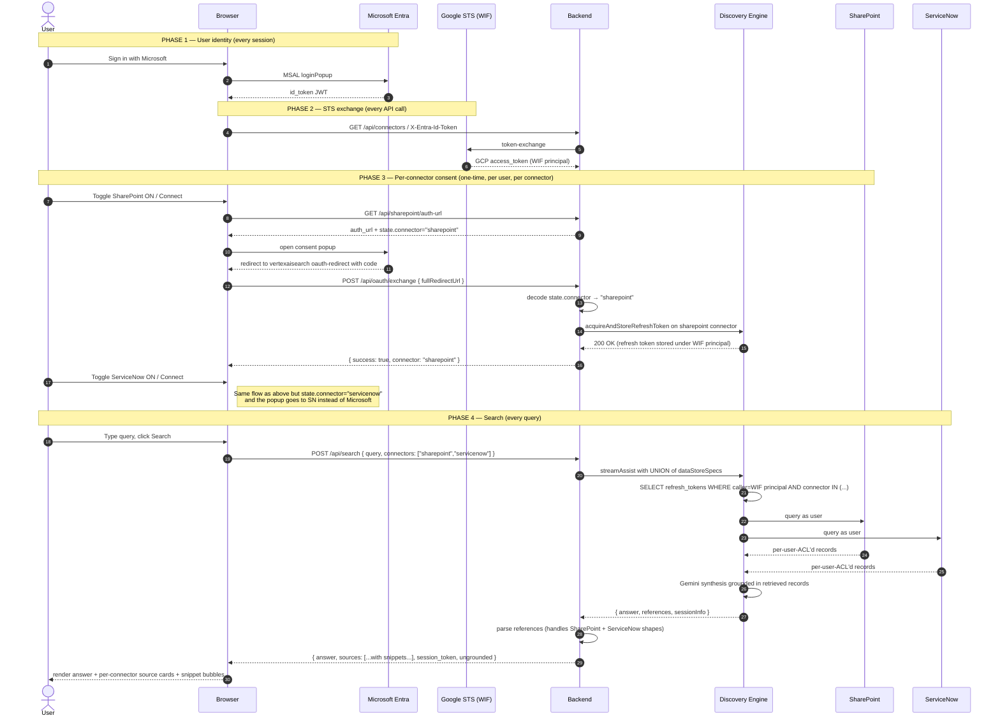
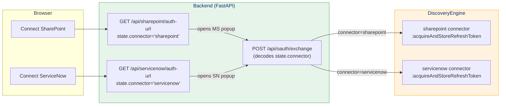
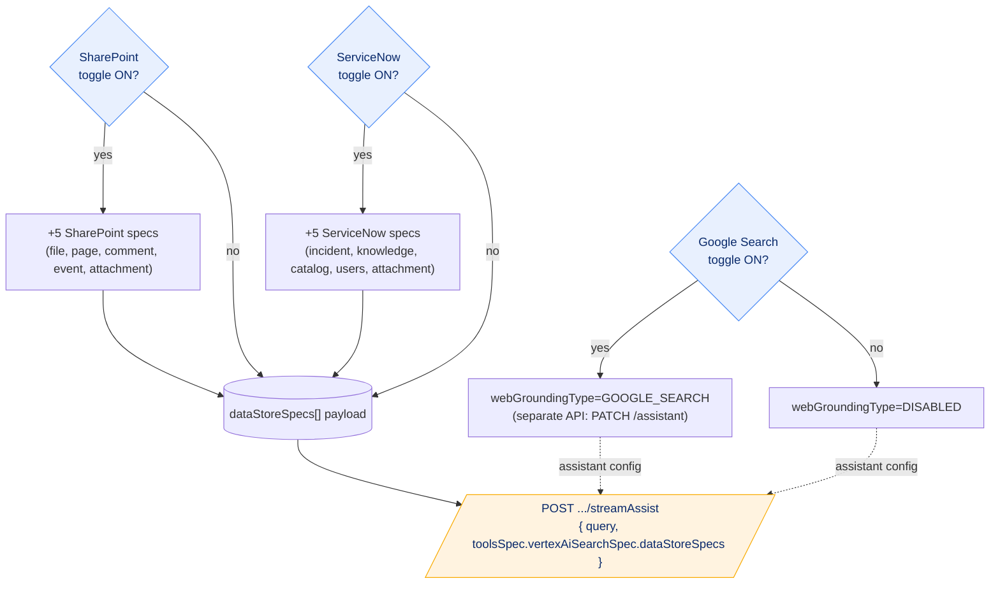
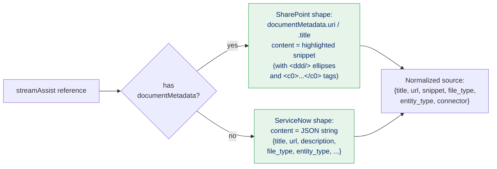
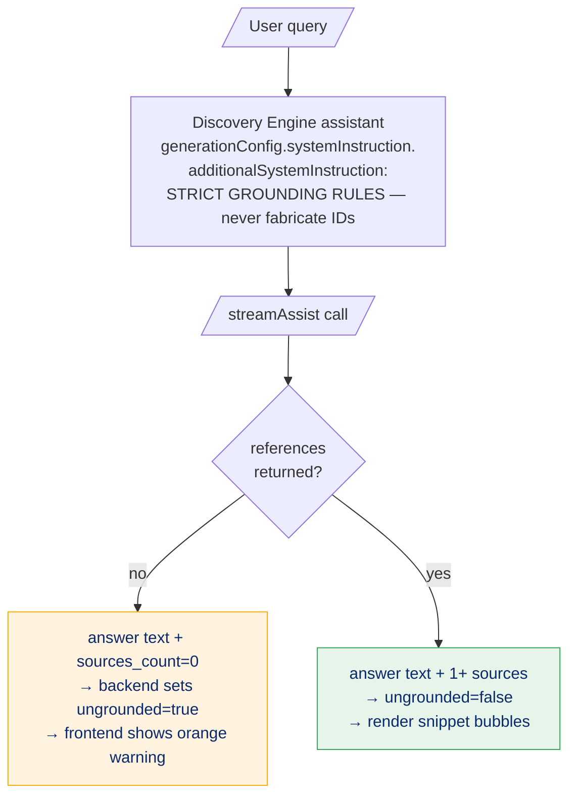

# Authentication Sequence — Mermaid Diagrams

End-to-end auth chain for the **combined SharePoint + ServiceNow + Google Search** portal.
Both connectors share a **single Discovery Engine app**, a **single backend**, and a
**single shared OAuth callback** that disambiguates connectors via `state.connector`.

> GitHub renders these mermaid blocks automatically.

---

## 1 · Overall — three independent toggles, one streamAssist call

---

## 2 · The shared OAuth callback — connector inferred from `state`

The browser opens a single OAuth callback URL regardless of which connector
initiated. The connector identity rides in the OAuth `state` parameter
(base64-encoded JSON `{origin, useBroadcastChannel, nonce, connector}`).
When the callback handler receives `code + state`, it decodes
`state.connector` and dispatches `acquireAndStoreRefreshToken` against the
correct connector. This keeps the URL surface small and the routing logic
self-describing.

---

## 3 · Toggle filters → streamAssist `dataStoreSpecs`

The connector toggles change the **request body**; the Google Search toggle
changes the **assistant resource** itself (out-of-band PATCH). Both are
applied to the same `streamAssist` call.

---

## 4 · Citation parsing — SharePoint vs ServiceNow shapes

Discovery Engine returns references in two different shapes depending on the
connector. The combined backend's `_ref_to_source()` handles both:

After parsing, references with the same URL are deduped but their snippets
are merged into a list — so a single source card can show multiple
highlighted excerpts that grounded different parts of the answer.

---

## 5 · Hallucination guard — assistant config + per-call ungrounded flag

Two-layer defense:

1. **Assistant-level (preventive):** `additionalSystemInstruction` forbids
   fabricating CVE IDs, incident numbers, etc., and requires the verbatim
   *"No matching documents were found…"* response when retrieval is empty.
2. **Response-level (detective):** the backend flags `ungrounded=true` when
   the model returns text with no citations, and the frontend shows a
   prominent warning so users can spot model misbehavior even if the
   instruction is partially ignored.

---

## Key takeaways

1. **Three completely separate identity universes still apply.** Microsoft
   Entra (`user@tenant.onmicrosoft.com`), SharePoint (the same Microsoft
   identity, but a different OAuth scope), and ServiceNow (its own user
   table). They are NOT federated to each other. Discovery Engine is the
   bridge that maps a single WIF principal to per-connector refresh tokens.

2. **One backend, one engine, multiple connectors.** Both connectors' data
   stores live on the same Discovery Engine app; the backend issues a single
   `streamAssist` call with the union of selected specs. The toggles are
   pure request-body filters — they don't disconnect anything.

3. **Toggle OFF ≠ disconnect.** Flipping a connector toggle off just removes
   its `dataStoreSpecs` from the request. The refresh token stays stored,
   so flipping back on is instant (no re-consent).

4. **Google Search is assistant-level, not request-level.** It can't be
   passed in the `streamAssist` body — it has to be PATCHed onto the
   `assistant` resource. The backend's `/api/grounding/web` endpoint does
   this round-trip on every toggle click.

5. **Hallucinations are a model problem, not a retrieval problem.** Even
   with perfect retrieval, the model sometimes invents structured
   identifiers to "complete" tables. The strict `additionalSystemInstruction`
   tells it not to; the `ungrounded` warning catches the cases where it
   ignores the instruction anyway.
