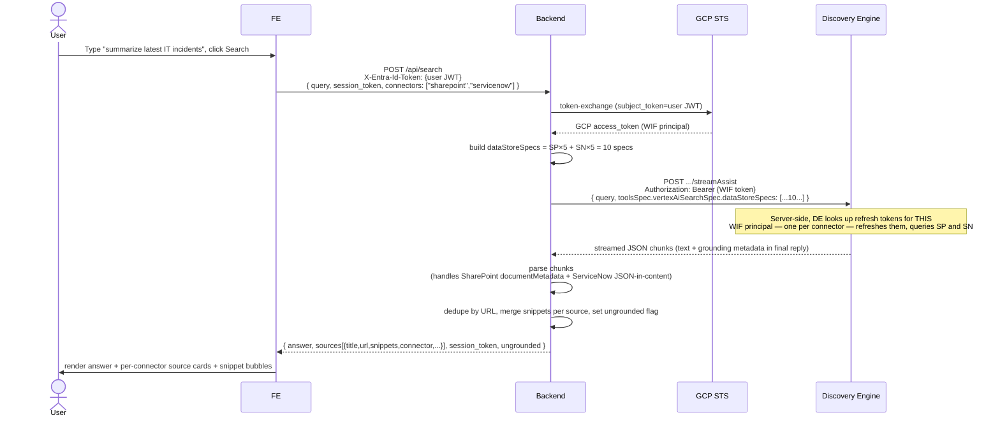

# Combined Portal — Conceptual Flow

> A single-file reference for running **Gemini Enterprise streamAssist** with
> **two federated connectors (SharePoint + ServiceNow)** plus an **assistant-level
> Google Search toggle**, on **one engine**, authenticated via **Workforce
> Identity Federation**, with **strict anti-hallucination guardrails**.

---

## TL;DR

If your demo combines two connectors and you see fake CVE IDs, fake incident
numbers, or other invented structured data, you almost certainly missed one
of these three configurations:

| # | What | Where | Symptom when missing |
|---|---|---|---|
| 1 | All connectors' data stores attached to **the same engine** | `engines/{engine}.dataStoreIds` | One toggle works, the other returns 0 results |
| 2 | Assistant's `additionalSystemInstruction` set to forbid fabrications | `assistants/default_assistant.generationConfig.systemInstruction` | Realistic-looking but invented IDs in tables |
| 3 | Assistant's `webGroundingType` = `WEB_GROUNDING_TYPE_DISABLED` (unless you want web fallback) | same as above | Slow responses (60+ s) and "answers" sourced from training/web when retrieval is empty |

The combined backend automates #2 and #3 via the **Google Search toggle** —
flipping it round-trips a PATCH to the assistant resource and swaps between
two pre-baked instructions.

---

## Table of contents

1. [Why this consolidated demo exists](#1-why-this-consolidated-demo-exists)
2. [Architecture](#2-architecture)
3. [Request flow — single search across N connectors](#3-request-flow--single-search-across-n-connectors)
4. [The three configurations that matter](#4-the-three-configurations-that-matter)
5. [How the toggles work mechanically](#5-how-the-toggles-work-mechanically)
6. [Citation parsing — handling two response shapes](#6-citation-parsing--handling-two-response-shapes)
7. [Hallucination guardrails — preventive + detective](#7-hallucination-guardrails--preventive--detective)
8. [Failure-mode lookup](#8-failure-mode-lookup)

---

## 1. Why this consolidated demo exists

The single-connector demos (`streamassist-oauth-flow-sharepoint`,
`streamassist-oauth-flow-servicenow`) prove that per-user OAuth + WIF +
streamAssist works for one source of truth. But customer demos almost always
ask the same follow-up: *"can the assistant answer questions that span
SharePoint AND ServiceNow in one query?"*

Naively running both single-connector backends side-by-side doesn't work —
they each point at a different engine. Discovery Engine apps each have their
own assistant, their own session state, and their own grounding metadata
shape. The combined demo solves this by:

- Putting both connectors' data stores on **one** engine
- Running a single FastAPI backend that exposes per-connector OAuth endpoints
  but a **single shared callback** (connector identity rides in OAuth `state`)
- Issuing a **single** `streamAssist` request per user query, with the union
  of `dataStoreSpecs` selected by the UI toggles
- Adding a third toggle for **assistant-level Google Search**, since web
  grounding is configured on the assistant resource itself, not in the
  request body

It also fixes a footgun present in both single-connector demos:

> The default Discovery Engine assistant has `webGroundingType =
> WEB_GROUNDING_TYPE_GOOGLE_SEARCH` and **no system instruction**. When
> retrieval returns nothing, it silently calls Gemini with no grounding
> constraint, which falls back to web search and/or training knowledge.
> Result: confident-looking answers full of fake CVE IDs and fake incident
> numbers.

---

## 2. Architecture

### What lives where

```mermaid
flowchart LR
  subgraph G["Identity providers (existing)"]
    direction TB
    PORTAL["Entra Portal App<br/>MSAL login"]
    WIFPOOL["Workforce Identity Pool<br/>+ OIDC Provider"]
    SPCONN["Entra Connector App<br/>SharePoint OAuth scope"]
    SNAPP["ServiceNow OAuth App"]
  end

  subgraph DE["Discovery Engine (one app)"]
    direction TB
    ENGINE["engines/{ENGINE_ID}<br/>+ workforceIdentityPoolProvider<br/>+ user license"]
    ASST["assistants/default_assistant<br/>+ webGroundingType<br/>+ additionalSystemInstruction"]
    SPDS["5 SharePoint datastores"]
    SNDS["5 ServiceNow datastores"]
    ENGINE --> ASST
    ENGINE --> SPDS
    ENGINE --> SNDS
  end

  subgraph App["Combined demo"]
    FE["Frontend :5177<br/>3-toggle UI"]
    BE["Backend :8004<br/>FastAPI"]
    FE -->|/api/*| BE
  end

  FE -.MSAL.-> PORTAL
  FE -.OAuth popup.-> SPCONN
  FE -.OAuth popup.-> SNAPP
  BE -->|STS exchange| WIFPOOL
  BE -->|user-WIF token| ENGINE
  BE -->|admin token (gcloud)| ASST

  classDef glob fill:#e8f0fe,stroke:#4285f4,color:#0a2a6b
  classDef de fill:#e6f4ea,stroke:#34a853,color:#0a2a6b
  classDef app fill:#fff3e0,stroke:#f9ab00,color:#0a2a6b
  class G glob
  class DE de
  class App app
```

### Two distinct credential flows

The backend issues two kinds of GCP tokens:

| Flow | Identity | Used for |
|---|---|---|
| **WIF user token** (every API call from the browser) | the signed-in Microsoft user, mapped to a WIF principal via STS | All `dataConnector:*` calls and `streamAssist` (per-user ACLs) |
| **Admin token** (assistant-config calls) | the active `gcloud` account on the host | `GET / PATCH assistants/default_assistant` for the Google Search toggle |

The user-flow tokens never have admin permissions, and the admin token is
never bound to a user identity. The split is intentional — it keeps the
per-user ACL story clean for `streamAssist` while allowing the demo to
reconfigure the assistant on the fly.

---

## 3. Request flow — single search across N connectors



### Why a single streamAssist call (not one per connector)?

You could imagine fanning out — one streamAssist per connector, then merging
results client-side. The combined demo doesn't, for three reasons:

1. **Coherent answer.** Gemini synthesizes a single response that can reason
   across SharePoint AND ServiceNow data. Two separate calls would give two
   separate answers that the frontend would have to glue together.
2. **One session token.** Multi-turn follow-ups (*"more details on the third
   incident"*) work cleanly with a single session.
3. **Simpler backend.** The merge logic for two parallel streamAssist
   responses (especially merging citations across them) is non-trivial.

This requires both connectors' data stores on the same engine — see §4(1).

---

## 4. The three configurations that matter

### 4.1 Both connectors on one engine

`engines/{ENGINE_ID}.dataStoreIds` must include all 10 data stores (5 per
connector). The combined backend builds:

```
projects/{P}/locations/global/collections/default_collection/dataStores/{SP_CONNECTOR_ID}_file
projects/{P}/locations/global/collections/default_collection/dataStores/{SP_CONNECTOR_ID}_page
... etc for comment, event, attachment
projects/{P}/locations/global/collections/default_collection/dataStores/{SN_CONNECTOR_ID}_incident
... etc for knowledge, catalog, users, attachment
```

If a data store referenced in `dataStoreSpecs` isn't attached to the engine,
streamAssist returns either `INVALID_ARGUMENT` or silently ignores it
depending on the API version.

### 4.2 Assistant `additionalSystemInstruction`

The default assistant has no system instruction. Without one, the model is
free to "complete" sparse retrieval with realistic-looking invented data.

The combined backend ships two pre-baked instructions:

| Constant in `main.py` | Used when | Allows |
|---|---|---|
| `GROUNDED_INSTRUCTION` | Google Search toggle OFF | Connector docs only; verbatim "no docs" fallback; no fabricated IDs |
| `WEB_AUGMENTED_INSTRUCTION` | Google Search toggle ON | Connector docs preferred, web search allowed; still no fabricated IDs |

Both forbid fabricating CVE IDs, INC numbers, KB IDs, ticket numbers,
employee IDs, contract numbers, or any other structured identifier.

### 4.3 Assistant `webGroundingType`

Two values that matter:

- `WEB_GROUNDING_TYPE_DISABLED` — assistant cannot call out to Google Search
- `WEB_GROUNDING_TYPE_GOOGLE_SEARCH` — assistant can fall back to / augment
  with Google Search results

The Google Search toggle in the UI flips this in real time via PATCH on
`assistants/default_assistant`. The toggle's `onChange` handler also picks
the matching system instruction from §4.2 — both fields are PATCHed in one
request to keep them consistent.

> **Note:** changes to the assistant config are global to the engine.
> Toggling Google Search ON in your demo affects every other tool/app that
> queries this assistant. For multi-tenant deployments, consider creating a
> dedicated assistant resource per app instead of mutating
> `default_assistant`.

---

## 5. How the toggles work mechanically

### 5.1 Connector toggles (SharePoint, ServiceNow)

```
ON  + connected:    add to dataStoreSpecs in next /api/search
ON  + !connected:   show "Needs consent" + Connect button → handleConnect()
OFF:                exclude from dataStoreSpecs (refresh token stays stored)
```

State lives in:

- React state (`connState[name].active`, `connState[name].connected`)
- LocalStorage (`active_<name>_<username>` and `connected_<name>_<username>`)
  for cross-reload persistence

### 5.2 Google Search toggle

```
ON:   PATCH assistant — webGroundingType=GOOGLE_SEARCH + WEB_AUGMENTED_INSTRUCTION
OFF:  PATCH assistant — webGroundingType=DISABLED       + GROUNDED_INSTRUCTION
```

State lives in:

- React state (`webGrounding`)
- The Discovery Engine assistant resource itself (single source of truth)

On page load, the frontend fetches `GET /api/grounding/web` and seeds the
toggle state from the live assistant config.

---

## 6. Citation parsing — handling two response shapes

Discovery Engine returns references in **two different shapes**:

### SharePoint shape

```json
{
  "content": "<ddd/>found a SQL <c0>injection</c0> vulnerability<ddd/>",
  "documentMetadata": {
    "uri": "https://contoso.sharepoint.com/.../doc.pdf",
    "title": "04_IT_Security_Assessment_2024",
    "document": "projects/.../dataStores/{connector_id}_event/branches/0/documents/1",
    "domain": "contoso.sharepoint.com"
  }
}
```

- `content` is a highlighted snippet with `<ddd/>` (ellipsis) and
  `<c0>...</c0>` (highlight) tags
- `documentMetadata` carries URL/title/source path

### ServiceNow shape (legacy)

```json
{
  "content": "{\"title\": \"INC0010234\", \"url\": \"https://dev12345.service-now.com/...\", \"description\": \"...\", ...}"
}
```

- `content` is a JSON-encoded string with the full source object
- No `documentMetadata`

The combined backend's `_ref_to_source(ref, selected)` function tries the
new shape first, then falls back to JSON-parsing `content`. Snippet
extraction (`_clean_snippet`) replaces `<ddd/>` with `…` and converts
`<c0>...</c0>` to `[[...]]` markers; the frontend renders `[[term]]` as
`<mark>term</mark>` for visual highlighting.

References are deduped by URL but their snippets are **merged** —
a single source can ground multiple parts of an answer, and the UI shows
each excerpt as a separate bubble below the source card.

---

## 7. Hallucination guardrails — preventive + detective

### Preventive: assistant `additionalSystemInstruction`

The strict instruction includes:

1. *Use ONLY information that appears VERBATIM in the retrieved snippets.*
2. *NEVER fabricate identifiers (CVE-XXXX, INC0XXXXXXX, KB0XXXXXXX,
   contract numbers, etc.).*
3. *NEVER add example IDs or placeholder values to make a table look
   complete.*
4. *If structured data isn't in the source, present as prose or say so
   explicitly.*
5. *If retrieval is empty, respond verbatim: "No matching documents were
   found in the selected connectors."*
6. *Do not use prior knowledge, training data, or web sources.*

It also includes BAD/GOOD examples to anchor the format expectation:

> BAD: `| CVE-2024-001 | SQL Injection | Critical |` (when no CVE ID is in source)
> GOOD: *"The assessment found a SQL injection vulnerability in the customer
>        search API endpoint (rated Critical, status: Unpatched)."*

### Detective: `ungrounded` flag + UI warning

After parsing the streamAssist response, the backend computes:

```python
ungrounded = bool(answer_text) and not unique_sources
```

If True, the frontend renders a prominent orange banner above the answer:

> ⚠ **No matching documents** in the active connector(s) (SharePoint).
> The answer below is ungrounded (model fallback / training knowledge).
> Toggle the right connector or rephrase.

This catches the cases where the model ignores the system instruction (rare
but possible). Users see immediately that they shouldn't trust the answer.

### What this doesn't catch

The instruction prevents *invented IDs in otherwise grounded answers*
(the original failure mode), but a *partially-grounded answer* — where the
model summarizes real docs but adds invented connective tissue — is
indistinguishable from the API's perspective. The snippet bubbles are the
mitigation: by showing exactly what was retrieved, users can spot
discrepancies between the answer and the source material.

---

## 8. Failure-mode lookup

| Symptom | Likely cause | Fix |
|---|---|---|
| One toggle works, the other returns 0 results | The other connector's data stores aren't attached to this engine | Run REPLICATE §1 to PATCH `dataStoreIds` |
| Hallucinated CVE / INC / KB IDs in answers | `additionalSystemInstruction` not set or reverted | Run REPLICATE §2 to re-PATCH the assistant |
| 60+ second responses | `webGroundingType=GOOGLE_SEARCH` enabled | Toggle Google Search OFF in the UI |
| Answer is *"No matching documents…"* even though docs exist | Toggle is ON but `connected=false` | Click Connect on the chip and complete consent |
| Toggle stuck on "Authorizing…" forever | Popup blocked or COOP killed `postMessage` | Allow popups; the popup-closed polling fallback should still work after 2-3 s |
| Source card snippet bubble empty | DE returned a reference with no `content` (rare) | Cosmetic — the URL is still clickable |
| `403 discoveryengine.assistants.get denied` from `/api/grounding/web` | Active `gcloud` account lacks `discoveryengine.assistants.update` | `gcloud auth login` as a project admin |
| Citation parser returns `sources_count=0` for SharePoint but answer has citations in the text | Old version of the parser (only handled ServiceNow JSON-in-content shape) | Pull latest `main.py` — `_ref_to_source` now handles both shapes |

---

For the per-connector OAuth chains and the WIF identity bridge mechanics,
see the single-connector docs:

- [`../streamassist-oauth-flow-sharepoint/README.md`](../streamassist-oauth-flow-sharepoint/README.md)
- [`../streamassist-oauth-flow-servicenow/FLOW.md`](../streamassist-oauth-flow-servicenow/FLOW.md)
- [`../streamassist-oauth-flow-servicenow/AUTH_SEQUENCE.md`](../streamassist-oauth-flow-servicenow/AUTH_SEQUENCE.md)

For copy-paste setup commands specific to the consolidated engine and
strict assistant config, see [`REPLICATE.md`](REPLICATE.md).
