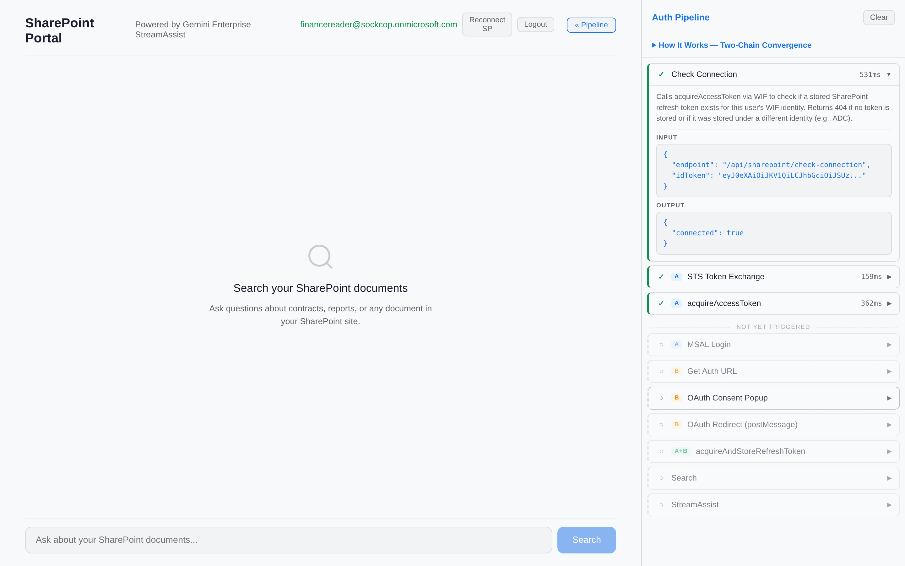
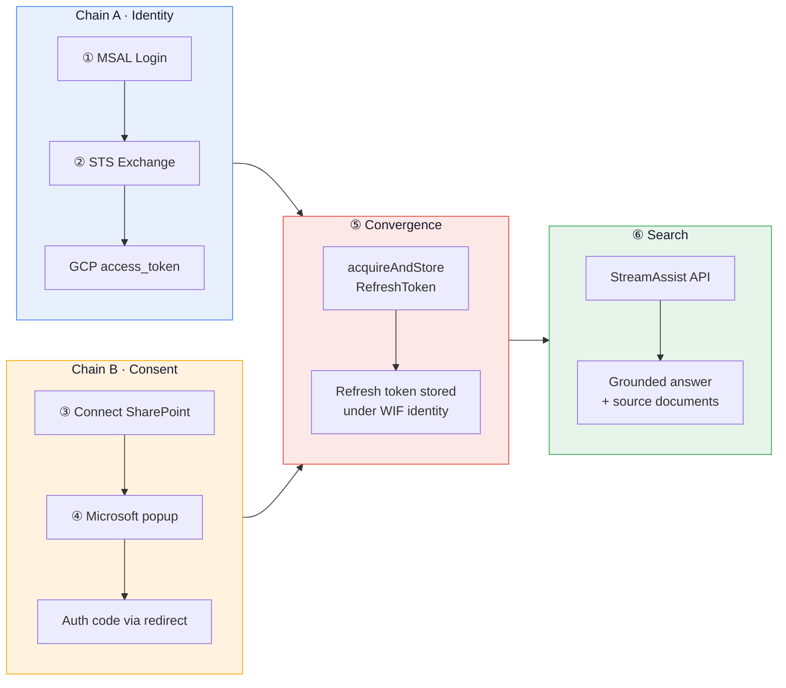
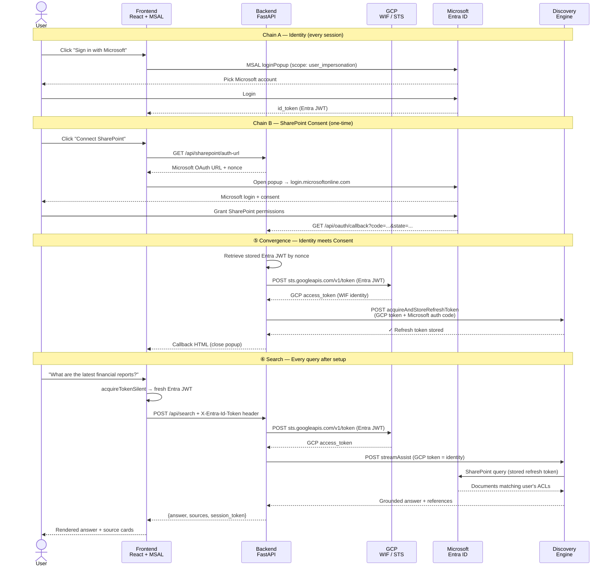

# StreamAssist OAuth Flow

> *Custom SharePoint Portal — Gemini Enterprise StreamAssist with per-user OAuth, zero credential storage.*




---

## vs `ge-sharepoint-cloudid`

| | **This project** | ge-sharepoint-cloudid |
|---|---|---|
| Identity | Entra ID (MSAL.js) | Google Cloud Identity (GIS) |
| Token chain | **Entra JWT → STS → GCP token** | Google auth code → GCP token |
| WIF | **Yes (Pool + Provider)** | No |
| Entra apps | **2 (Portal + Connector)** | 1 (Connector only) |
| Auth library | **`@azure/msal-browser`** | Google Identity Services |

---

## The Flow

### High-Level Phases



### Sequence — What Actually Gets Sent Where



---

## Step-by-Step Code

Each numbered step maps to the diagrams above. The table links jump to the exact source lines.

---

### ① MSAL Login → Entra JWT

The user clicks **Sign in with Microsoft**. MSAL opens a popup, user logs in, and MSAL returns an `id_token` (Entra JWT). The `api://{client-id}/user_impersonation` scope sets the `aud` claim that WIF validates.

| | File | Lines |
|---|---|---|
| **MSAL config** | [`authConfig.ts`](frontend/src/authConfig.ts#L8-L28) | Client ID, authority, scopes |
| **Login handler** | [`App.tsx` — handleLogin](frontend/src/App.tsx#L169-L191) | MSAL popup + trace |
| **Token acquisition** | [`App.tsx` — getToken](frontend/src/App.tsx#L154-L167) | Silent → popup fallback |

> [!IMPORTANT]
> The Portal App's Entra manifest must have `"oauth2AllowIdTokenImplicitFlow": true`. Without it, WIF silently rejects the id_token and STS exchange fails with no useful error.

```ts
// frontend/src/authConfig.ts:20
export const loginRequest = {
  scopes: [
    `api://${CLIENT_ID}/user_impersonation`,  // aud claim for WIF
    'openid', 'profile', 'email',
  ],
};
```

---

### ② STS Token Exchange — Entra JWT → GCP Token

Backend exchanges the Entra JWT for a GCP access token via [Workforce Identity Federation](https://cloud.google.com/iam/docs/workforce-identity-federation). The `audience` must match the WIF provider, and `subjectTokenType` must be `id_token`.

| | File | Lines |
|---|---|---|
| **STS exchange** | [`main.py` — _exchange_token](backend/main.py#L52-L78) | Entra JWT → WIF → GCP token |
| **Token extraction** | [`main.py` — _get_gcp_token](backend/main.py#L89-L91) | Header → exchange pipeline |
| **Frontend header** | [`App.tsx:370`](frontend/src/App.tsx#L370) | Sends `X-Entra-Id-Token` header |

> [!IMPORTANT]
> This WIF-based GCP token IS the user's identity for Discovery Engine. Using ADC (service account) instead causes `acquireAccessToken` to return 404 later — identity mismatch between who stored the token and who requests it.

```python
# backend/main.py:52
def _exchange_token(entra_jwt: str, trace: list | None = None) -> Optional[str]:
    body = {
        "audience": f"//iam.googleapis.com/locations/global/workforcePools/{WIF_POOL_ID}/providers/{WIF_PROVIDER_ID}",
        "grantType": "urn:ietf:params:oauth:grant-type:token-exchange",
        "requestedTokenType": "urn:ietf:params:oauth:token-type:access_token",
        "scope": "https://www.googleapis.com/auth/cloud-platform",
        "subjectToken": entra_jwt,
        "subjectTokenType": "urn:ietf:params:oauth:token-type:id_token",
    }
    resp = requests.post("https://sts.googleapis.com/v1/token", json=body, timeout=10)
    return resp.json().get("access_token") if resp.ok else None
```

---

### ③ Connect SharePoint — Get Auth URL

User clicks **Connect SharePoint**. Backend generates a Microsoft OAuth URL for the **Connector App** (separate from the Portal App). The backend stores the Entra JWT by nonce so the callback can retrieve it.

| | File | Lines |
|---|---|---|
| **Backend** | [`main.py` — /api/sharepoint/auth-url](backend/main.py#L110-L134) | Generates Microsoft OAuth URL |
| **State encoding** | [`main.py:126`](backend/main.py#L126) | Base64-encoded JSON with nonce + origin |
| **Frontend** | [`App.tsx` — handleConsent](frontend/src/App.tsx#L312-L347) | Opens popup, polls for close |

> [!TIP]
> The `redirect_uri` must be exactly `vertexaisearch.cloud.google.com/oauth-redirect` — this is what `acquireAndStoreRefreshToken` expects internally. Register this exact URI in your Entra **Connector App**.

```python
# backend/main.py:120
params = {
    "client_id": CONNECTOR_CLIENT_ID,    # Connector App (NOT Portal App)
    "response_type": "code",
    "redirect_uri": REDIRECT_URI,        # vertexaisearch.cloud.google.com/oauth-redirect
    "scope": SP_SCOPES,                  # AllSites.Read + Sites.Search.All
    "state": base64.b64encode(json.dumps({
        "origin": origin, "useBroadcastChannel": "false", "nonce": nonce,
    }).encode()).decode(),
}
```

---

### ④ Microsoft Consent → OAuth Callback

User logs in to Microsoft and grants SharePoint permissions. Microsoft redirects to `vertexaisearch.cloud.google.com/oauth-redirect` with an auth code. The callback retrieves the stored Entra JWT by nonce, exchanges it for a WIF/GCP token (② again), then calls `acquireAndStoreRefreshToken`.

| | File | Lines |
|---|---|---|
| **Backend** | [`main.py` — /api/oauth/callback](backend/main.py#L137-L179) | Receives auth code from Microsoft |
| **WIF exchange** | [`main.py:159-160`](backend/main.py#L159-L160) | Nonce → stored JWT → GCP token |
| **Store token** | [`main.py:168-173`](backend/main.py#L168-L173) | `acquireAndStoreRefreshToken` call |
| **ADC fallback** | [`main.py:161-166`](backend/main.py#L161-L166) | Falls back to ADC if nonce expired |

> [!NOTE]
> `vertexaisearch.cloud.google.com` sets Cross-Origin-Opener-Policy, which blocks `postMessage`. The frontend uses popup-closed polling as a fallback — see [`App.tsx:285-310`](frontend/src/App.tsx#L285-L310).

```python
# backend/main.py:159
entra_jwt = _pending_consents.pop(nonce, None)
gcp_token = _exchange_token(entra_jwt) if entra_jwt else None

# Store SharePoint refresh token under this WIF identity
resp = requests.post(
    f"{CONNECTOR_URL}/dataConnector:acquireAndStoreRefreshToken",
    headers=_gcp_headers(gcp_token),         # WIF token = identity (from ②)
    json={"fullRedirectUri": str(request.url)},  # contains Microsoft auth code (from ④)
)
# Discovery Engine stores SharePoint refresh token under this WIF identity
```

---

### ⑤ Convergence — Identity Meets Consent

**Chain A** (WIF/GCP token = who you are) meets **Chain B** (auth code = SharePoint access you granted). Discovery Engine extracts the Microsoft auth code from `fullRedirectUri`, exchanges it for a SharePoint refresh token, and stores it **mapped to the WIF identity** from the GCP token in the `Authorization` header.

> [!IMPORTANT]
> After this one-time step, the user never sees Microsoft consent again. The WIF token (not ADC) is critical — if stored under a service account, `acquireAccessToken` returns 404 because the identity that stored the token doesn't match the identity requesting it.

---

### ⑥ StreamAssist Federated Search

Every search re-does the STS exchange (① → ②) to get a fresh GCP token, then calls StreamAssist with all 5 data store entity types. Discovery Engine uses the stored refresh token (from ⑤) to query SharePoint with the user's ACLs.

| | File | Lines |
|---|---|---|
| **Search endpoint** | [`main.py` — /api/search](backend/main.py#L260-L271) | Extracts token, delegates to thread |
| **StreamAssist** | [`main.py` — _stream_assist](backend/main.py#L274-L336) | API call + response parsing |
| **Frontend** | [`App.tsx` — handleSearch](frontend/src/App.tsx#L349-L396) | Submit query, render answer |
| **Source cards** | [`App.tsx:532-549`](frontend/src/App.tsx#L532-L549) | Clickable SharePoint document cards |

> [!TIP]
> StreamAssist returns `assistToken` in responses but **rejects it as input**. For follow-up queries, use `sessionInfo.session` (a resource name like `projects/.../sessions/...`). See [`main.py:305`](backend/main.py#L305).

<details>
<summary>StreamAssist payload structure</summary>

```python
# backend/main.py:276
payload = {
    "query": {"text": query},
    "dataStoreSpecs": [
        {"dataStore": f"{ds_base}_{et}"}
        for et in ["file", "page", "comment", "event", "attachment"]
    ],
}
if session_token:
    payload["session"] = session_token   # NOT "assistToken" — that field is rejected

resp = requests.post(STREAMASSIST_URL, headers=_gcp_headers(gcp_token), json=payload, timeout=60)
```

</details>

<details>
<summary>Source extraction from grounding metadata</summary>

```python
# backend/main.py:306
for reply in chunk.get("answer", {}).get("replies", []):
    gc = reply.get("groundedContent", {})
    content = gc.get("content", {})
    if not content.get("thought") and content.get("text"):
        answer_parts.append(content["text"])
    for ref in gc.get("textGroundingMetadata", {}).get("references", []):
        s = json.loads(ref.get("content", "{}"))
        if s.get("url"):
            sources.append({"title": s.get("title"), "url": s["url"], ...})
```

</details>

<details>
<summary>Session continuity — use session, not assistToken</summary>

```python
# backend/main.py:305
for chunk in chunks:
    session_name = chunk.get("sessionInfo", {}).get("session") or session_name
    #                        ^^^^^^^^^^^^^^^^^^^^^^^^^^^^^^^^^^^
    #                        Use this, NOT chunk["assistToken"]
```

```ts
// frontend/src/App.tsx:387
if (data.session_token) setSessionToken(data.session_token);
```

</details>

---

## Quick Reference

```
streamassist-oauth-flow/
├── backend/
│   ├── main.py              # All endpoints — OAuth + WIF + StreamAssist (340 lines)
│   ├── .env.example         # Required env vars template
│   └── pyproject.toml
├── frontend/
│   ├── src/
│   │   ├── App.tsx          # Chat UI + MSAL auth + debug sidebar
│   │   ├── authConfig.ts    # MSAL configuration + scopes
│   │   ├── main.tsx         # React entry point with MsalProvider
│   │   └── index.css        # Dark theme + sidebar styles
│   ├── .env.example
│   └── package.json
├── docs/
│   └── demo.gif
└── README.md
```

---

## Setup

### Run

```bash
# Backend
cd backend && cp .env.example .env  # fill in values
uv sync && uv run python main.py    # port 8003

# Frontend
cd frontend && cp .env.example .env  # set VITE_CLIENT_ID + VITE_TENANT_ID
npm install && npm run dev           # port 5174
```

### Environment Variables

| Variable | Where | Description |
|----------|-------|-------------|
| `PROJECT_NUMBER` | backend | GCP project number |
| `ENGINE_ID` | backend | Discovery Engine app ID |
| `CONNECTOR_ID` | backend | SharePoint connector ID (parent connector, not a child data store) |
| `DATA_STORE_ID` | backend | A child data store ID, e.g. `{CONNECTOR_ID}_file` — only used by `auth_sharepoint.py` |
| `WIF_POOL_ID` | backend | Workforce Identity Federation pool ID |
| `WIF_PROVIDER_ID` | backend | WIF OIDC provider ID |
| `CONNECTOR_CLIENT_ID` | backend | Entra Connector App client ID |
| `CONNECTOR_CLIENT_SECRET` | backend | Entra Connector App client secret |
| `TENANT_ID` | backend | Entra tenant ID |
| `SHAREPOINT_DOMAIN` | backend | Your SharePoint host, e.g. `contoso.sharepoint.com` |
| `BACKEND_PORT` | backend | Defaults to `8003` |
| `SP_USERNAME` / `SP_PASSWORD` | backend | *Optional.* Auto-fills the Microsoft login when running the `auth_sharepoint.py` Playwright bootstrap CLI. Leave blank to type credentials manually. |
| `VITE_CLIENT_ID` | frontend | Entra Portal App client ID |
| `VITE_TENANT_ID` | frontend | Entra tenant ID |

> [!NOTE]
> `backend/auth_sharepoint.py` is an optional one-shot CLI that drives the Microsoft consent flow with Playwright instead of the in-app popup. Use it for headless bootstrapping (CI, scripts) — not required for normal portal use, where the `Connect SharePoint` button in the UI handles consent.

---

## Prerequisites

> [!NOTE]
> Four things need to be configured before running: two Entra app registrations, a WIF pool/provider, and a Gemini Enterprise app with SharePoint connector. Expand each section below for step-by-step instructions.

<details>
<summary><strong>1. Microsoft Entra ID — Portal App (MSAL login)</strong></summary>

The Portal App handles user sign-in via MSAL.js. Its `id_token` is exchanged for a GCP token through WIF.

#### Create App Registration

```
Entra Admin Center → App registrations → New registration
→ Name: "SP-Portal"
→ Supported account types: Single tenant
→ Redirect URI: Single-page application → http://localhost:5174
```

#### Expose an API

```
App registration → Expose an API → Add a scope
→ Application ID URI: api://{client-id} (accept default)
→ Scope name: user_impersonation
→ Who can consent: Admins and users
```

This creates the `api://{client-id}/user_impersonation` scope that sets the `aud` claim WIF validates.

#### Edit Manifest

```
App registration → Manifest → Find and set:
"oauth2AllowIdTokenImplicitFlow": true
```

> [!IMPORTANT]
> Without this flag, WIF silently rejects the `id_token`. The STS exchange returns a generic error with no indication that this setting is the problem.

#### Token Configuration

```
App registration → Token configuration → Add optional claim
→ Token type: ID
→ Claim: email
```

Note down:
- **Application (client) ID** → `VITE_CLIENT_ID`
- **Directory (tenant) ID** → `VITE_TENANT_ID` and `TENANT_ID`

</details>

<details>
<summary><strong>2. Microsoft Entra ID — Connector App (SharePoint OAuth)</strong></summary>

The Connector App handles SharePoint consent. Discovery Engine uses it to access SharePoint on behalf of users.

#### Create App Registration

```
Entra Admin Center → App registrations → New registration
→ Name: "SP-Connector"
→ Supported account types: Single tenant
→ Redirect URI: Web → https://vertexaisearch.cloud.google.com/oauth-redirect
```

> [!IMPORTANT]
> The redirect URI **must** be exactly `https://vertexaisearch.cloud.google.com/oauth-redirect`. Also add `https://vertexaisearch.cloud.google.com/console/oauth/sharepoint_oauth.html` as a second redirect URI.

#### Add API Permissions

```
App registration → API permissions → Add a permission
→ APIs my organization uses → SharePoint
→ Delegated permissions:
  ✓ AllSites.Read
  ✓ Sites.Search.All
→ Add a permission → Microsoft Graph
→ Delegated permissions:
  ✓ offline_access
  ✓ openid
```

Then click **Grant admin consent for {tenant}**.

#### Create Client Secret

```
App registration → Certificates & secrets → New client secret
→ Copy the Value (not the Secret ID)
```

Note down:
- **Application (client) ID** → `CONNECTOR_CLIENT_ID`

</details>

<details>
<summary><strong>3. Google Cloud — Workforce Identity Federation</strong></summary>

WIF maps Entra ID tokens to GCP identities. This is the key difference from `ge-sharepoint-cloudid` — users sign in with Microsoft, and WIF translates that into a GCP identity.

#### Create Workforce Pool

```bash
gcloud iam workforce-pools create sp-wif-pool \
  --location=global \
  --organization=ORGANIZATION_ID \
  --session-duration=3600s
```

#### Create OIDC Provider

```bash
gcloud iam workforce-pools providers create-oidc ge-login-provider \
  --workforce-pool=sp-wif-pool \
  --location=global \
  --issuer-uri="https://login.microsoftonline.com/TENANT_ID/v2.0" \
  --client-id="api://PORTAL_APP_CLIENT_ID" \
  --attribute-mapping="google.subject=assertion.sub"
```

> [!IMPORTANT]
> The `--client-id` (audience) must be `api://{portal-app-client-id}` — matching the Portal App's "Expose an API" URI. This is what the `aud` claim in the Entra JWT is set to.

#### Grant IAM Permissions

```bash
gcloud projects add-iam-policy-binding PROJECT_ID \
  --member="principalSet://iam.googleapis.com/locations/global/workforcePools/sp-wif-pool/*" \
  --role="roles/discoveryengine.editor"
```

Note down:
- Pool ID → `WIF_POOL_ID`
- Provider ID → `WIF_PROVIDER_ID`

</details>

<details>
<summary><strong>4. Gemini Enterprise — Search App + SharePoint Connector</strong></summary>

#### Create a Search App

```
Cloud Console → Agent Builder → Apps → Create App
→ Type: Search
→ Enterprise features: ON (required for StreamAssist)
→ App name: "sharepoint-portal"
→ Region: global
```

Note down the **Engine ID** from the app URL → `ENGINE_ID`.

#### Add SharePoint Online Connector

```
Agent Builder → Data Stores → Create Data Store
→ Source: SharePoint Online
→ SharePoint URL: https://TENANT.sharepoint.com
→ Entity types: Select all (file, page, comment, event, attachment)
→ Authentication: OAuth (will configure redirect URI)
```

Note down the **Connector ID** → `CONNECTOR_ID`.

#### Connect the Data Store to Your App

```
Agent Builder → Apps → your app → Data Stores
→ Add the SharePoint data store you just created
```

> [!TIP]
> The connector creates 5 sub-data-stores automatically: `{CONNECTOR_ID}_file`, `_page`, `_comment`, `_event`, `_attachment`. The backend queries all 5 via `dataStoreSpecs`.

#### How Federated Search Works

Unlike indexed connectors that crawl and store documents, the SharePoint **federated connector** queries SharePoint in real-time at search time:

```
User query → StreamAssist → Discovery Engine → SharePoint Online (live) → Results
```

- No data is copied into Google Cloud
- Per-user ACLs are enforced via the stored refresh token
- Results are always current (no sync delay)
- The `acquireAndStoreRefreshToken` API maps each user's SharePoint credentials to their WIF identity

</details>

---

## Gotchas

| # | Issue | Detail |
|---|-------|--------|
| 1 | **WIF token, not ADC** | `acquireAndStoreRefreshToken` must use a WIF token. ADC stores the token under the service account identity → `acquireAccessToken` returns 404. [-> code](backend/main.py#L159-L160) |
| 2 | **`oauth2AllowIdTokenImplicitFlow`** | Must be `true` in the Portal App's Entra manifest. Without it, WIF silently rejects the id_token. |
| 3 | **COOP blocks postMessage** | `vertexaisearch.cloud.google.com` sets Cross-Origin-Opener-Policy. Frontend uses popup-closed polling as fallback. [-> code](frontend/src/App.tsx#L285-L310) |
| 4 | **redirect_uri is hardcoded** | `acquireAndStoreRefreshToken` always uses `vertexaisearch.cloud.google.com/oauth-redirect` internally. Your Connector App must register this exact URI. |
| 5 | **`state` must be base64** | The redirect page at `vertexaisearch.cloud.google.com` expects base64-encoded state. Raw JSON throws `Illegal base64 character`. [-> code](backend/main.py#L126) |
| 6 | **Natural language only** | Keyword queries return `NON_ASSIST_SEEKING_QUERY_IGNORED`. Always phrase as questions. |
| 7 | **`session` not `assistToken`** | StreamAssist returns `assistToken` but rejects it as input. Use `sessionInfo.session` for follow-ups. [-> code](backend/main.py#L305) |
