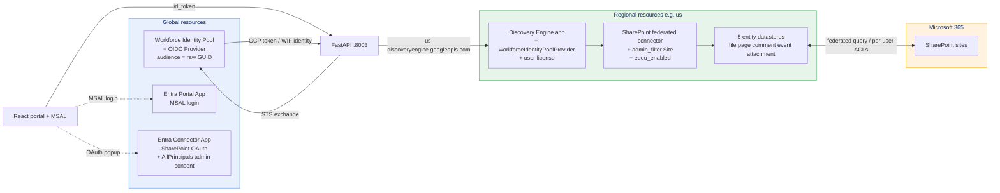
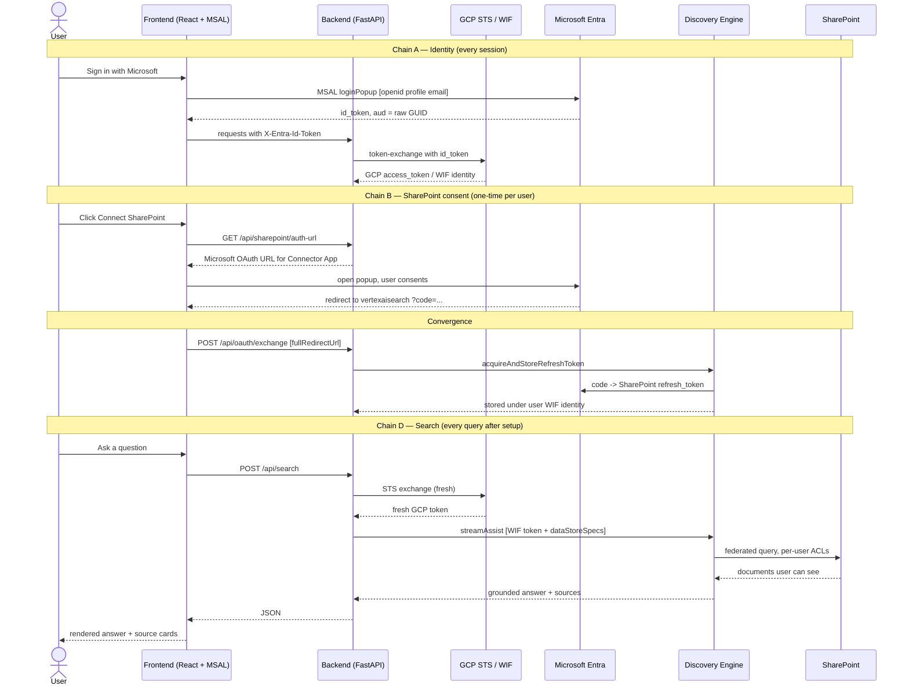

# Gemini Enterprise · SharePoint · WIF — End-to-End Flow

> A single-file reference for running **Gemini Enterprise streamAssist** + a **federated SharePoint connector** + **per-user ACLs** in any region (`global` or `us`), authenticated via **Workforce Identity Federation** with the **raw `client_id`** audience pattern.

---

## TL;DR

If federated search returns **0 results from your SharePoint connector** — even though every API call returns HTTP 200 — you almost certainly forgot one of these four post-create configurations on the engine:

| # | What | Where | Symptom when missing |
|---|---|---|---|
| 1 | `accessSettings.workforceIdentityPoolProvider` set on the engine | Cloud Console → Set up identity | Generic *"…I couldn't find that in our internal systems"* |
| 2 | `params.admin_filter.Site` populated on the connector | Set at connector creation only | Direct datastore search returns empty |
| 3 | Per-user `acquireAndStoreRefreshToken` for each searcher | Portal → Connect SharePoint button | *"…I couldn't find that in SharePoint"* |
| 4 | License seat assigned to the user on the engine | Cloud Console → Manage subscriptions | HTTP 400 `LICENSE_WITHOUT_SUBSCRIPTION_TIER` |

**Region (`global` vs `us`) is not the cause.** The same four steps are required either way.

---

## Table of contents

1. [Why this document exists](#1-why-this-document-exists)
2. [Architecture at a glance](#2-architecture-at-a-glance)
3. [The full request flow](#3-the-full-request-flow)
4. [The four mandatory configurations](#4-the-four-mandatory-configurations)
5. [Replication checklist](#5-replication-checklist)
6. [How to verify it works](#6-how-to-verify-it-works)
7. [Failure-mode lookup table](#7-failure-mode-lookup-table)
8. [Why "us doesn't work" was a red herring](#8-why-us-doesnt-work-was-a-red-herring)

---

## 1. Why this document exists

A customer reported *"Gemini Enterprise + SharePoint federated connector + WIF only works when the engine is in `global`."*

We rebuilt the same setup in `us` regional location. **It works end-to-end.** The customer's symptom was real, but the root cause was **never the region** — it was four post-creation configurations that are easy to miss when standing up a fresh engine.

This doc captures every step + every gotcha so the next engagement doesn't lose a day to the same dead end.

---

## 2. Architecture at a glance

### What lives where



### Two parallel chains converge into one search

The portal runs **two independent OAuth chains** that meet at a single API call (`acquireAndStoreRefreshToken`). After convergence, every search is a single quick round-trip.



---

## 3. The full request flow

> Each step name (e.g. `A1`, `D3`) matches the boxes in `frontend/src/App.tsx`'s debug sidebar — open it while the portal runs to see traces in real time.

### Chain A — Identity *(every session)*

#### A1 · MSAL Login &nbsp;`frontend/src/authConfig.ts`, `App.tsx:handleLogin`

- User clicks **Sign in with Microsoft**
- MSAL opens a popup at `https://login.microsoftonline.com/<TENANT_ID>/oauth2/v2.0/authorize`
- Scopes requested: `openid profile email` only — **no `api://...` scope**
- Microsoft v2.0 endpoint returns an `id_token` whose `aud` claim is the **raw `<PORTAL_CLIENT_ID>` GUID** (no `api://` prefix)

#### A2 · STS Token Exchange &nbsp;`backend/main.py:_exchange_token`

- Frontend sends the id_token to backend in the `X-Entra-Id-Token` header
- Backend POSTs to `https://sts.googleapis.com/v1/token`:
  | Field | Value |
  |---|---|
  | `grant_type` | `urn:ietf:params:oauth:grant-type:token-exchange` |
  | `audience` | `//iam.googleapis.com/locations/global/workforcePools/<POOL_ID>/providers/<PROVIDER_ID>` |
  | `subject_token` | the Entra id_token |
  | `subject_token_type` | `urn:ietf:params:oauth:token-type:id_token` |
- Returns a GCP access_token whose principal is the user's **WIF identity**:
  ```
  principal://iam.googleapis.com/locations/global/workforcePools/<POOL_ID>/subject/<sub-hash>
  ```

#### A3 · acquireAccessToken *(probe)*

- Backend POSTs to `…/dataConnector:acquireAccessToken` with the user's WIF token
- Returns `404` if no per-user SharePoint refresh token is stored on this connector → portal shows the **Connect SharePoint** button

---

### Chain B — SharePoint consent *(one-time per user per connector)*

#### B1 · Get Auth URL &nbsp;`backend/main.py:get_auth_url`

- Backend generates a Microsoft OAuth URL for the **Connector App** (not the Portal App)
- `redirect_uri` is hard-coded to `https://vertexaisearch.cloud.google.com/oauth-redirect`
- `state` is **base64-encoded JSON** containing `{origin, useBroadcastChannel, nonce}`
- Backend stores the user's id_token under that `nonce` so the callback can later mint a WIF token
- Scope list (the working set):
  ```
  openid offline_access
  https://<TENANT>.sharepoint.com/AllSites.Read
  https://<TENANT>.sharepoint.com/AllSites.Write
  https://<TENANT>.sharepoint.com/Files.Read.All
  https://<TENANT>.sharepoint.com/Files.ReadWrite.All
  https://<TENANT>.sharepoint.com/Sites.Manage.All
  https://<TENANT>.sharepoint.com/Sites.Read.All
  https://<TENANT>.sharepoint.com/Sites.Search.All
  ```

#### B2 · OAuth Consent Popup

- Frontend opens the URL in a popup
- User signs in to Microsoft, grants consent
- Microsoft redirects to `https://vertexaisearch.cloud.google.com/oauth-redirect?code=…&state=<base64>`

#### B3 · OAuth Redirect → postMessage

- The `vertexaisearch.cloud.google.com/oauth-redirect` page parses `code` and `state`, then `postMessage`s `{fullRedirectUrl, code, state}` back to `window.opener`

> [!WARNING]
> **COOP gotcha** — when the portal is on a different origin (e.g. `localhost:5174` vs `vertexaisearch.cloud.google.com`), the `postMessage` may be silently blocked. The code falls back to **popup-closed polling** at `App.tsx:285-310`.

---

### Convergence

#### C · acquireAndStoreRefreshToken &nbsp;`backend/main.py:oauth_exchange`

- Frontend forwards `fullRedirectUrl` to backend `/api/oauth/exchange`
- Backend re-runs the STS exchange with the stored id_token (looked up by `nonce`) → fresh GCP WIF token
- Backend POSTs to `…/dataConnector:acquireAndStoreRefreshToken`:
  - `Authorization: Bearer <user's WIF GCP token>`
  - body: `{"fullRedirectUri": "<the full callback URL with ?code=… still in it>"}`
- Discovery Engine extracts the auth code, exchanges it for a SharePoint refresh token, stores it **keyed by the user's WIF identity hash**

> [!IMPORTANT]
> The `Authorization` header **must** be a WIF token, not Application Default Credentials. If you call this with ADC, Discovery Engine stores the SharePoint token under the service account identity, and every later search by the actual user gets a 404 from `acquireAccessToken`.

---

### Chain D — Search *(every query after setup)*

#### D1 · Search request

- Frontend POSTs to `/api/search` with the question text + the cached `X-Entra-Id-Token` header

#### D2 · STS exchange *(fresh, re-run)*

- Same as A2 → produces a fresh GCP WIF token

#### D3 · streamAssist call &nbsp;`backend/main.py:_stream_assist`

**Endpoint:**
```
POST https://<HOST>/v1alpha/projects/<PROJECT_NUMBER>/locations/<LOCATION>/collections/default_collection/engines/<ENGINE_ID>/assistants/default_assistant:streamAssist
```
where:
- `<HOST>` = `discoveryengine.googleapis.com` for `global`, otherwise `<LOCATION>-discoveryengine.googleapis.com`
- `<LOCATION>` = `global` or a region like `us`

**Headers:**
| Header | Value |
|---|---|
| `Authorization` | `Bearer <WIF GCP token>` |
| `X-Goog-User-Project` | the **numeric project number** (not project ID) |
| `Content-Type` | `application/json` |

**Body:**
```json
{
  "query": {"text": "..."},
  "toolsSpec": {
    "vertexAiSearchSpec": {
      "dataStoreSpecs": [
        {"dataStore": "projects/<PROJECT_NUMBER>/locations/<LOC>/collections/default_collection/dataStores/<CONNECTOR_ID>_file"},
        {"dataStore": ".../<CONNECTOR_ID>_page"},
        {"dataStore": ".../<CONNECTOR_ID>_comment"},
        {"dataStore": ".../<CONNECTOR_ID>_event"},
        {"dataStore": ".../<CONNECTOR_ID>_attachment"}
      ]
    }
  }
}
```

> [!IMPORTANT]
> `dataStoreSpecs` **must** be nested in `toolsSpec.vertexAiSearchSpec`. Putting it at the root is silently ignored — the response will come back ungrounded. This is the single most common cause of *"no SharePoint sources"* that isn't a config issue.

#### D4 · Discovery Engine internals

1. DE reads the WIF principal from your `Authorization` header
2. DE looks up the stored SharePoint refresh token using the WIF identity hash
3. DE exchanges the refresh token for a fresh SharePoint access token
4. DE issues federated SharePoint search queries scoped to that user's ACLs
5. DE feeds matching documents into Gemini for grounded synthesis

#### D5 · Streaming response parsing

The response is a **JSON array of chunks**. To pull out the answer + sources:

| Field | What it contains |
|---|---|
| `answer.replies[].groundedContent.content.text` (when `thought` is not `true`) | The user-visible answer prose |
| `groundedContent.textGroundingMetadata.references[]` | Source documents — parse `ref.content` as JSON to get `title`, `url`, `description` |
| `sessionInfo.session` | Resource name to pass back as `session` in follow-up queries |

> [!TIP]
> Don't use `assistToken` for follow-ups. It's returned by the API but rejected as input. Use `sessionInfo.session` — it's a full resource name like `projects/.../sessions/...`.

---

## 4. The four mandatory configurations

If federated search returns 0 documents on a fresh engine, **one of these four is missing**. Required regardless of region.

### 4·1 &nbsp; Engine-level `workforceIdentityPoolProvider` &nbsp; ⭐ *most-missed*

**Why it matters.** Discovery Engine needs to know which IdP this engine's users come from, so it can forward the user's identity to SharePoint. Without it, federated queries return 0 results.

**Where it lives.** On the engine's `WidgetConfig.accessSettings`. The widget config is **created lazily by Cloud Console** the first time you visit the engine's overview page — so there's no API to create it from scratch; you must trigger Console once.

**How to set it.**
1. Cloud Console → AI Applications → Apps → `<ENGINE_ID>`
2. The **"Set up your workforce identity"** card appears on the dashboard — click **Set up identity**
3. Choose **Use a third-party identity provider**
4. **Workforce pool ID:** `locations/global/workforcePools/<POOL_ID>`
5. **Workforce provider ID:** `<PROVIDER_ID>`
6. Click **Confirm Workforce Identity**

You'll see ✅ *"Authentication configurations have been updated successfully"* and *"Workforce identity setup complete."*

> [!CAUTION]
> **Symptom when missing:** streamAssist responds HTTP 200 with a generic LLM answer that says *"I couldn't find any information about X in our internal systems"* and **NOT GROUNDED** — no sources. No error code, no warning. The silent killer.

---

### 4·2 &nbsp; Connector `params.admin_filter.Site` populated

**Why it matters.** The federated connector needs an explicit list of SharePoint site URLs to search. Empty list = nothing to search.

**How to set it (only at connector creation time).**

- **Console:** the SharePoint connector creation wizard auto-populates this when you click **Authorize**
- **REST:** include in the `params` of `setUpDataConnector`:
  ```json
  "params": {
    "admin_filter": {
      "Site": [
        "https://<TENANT>.sharepoint.com",
        "https://<TENANT>.sharepoint.com/sites/<TARGET_SITE>"
      ],
      "Path": []
    },
    "eeeu_enabled": true
  }
  ```

> [!WARNING]
> The `dataConnector` PATCH endpoint **does not allow** `admin_filter` to be updated post-creation. If you forgot it, you must delete the connector (which takes hours to fully purge) and recreate.

---

### 4·3 &nbsp; Per-user `acquireAndStoreRefreshToken`

**Why it matters.** Even with `AllPrincipals` admin consent on the Connector App and the engine-level WIF set, every user that searches must have **their own** SharePoint refresh token stored under their WIF identity hash on this specific connector.

**How it gets stored.**

**Normal flow** *(automatic via the portal):*

> Portal → **Connect SharePoint** → consent popup → vertexaisearch redirect → postMessage → backend `/api/oauth/exchange` → `…:acquireAndStoreRefreshToken`

**Programmatic / bootstrap flow** *(if you need to seed it from a script):*

```bash
# 1. Get user's id_token from MSAL (e.g. from sessionStorage)
# 2. Exchange for WIF GCP token via STS (see step A2)
# 3. Generate a Microsoft auth URL with the same scopes as B1, complete OAuth in a browser
# 4. Capture the full vertexaisearch redirect URL (includes ?code=… and &state=…)
# 5. POST it to acquireAndStoreRefreshToken:

curl -X POST \
  -H "Authorization: Bearer <USER_WIF_GCP_TOKEN>" \
  -H "X-Goog-User-Project: <PROJECT_NUMBER>" \
  -H "Content-Type: application/json" \
  "https://us-discoveryengine.googleapis.com/v1alpha/projects/<P>/locations/us/collections/<CONNECTOR_ID>/dataConnector:acquireAndStoreRefreshToken" \
  -d '{"fullRedirectUri": "https://vertexaisearch.cloud.google.com/oauth-redirect?code=…&state=…"}'
```

**Verify** with `…:acquireAccessToken` (empty `{}` body) — should return a `refreshTokenInfo` block listing the granted scopes, **not** 404.

> [!CAUTION]
> **Symptom when missing:** streamAssist responds with *"I couldn't find any information about X in SharePoint"* — note the wording is **"in SharePoint"**, distinct from §4·1's *"in our internal systems"*. The wording difference tells you which of the two configs is missing.

---

### 4·4 &nbsp; User license assigned to the engine

**Why it matters.** Each user querying the engine must hold a `SUBSCRIPTION_TIER_SEARCH_AND_ASSISTANT` license seat for that **specific** engine. Licenses are per-engine, not project-wide.

**How to set it.**
- Cloud Console → AI Applications → Apps → `<ENGINE_ID>` → **Manage subscriptions** → assign the user

> [!CAUTION]
> **Symptom when missing:** API returns HTTP 400 with `LICENSE_WITHOUT_SUBSCRIPTION_TIER` and `requiredSubscriptionTier: "SUBSCRIPTION_TIER_SEARCH_AND_ASSISTANT"`. Easy to spot.

---

## 5. Replication checklist

Greenfield → grounded answer. Tick each box in order.

### Prerequisites *(one-time per project)*

- [ ] GCP project with **Discovery Engine API** + **AI Platform API** enabled
- [ ] Workforce Identity Pool exists at `locations/global/workforcePools/<POOL_ID>`
- [ ] OIDC Provider in that pool with:
  - `client_id` = **raw GUID** of the Portal App (NO `api://` prefix)
  - `issuer_uri` = `https://login.microsoftonline.com/<TENANT_ID>/v2.0` *(or v1.0 `https://sts.windows.net/<TENANT_ID>/` works too)*
  - `attribute_mapping`: `google.subject = assertion.sub`
- [ ] WIF `principalSet` has IAM roles on the project:
  - `roles/discoveryengine.editor` *(covers streamAssist permission)*
  - `roles/discoveryengine.user`
  - `roles/discoveryengine.viewer`

### Microsoft Entra apps *(one-time per tenant)*

- [ ] **Portal App** registered as **SPA** with `redirect_uri = http://<frontend-host>`; manifest sets `oauth2AllowIdTokenImplicitFlow: true`
- [ ] **Connector App** registered as **Web** with `redirect_uri = https://vertexaisearch.cloud.google.com/oauth-redirect`
  - Delegated SharePoint permissions: `AllSites.Read`, `AllSites.Write`, `Files.Read.All`, `Files.ReadWrite.All`, `Sites.Manage.All`, `Sites.Read.All`, `Sites.Search.All`
  - Microsoft Graph: `openid`, `offline_access`
  - **Admin consent granted (AllPrincipals)**
  - Client secret created and saved

### Per-engine setup *(repeat for each engine you create)*

- [ ] Discovery Engine app created at `locations/<LOCATION>` with `searchTier=ENTERPRISE` + `searchAddOns=[LLM]`
- [ ] SharePoint federated connector created via `setUpDataConnector` with:
  - `params.admin_filter.Site` populated &nbsp;**← config #4·2**
  - `params.eeeu_enabled = true`
  - `params.refresh_token` = an admin-bootstrapped SharePoint refresh token
  - `actionConfig.actionParams.{tenant_id, client_id, client_secret}` set
  - `actionConfig.createBapConnection = true`
- [ ] `engine.dataStoreIds` patched to include the 5 connector child datastores (`_file`, `_page`, `_comment`, `_event`, `_attachment`)
- [ ] Engine `workforceIdentityPoolProvider` set via Console **Set up identity** &nbsp;**← config #4·1**

### Per-user setup

- [ ] Each user assigned a license on this engine &nbsp;**← config #4·4**
- [ ] Each user runs the portal **Connect SharePoint** flow once &nbsp;**← config #4·3**

### Done

- [ ] Search returns grounded answers with source documents

---

## 6. How to verify it works

After a real query in the portal, **all three** signals should be true:

| # | Signal | Where to look |
|---|---|---|
| 1 | API host is regional | DevTools → Network panel: requests hit `<LOCATION>-discoveryengine.googleapis.com` (or unprefixed for `global`) |
| 2 | id_token `aud` is raw GUID | Decode at jwt.io: `aud` matches the Portal App client_id without `api://` prefix |
| 3 | Response is grounded | streamAssist response has `groundedContent.textGroundingMetadata.references[]` populated; UI shows green **GROUNDED** badge with source cards |

If all three pass, the proof is closed.

---

## 7. Failure-mode lookup table

| Symptom | Likely cause | Fix in |
|---|---|---|
| HTTP 400 `LICENSE_WITHOUT_SUBSCRIPTION_TIER` | User has no license on this engine | §4·4 |
| `acquireAccessToken` → 404 *"authorization not found"* | No per-user refresh token stored | §4·3 |
| Answer says *"…in our internal systems"*, NOT GROUNDED | Engine `workforceIdentityPoolProvider` missing | §4·1 |
| Answer says *"…in SharePoint"*, NOT GROUNDED | Per-user refresh token missing on this connector | §4·3 |
| Direct datastore search returns empty `summary` | Connector `admin_filter.Site` empty | §4·2 *(recreate)* |
| HTTP 401 on streamAssist (other endpoints work) | WIF principal missing `roles/discoveryengine.editor` | grant on the project |
| HTTP 500 on streamAssist | `X-Goog-User-Project` is project ID, not project number | use the numeric project number |
| STS error *"audience does not match"* | WIF provider `client-id` mismatches the id_token's `aud` | re-create the OIDC provider with the correct value |
| *"Last unit does not have enough valid bits"* on the redirect page | The `state` param wasn't base64-encoded JSON | base64-encode `{origin, useBroadcastChannel, nonce}` |
| OAuth popup closes immediately, no consent screen | Cached MSAL session + COOP blocked the postMessage | popup-closed polling fallback (already implemented) |
| `dataStoreSpecs` set but answer is generic + ungrounded | `dataStoreSpecs` placed at root instead of `toolsSpec.vertexAiSearchSpec` | nest it correctly |

---

## 8. Why "us doesn't work" was a red herring

The customer's working setup happened to be in `global` only because that engine had been provisioned earlier with §4·1, §4·2, §4·3, and §4·4 all completed. When they tried `us`, they created a fresh engine + connector but didn't realize **those four post-creation configurations were missing**.

> The same four steps are required in `global`. They just weren't aware of them, because their `global` setup had been working since before they started looking at `us`.

The **technical chain** — STS exchange, raw `client_id` audience, streamAssist API contract, federated SharePoint, per-user ACLs — behaves **identically** between `global` and `us`. The only code differences are:

| | `global` | regional (e.g. `us`) |
|---|---|---|
| API host | `discoveryengine.googleapis.com` | `<LOCATION>-discoveryengine.googleapis.com` |
| Resource paths | `/locations/global/` | `/locations/<LOCATION>/` |
| WIF audience path | `/locations/global/workforcePools/...` | **same** *(workforce pools are inherently global)* |

That's it. Three lines of code. No region-specific behavior in the auth chain or the API contract.

---

<sub>Built and validated end-to-end against a `us`-region Discovery Engine app.</sub>
