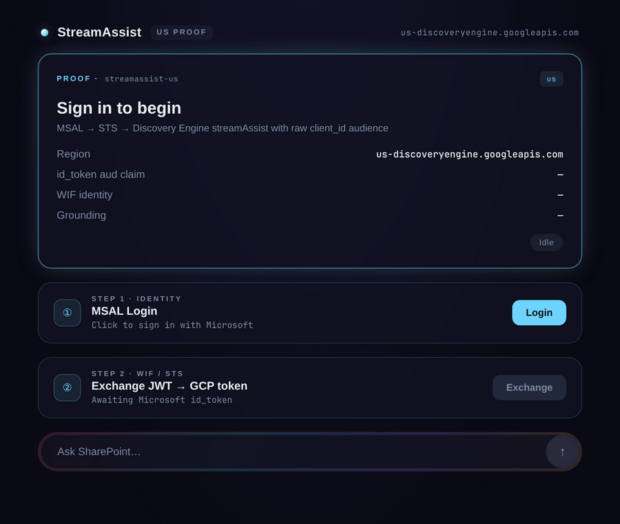

# StreamAssist · US

> *Gemini Enterprise streamAssist + SharePoint federated connector + per-user ACLs running in **us** regional location, with raw client_id WIF audience.*


**Full flow doc:** [FLOW.md](FLOW.md) — single-file end-to-end reference

---

## Why this project exists

A customer claimed Gemini Enterprise + SharePoint federated connector + WIF only worked in `global` location after switching from `us`. This portal is a working counter-example: same flow as [`streamassist-oauth-flow`](../streamassist-oauth-flow/), but the engine and connector live in `us`, and the WIF provider uses **raw client_id audience** (no `api://` prefix) — matching the customer's Entra app pattern.

If this works (it does — see the [demo](#demo)), the customer's "must use global" conclusion was a misconfiguration, not a regional limitation.

## What's different from `streamassist-oauth-flow`

| | This project | streamassist-oauth-flow |
|---|---|---|
| GE region | **us** (`us-discoveryengine.googleapis.com`) | global |
| Engine | new `us`-region engine | existing `global`-region engine |
| Connector | new SharePoint federated connector at `locations/us` | existing one at `locations/global` |
| MSAL scope | **No `api://` scope** — just `openid profile email` | `api://{client-id}/user_impersonation` (also produces raw GUID `aud` on v2.0) |
| WIF provider | OIDC provider with `--client-id="{RAW_GUID}"` (no `api://` prefix) | same |
| Entra apps | same Portal App + Connector App registrations | same |

Everything else — STS exchange, `acquireAndStoreRefreshToken`, streamAssist payload — is identical.

## Demo



▶ **Higher-quality video:** [docs/demo-us.mp4](docs/demo-us.mp4) *(open raw to play)*

End-to-end: MSAL login → STS exchange → SharePoint consent → grounded answer with source cards. All API calls hit `us-discoveryengine.googleapis.com`. Sensitive identifiers in the recording are redacted.

## The proof in three signals

1. **Network panel** shows requests to `us-discoveryengine.googleapis.com` (not `discoveryengine.googleapis.com`)
2. **Decoded id_token** has `aud` = raw client_id GUID (not `api://...`)
3. **streamAssist response** is grounded — `textGroundingMetadata.references` populated with SharePoint sources

See [FLOW.md](FLOW.md) for the full step-by-step + the four mandatory configurations.

## Quickstart

```bash
# Backend
cd backend && cp .env.example .env  # values already set for our test setup
uv sync && uv run python main.py    # port 8003

# Frontend
cd frontend && cp .env.example .env
npm install && npm run dev          # port 5174
```

Open `http://localhost:5174`, sign in with Microsoft, click **Connect SharePoint**, ask "What are the latest financial reports?".

## What had to change in the code

Three lines in `backend/main.py`. Nothing else.

```python
# 1. API host + path location
LOCATION = os.environ.get("LOCATION", "us")
API_HOST = "discoveryengine.googleapis.com" if LOCATION == "global" \
           else f"{LOCATION}-discoveryengine.googleapis.com"
BASE = f"https://{API_HOST}/v1alpha/projects/{PROJECT_NUMBER}/locations/{LOCATION}/collections"

# 2. dataStore path
ds_base = f"projects/{PROJECT_NUMBER}/locations/{LOCATION}/collections/default_collection/dataStores/{CONNECTOR_ID}"

# 3. WIF audience — UNCHANGED (workforce pools are global-only by design)
"audience": f"//iam.googleapis.com/locations/global/workforcePools/{WIF_POOL_ID}/providers/{WIF_PROVIDER_ID}"
```

> [!IMPORTANT]
> **WIF workforce pools are always at `/locations/global/`**, even when the Discovery Engine engine is regional. The "regional" choice is the engine + datastore location, not the WIF identity path. Only the API host (`us-discoveryengine.googleapis.com`) and the resource path (`/locations/us/`) change.

## Gotchas (in addition to the original project's [Gotchas](../streamassist-oauth-flow/README.md#gotchas))

| | Issue | Detail |
|---|-------|--------|
| 1 | **`global-discoveryengine.googleapis.com` does NOT exist** | When LOCATION is `global`, the API host has no prefix. The conditional in `BASE` handles this. |
| 2 | **WIF audience path stays global** | Even for `us` engines, keep `/locations/global/workforcePools/...`. Workforce pools cannot be regional. |
| 3 | **Datastores are location-scoped** | A `global` SharePoint datastore cannot be queried from a `us` engine. We had to create a fresh SharePoint connector in `us`. |
| 4 | **Connector setUp needs an admin refresh token** | The `setUpDataConnector` REST API requires a SharePoint admin refresh token even in federated mode. Use Microsoft's **device code flow** to bootstrap one without modifying the Entra app's redirect URIs. |

## Layout

```
streamassist-oauth-flow-us/
├── backend/
│   ├── main.py              # 3-line region change vs original
│   ├── .env.example
│   └── pyproject.toml
├── frontend/
│   ├── src/
│   │   ├── App.tsx          # STAGE_INFO copy updated for US + raw-GUID
│   │   ├── authConfig.ts    # MSAL scopes: NO api:// — just openid/profile/email
│   │   └── main.tsx
│   └── .env.example
├── tester/                  # single-file HTML auth-chain tester (port 5175)
├── docs/
│   └── demo-us.gif
├── FLOW.md                  # full end-to-end flow doc
└── README.md
```

---

Built by [Jesus Chavez](https://www.linkedin.com/in/jchavezar/) — Customer Engineer, Google Cloud.
