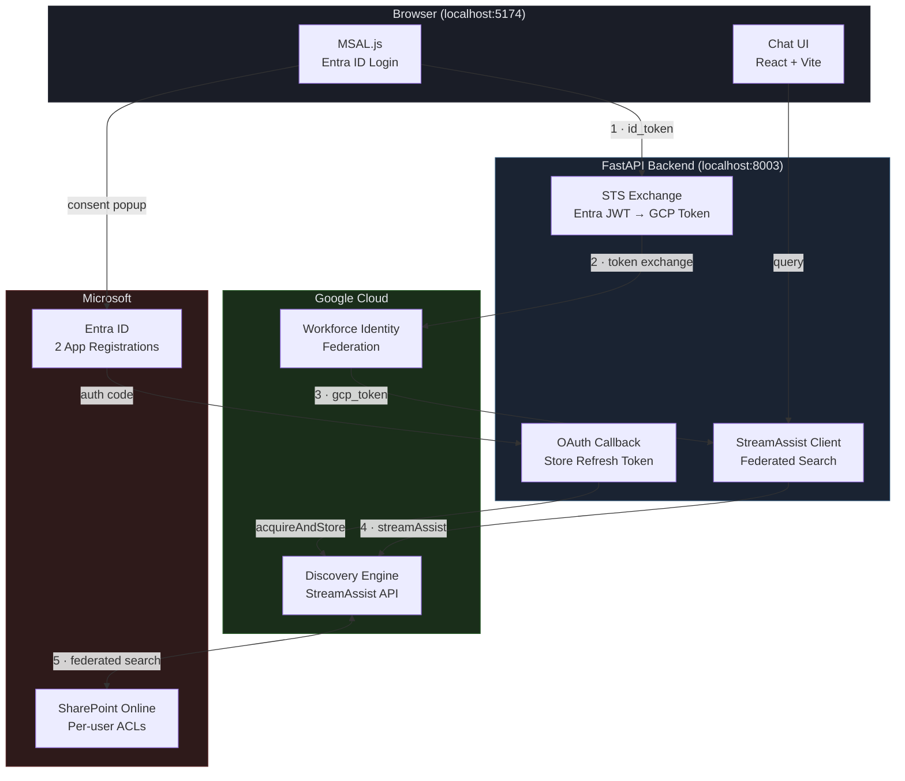
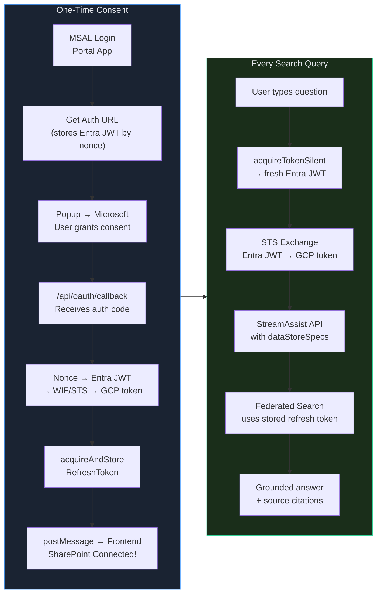

# StreamAssist OAuth Flow

> *Custom SharePoint Portal — Gemini Enterprise StreamAssist with per-user OAuth, zero credential storage.*


Search SharePoint documents via StreamAssist **without the Gemini Enterprise UI**. Users sign in with Microsoft, authorize SharePoint once, then ask natural language questions. StreamAssist does **federated search** (real-time, not indexed) with per-user ACL enforcement.

---

## Architecture



---

## Auth Lifecycle

The complete lifecycle from first visit to search results — inspired by the event-driven pattern from [Claude Code Hooks](https://docs.anthropic.com/en/docs/claude-code/hooks).



---

## Code Walkthrough — Auth Cycle

Each step maps to a numbered arrow in the architecture diagram above.

### Step 1 · MSAL Login → Entra JWT

The frontend authenticates via MSAL.js against the **Portal App** registration. The `api://{client-id}/user_impersonation` scope is critical — it sets the `aud` claim that WIF validates.

```ts
// authConfig.ts — MSAL configuration
export const loginRequest = {
  scopes: [
    `api://${CLIENT_ID}/user_impersonation`,  // aud claim for WIF
    'openid', 'profile', 'email',
  ],
};
```

```ts
// App.tsx — acquire token silently (or popup fallback)
const getToken = async (): Promise<string | null> => {
  try {
    const resp = await instance.acquireTokenSilent({
      ...loginRequest, account: accounts[0],
    });
    return resp.idToken;  // Entra JWT — sent as X-Entra-Id-Token header
  } catch {
    return (await instance.acquireTokenPopup(loginRequest)).idToken;
  }
};
```

### Step 2 · STS Token Exchange — Entra JWT → GCP Token

The backend exchanges the Entra JWT for a GCP access token via [Workforce Identity Federation](https://cloud.google.com/iam/docs/workforce-identity-federation). The `audience` must match the WIF provider, and `subjectTokenType` must be `id_token`.

```python
# main.py — _exchange_token()
def _exchange_token(entra_jwt: str) -> Optional[str]:
    resp = requests.post("https://sts.googleapis.com/v1/token", json={
        "audience": (
            f"//iam.googleapis.com/locations/global/workforcePools"
            f"/{WIF_POOL_ID}/providers/{WIF_PROVIDER_ID}"
        ),
        "grantType": "urn:ietf:params:oauth:grant-type:token-exchange",
        "requestedTokenType": "urn:ietf:params:oauth:token-type:access_token",
        "scope": "https://www.googleapis.com/auth/cloud-platform",
        "subjectToken": entra_jwt,           # the Entra id_token from Step 1
        "subjectTokenType": "urn:ietf:params:oauth:token-type:id_token",
    }, timeout=10)
    return resp.json().get("access_token") if resp.ok else None
```

### Step 3 · SharePoint OAuth Consent (one-time)

The user clicks **Connect SharePoint** → popup opens Microsoft login for the **Connector App**. The backend generates the auth URL, storing the Entra JWT by nonce so it can be retrieved in the callback.

```python
# main.py — get_auth_url()
@app.get("/api/sharepoint/auth-url")
async def get_auth_url(request: Request):
    nonce = secrets.token_urlsafe(16)
    _pending_consents[nonce] = entra_jwt     # store JWT for callback

    params = {
        "client_id": CONNECTOR_CLIENT_ID,    # Connector App (not Portal App)
        "response_type": "code",
        "redirect_uri": REDIRECT_URI,        # /api/oauth/callback
        "scope": SP_SCOPES,                  # SharePoint AllSites.Read + Sites.Search.All
        "state": json.dumps({"origin": origin, "nonce": nonce}),
    }
    url = f"https://login.microsoftonline.com/{TENANT_ID}/oauth2/v2.0/authorize?{urlencode(params)}"
    return {"auth_url": url}
```

### Step 4 · OAuth Callback → `acquireAndStoreRefreshToken`

Microsoft redirects to `/api/oauth/callback` with an auth code. The backend retrieves the stored Entra JWT by nonce, exchanges it for a WIF/GCP token (Step 2 again), then calls Discovery Engine to store the SharePoint refresh token **under that WIF identity**.

```python
# main.py — oauth_callback()
@app.get("/api/oauth/callback")
async def oauth_callback(request: Request):
    nonce = state.get("nonce", "")
    entra_jwt = _pending_consents.pop(nonce, None)  # retrieve stored JWT
    gcp_token = _exchange_token(entra_jwt)           # WIF token (not ADC!)

    # Store the SharePoint refresh token under this WIF identity
    resp = requests.post(
        f"{CONNECTOR_URL}/dataConnector:acquireAndStoreRefreshToken",
        headers=_gcp_headers(gcp_token),
        json={"fullRedirectUri": str(request.url)},  # contains the auth code
    )
    # postMessage back to frontend → "SharePoint Connected!"
```

> **Why WIF, not ADC?** The token identifies the user. If you use ADC (service account), `acquireAccessToken` later returns 404 because the identity that stored the token doesn't match the identity requesting it.

### Step 5 · StreamAssist Federated Search

Every search query goes through the same STS exchange (Steps 1-2), then calls StreamAssist with all 5 data store entity types. StreamAssist uses the stored refresh token to query SharePoint with the user's ACLs.

```python
# main.py — _stream_assist()
def _stream_assist(gcp_token, query, session_token=None):
    ds_base = f"{BASE}/default_collection/dataStores/{CONNECTOR_ID}"
    payload = {
        "query": {"text": query},
        "dataStoreSpecs": [
            {"dataStore": f"{ds_base}_{et}"}
            for et in ["file", "page", "comment", "event", "attachment"]
        ],
    }
    if session_token:
        payload["session"] = session_token   # NOT "assistToken" — that field is rejected

    resp = requests.post(STREAMASSIST_URL, headers=_gcp_headers(gcp_token),
                         json=payload, timeout=60)
```

### Step 6 · Session Continuity

StreamAssist returns an opaque `assistToken` in responses — **but rejects it as input**. For follow-up queries, use `sessionInfo.session` (a resource name like `projects/.../sessions/...`).

```python
# main.py — extracting session from response
for chunk in chunks:
    session_name = chunk.get("sessionInfo", {}).get("session") or session_name
    #                        ^^^^^^^^^^^^^^^^^^^^^^^^^^^^^^^^^^^
    #                        Use this, NOT chunk["assistToken"]
```

```ts
// App.tsx — sending session on follow-up queries
const resp = await fetch('/api/search', {
  method: 'POST',
  headers: { 'Content-Type': 'application/json', 'X-Entra-Id-Token': token },
  body: JSON.stringify({ query: q, session_token: sessionToken }),
  //                                ^^^^^^^^^^^^^ sessionInfo.session from previous response
});
if (data.session_token) setSessionToken(data.session_token);
```

---

## What Makes It Work

These are the non-obvious constraints that aren't in any public documentation. Each one was discovered through trial-and-error.

> [!WARNING]
> **Read these before attempting setup.** Skipping any single item causes silent failures — the API returns HTTP 200 with plausible-looking answers from training data, not your SharePoint.

| # | Constraint | Why It Matters |
|---|-----------|----------------|
| 1 | **WIF token for `acquireAndStoreRefreshToken`** | The token identifies the user. If you use ADC instead of WIF, `acquireAccessToken` later returns 404 because the identity doesn't match. |
| 2 | **`session` field, not `assistToken`** | StreamAssist returns `assistToken` in responses but rejects it as input. Use `sessionInfo.session` (a resource name) for follow-up queries. |
| 3 | **Natural language queries only** | Keyword queries like `"Apex Financial"` are silently skipped (`NON_ASSIST_SEEKING_QUERY_IGNORED`). Always use full questions. |
| 4 | **All 5 entity types in `dataStoreSpecs`** | `file`, `page`, `comment`, `event`, `attachment` — each is a separate data store named `{connector}_{type}`. Missing any means missing results. |
| 5 | **`oauth2AllowIdTokenImplicitFlow: true`** | Required in the Portal App's Entra manifest for WIF to accept the id_token. Without it, STS exchange silently fails. |

---

## Configuration

<details>
<summary><strong>Microsoft Entra ID</strong> — 2 app registrations required</summary>

### Portal App (MSAL login)

The frontend uses this to sign users in and get Entra ID tokens for WIF exchange.

| Setting | Value |
|---------|-------|
| App type | Single-page application |
| Redirect URI | `http://localhost:5174` |
| Supported account types | Single tenant |
| Expose an API | `api://{client-id}/user_impersonation` |
| Manifest flag | `"oauth2AllowIdTokenImplicitFlow": true` |
| Token configuration | Add `email` optional claim to ID token |

### Connector App (SharePoint OAuth)

Discovery Engine uses this to access SharePoint on behalf of users.

| Setting | Value |
|---------|-------|
| App type | Web |
| Redirect URI | `http://localhost:8003/api/oauth/callback` |
| Client secret | Generate one, add to `.env` |
| API permissions | `SharePoint > AllSites.Read`, `SharePoint > Sites.Search.All` |
| Admin consent | Grant admin consent for the tenant |

</details>

<details>
<summary><strong>Google Cloud</strong> — WIF + Discovery Engine</summary>

### Workforce Identity Federation

| Resource | Configuration |
|----------|--------------|
| Pool | Name: `sp-wif-pool-v2`, session duration: 1h |
| Provider | Name: `ge-login-provider`, OIDC, issuer: `https://login.microsoftonline.com/{tenant}/v2.0` |
| Audience | `api://{portal-app-client-id}` (must match Portal App) |
| Attribute mapping | `google.subject = assertion.sub` |
| IAM binding | `principalSet://...` → `roles/discoveryengine.editor` on the project |

### Discovery Engine

| Resource | Configuration |
|----------|--------------|
| Engine | Type: `GENERIC`, name: `gemini-enterprise` |
| Connector | SharePoint connector, ID: `sharepoint-data-def-connector` |
| Data stores | 5 auto-created: `{connector}_file`, `_page`, `_comment`, `_event`, `_attachment` |
| Entity types | All 5 must be included in `dataStoreSpecs` for search |

</details>

<details>
<summary><strong>Environment Variables</strong></summary>

**Backend `.env`**

```env
PROJECT_NUMBER=REDACTED_PROJECT_NUMBER
ENGINE_ID=gemini-enterprise
CONNECTOR_ID=sharepoint-data-def-connector
WIF_POOL_ID=sp-wif-pool-v2
WIF_PROVIDER_ID=ge-login-provider
CONNECTOR_CLIENT_ID=22c127d8-...
TENANT_ID=de46a3fd-...
```

**Frontend `.env`**

```env
VITE_CLIENT_ID=7868d053-...    # Portal App
VITE_TENANT_ID=de46a3fd-...
```

</details>

---

## Quick Start

```bash
# Backend
cd backend && uv sync && uv run uvicorn main:app --reload --port 8003

# Frontend (new terminal)
cd frontend && npm install && npm run dev
# → http://localhost:5174
```

1. Sign in with Microsoft (MSAL popup)
2. Click **Connect SharePoint** (one-time OAuth consent)
3. Ask a natural language question about your documents

---

## API

The backend exposes 5 endpoints. Click any to see the implementation.

<details>
<summary><code>GET</code> <strong><code>/health</code></strong> — Health check</summary>

```python
@app.get("/health")
async def health():
    return {"status": "healthy"}
```

</details>

<details>
<summary><code>GET</code> <strong><code>/api/sharepoint/auth-url</code></strong> — Generate Microsoft OAuth URL for consent popup</summary>

Stores the caller's Entra JWT by nonce so the callback can retrieve it later for WIF exchange.

```python
@app.get("/api/sharepoint/auth-url")
async def get_auth_url(request: Request):
    entra_jwt = request.headers.get("X-Entra-Id-Token")
    nonce = secrets.token_urlsafe(16)
    _pending_consents[nonce] = entra_jwt          # store for callback

    params = {
        "client_id": CONNECTOR_CLIENT_ID,          # Connector App, not Portal App
        "response_type": "code",
        "redirect_uri": REDIRECT_URI,              # /api/oauth/callback
        "scope": SP_SCOPES,                        # AllSites.Read + Sites.Search.All
        "state": json.dumps({"origin": origin, "nonce": nonce}),
        "prompt": "login",
    }
    url = f"https://login.microsoftonline.com/{TENANT_ID}/oauth2/v2.0/authorize?{urlencode(params)}"
    return {"auth_url": url}
```

**Frontend caller:**
```ts
const resp = await fetch(`/api/sharepoint/auth-url?login_hint=${username}`, {
  headers: { 'X-Entra-Id-Token': token },
});
const { auth_url } = await resp.json();
popup.location.href = auth_url;
```

</details>

<details>
<summary><code>GET</code> <strong><code>/api/oauth/callback</code></strong> — OAuth redirect target — stores refresh token via WIF</summary>

Microsoft redirects here with an auth code. The nonce in `state` retrieves the stored Entra JWT → WIF exchange → `acquireAndStoreRefreshToken` stores the SharePoint refresh token under that WIF identity.

```python
@app.get("/api/oauth/callback")
async def oauth_callback(request: Request):
    state = json.loads(request.query_params.get("state", "{}"))
    nonce = state.get("nonce", "")

    # Retrieve stored Entra JWT → exchange for GCP token via WIF
    entra_jwt = _pending_consents.pop(nonce, None)
    gcp_token = _exchange_token(entra_jwt)          # WIF token, NOT ADC

    # Store SharePoint refresh token under this WIF identity
    resp = requests.post(
        f"{CONNECTOR_URL}/dataConnector:acquireAndStoreRefreshToken",
        headers=_gcp_headers(gcp_token),
        json={"fullRedirectUri": str(request.url)},  # contains the auth code
    )

    # postMessage back to frontend popup → "SharePoint Connected!"
    return _callback_page("SharePoint Connected!", ...)
```

> **Why WIF, not ADC?** If you use ADC here, `acquireAccessToken` later returns 404 — the identity that *stored* the token doesn't match the identity *requesting* it.

</details>

<details>
<summary><code>GET</code> <strong><code>/api/sharepoint/check-connection</code></strong> — Verify user has a stored SharePoint token</summary>

Exchanges the Entra JWT for a WIF/GCP token, then calls `acquireAccessToken` to check if a SharePoint refresh token exists for this identity.

```python
@app.get("/api/sharepoint/check-connection")
async def check_connection(request: Request):
    gcp_token = _get_gcp_token(request)             # Entra JWT → WIF → GCP token
    if not gcp_token:
        return {"connected": False}

    resp = requests.post(
        f"{CONNECTOR_URL}/dataConnector:acquireAccessToken",
        headers=_gcp_headers(gcp_token),
        json={},
    )
    return {"connected": resp.ok and bool(resp.json().get("accessToken"))}
```

**Frontend caller** (on mount):
```ts
const resp = await fetch('/api/sharepoint/check-connection', {
  headers: { 'X-Entra-Id-Token': token },
});
const { connected } = await resp.json();
```

</details>

<details>
<summary><code>POST</code> <strong><code>/api/search</code></strong> — StreamAssist federated search with session continuity</summary>

Calls StreamAssist with all 5 entity types. Uses `session` (not `assistToken`) for follow-up queries.

```python
@app.post("/api/search")
async def search(request: Request, body: SearchRequest):
    gcp_token = _get_gcp_token(request)
    return await asyncio.to_thread(_stream_assist, gcp_token, body.query, body.session_token)

def _stream_assist(gcp_token, query, session_token=None):
    ds_base = f"{BASE}/default_collection/dataStores/{CONNECTOR_ID}"
    payload = {
        "query": {"text": query},
        "dataStoreSpecs": [
            {"dataStore": f"{ds_base}_{et}"}
            for et in ["file", "page", "comment", "event", "attachment"]
        ],
    }
    if session_token:
        payload["session"] = session_token           # NOT "assistToken"

    resp = requests.post(STREAMASSIST_URL, headers=_gcp_headers(gcp_token),
                         json=payload, timeout=60)

    # Parse: skip thought chunks, extract text + sources + session name
    for chunk in chunks:
        session_name = chunk.get("sessionInfo", {}).get("session") or session_name
        for reply in chunk.get("answer", {}).get("replies", []):
            content = reply.get("groundedContent", {}).get("content", {})
            if not content.get("thought") and content.get("text"):
                answer_parts.append(content["text"])

    return {"answer": "".join(answer_parts), "sources": unique, "session_token": session_name}
```

**Frontend caller:**
```ts
const resp = await fetch('/api/search', {
  method: 'POST',
  headers: { 'Content-Type': 'application/json', 'X-Entra-Id-Token': token },
  body: JSON.stringify({ query: q, session_token: sessionToken }),
});
```

</details>

---

## Project Structure

```
streamassist-oauth-flow/
├── backend/
│   ├── main.py              # 175 lines — complete backend
│   ├── .env                 # GCP + Entra configuration
│   └── pyproject.toml
├── frontend/
│   ├── src/
│   │   ├── App.tsx          # 265 lines — chat UI + OAuth flow
│   │   ├── authConfig.ts    # MSAL configuration
│   │   ├── main.tsx         # React entry point
│   │   └── index.css        # Dark theme styles
│   ├── .env                 # VITE_CLIENT_ID + VITE_TENANT_ID
│   └── package.json
└── README.md
```

---

## Identity Chain

Two Entra apps, one WIF pool, one token exchange — zero stored credentials.

```
Portal App (7868d053)           Connector App (22c127d8)
       │                               │
 MSAL login → id_token           OAuth consent → auth code
       │                               │
 STS exchange (WIF)              acquireAndStoreRefreshToken
       │                               │
 GCP access token                stored refresh token
       │                               │
 StreamAssist API  ◄──── uses stored token to query SharePoint
```

| Component | Purpose |
|-----------|---------|
| Portal App | MSAL login — provides Entra JWT for WIF exchange |
| Connector App | SharePoint consent — provides auth code for refresh token storage |
| WIF Pool (`sp-wif-pool-v2`) | Maps Entra JWT `sub` claim to GCP identity |
| Discovery Engine (`gemini-enterprise`) | StreamAssist engine with SharePoint connector |

---

## Key Difference from `sharepoint_wif_portal`

| | `sharepoint_wif_portal` | `streamassist-oauth-flow` |
|---|---|---|
| **Auth flow** | Google's oauth-redirect + postMessage relay | Direct OAuth callback on our backend |
| **Token storage** | ADC or WIF | WIF only (correct identity mapping) |
| **Search** | StreamAssist + Graph Search + Gemini | StreamAssist only (federated) |
| **Backend size** | ~800 lines | 175 lines |
| **Endpoints** | 8+ | 5 |
| **Agent support** | InsightComparator ADK agent | Not needed — StreamAssist handles everything |
