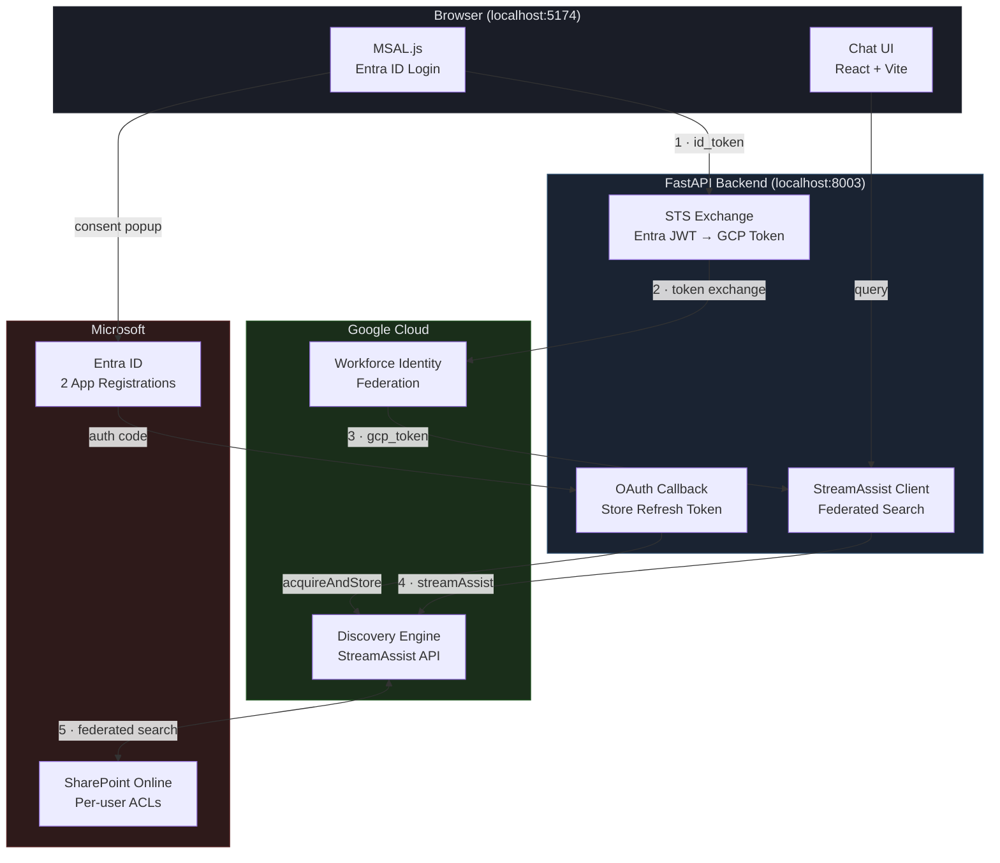
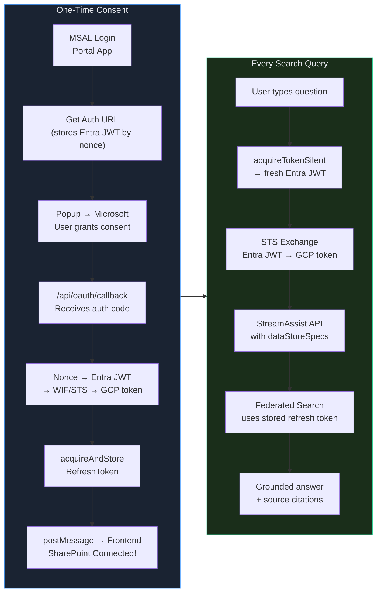

# StreamAssist OAuth Flow

> *Custom SharePoint Portal — Gemini Enterprise StreamAssist with per-user OAuth, zero credential storage.*


Search SharePoint documents via StreamAssist **without the Gemini Enterprise UI**. Users sign in with Microsoft, authorize SharePoint once, then ask natural language questions. StreamAssist does **federated search** (real-time, not indexed) with per-user ACL enforcement.

---

## Architecture



---

## Auth Lifecycle

The complete lifecycle from first visit to search results — inspired by the event-driven pattern from [Claude Code Hooks](https://docs.anthropic.com/en/docs/claude-code/hooks).



---

## What Makes It Work

These are the non-obvious constraints that aren't in any public documentation. Each one was discovered through trial-and-error.

> [!WARNING]
> **Read these before attempting setup.** Skipping any single item causes silent failures — the API returns HTTP 200 with plausible-looking answers from training data, not your SharePoint.

| # | Constraint | Why It Matters |
|---|-----------|----------------|
| 1 | **WIF token for `acquireAndStoreRefreshToken`** | The token identifies the user. If you use ADC instead of WIF, `acquireAccessToken` later returns 404 because the identity doesn't match. |
| 2 | **`session` field, not `assistToken`** | StreamAssist returns `assistToken` in responses but rejects it as input. Use `sessionInfo.session` (a resource name) for follow-up queries. |
| 3 | **Natural language queries only** | Keyword queries like `"Apex Financial"` are silently skipped (`NON_ASSIST_SEEKING_QUERY_IGNORED`). Always use full questions. |
| 4 | **All 5 entity types in `dataStoreSpecs`** | `file`, `page`, `comment`, `event`, `attachment` — each is a separate data store named `{connector}_{type}`. Missing any means missing results. |
| 5 | **`oauth2AllowIdTokenImplicitFlow: true`** | Required in the Portal App's Entra manifest for WIF to accept the id_token. Without it, STS exchange silently fails. |

---

## Configuration

<details>
<summary><strong>Microsoft Entra ID</strong> — 2 app registrations required</summary>

### Portal App (MSAL login)

The frontend uses this to sign users in and get Entra ID tokens for WIF exchange.

| Setting | Value |
|---------|-------|
| App type | Single-page application |
| Redirect URI | `http://localhost:5174` |
| Supported account types | Single tenant |
| Expose an API | `api://{client-id}/user_impersonation` |
| Manifest flag | `"oauth2AllowIdTokenImplicitFlow": true` |
| Token configuration | Add `email` optional claim to ID token |

### Connector App (SharePoint OAuth)

Discovery Engine uses this to access SharePoint on behalf of users.

| Setting | Value |
|---------|-------|
| App type | Web |
| Redirect URI | `http://localhost:8003/api/oauth/callback` |
| Client secret | Generate one, add to `.env` |
| API permissions | `SharePoint > AllSites.Read`, `SharePoint > Sites.Search.All` |
| Admin consent | Grant admin consent for the tenant |

</details>

<details>
<summary><strong>Google Cloud</strong> — WIF + Discovery Engine</summary>

### Workforce Identity Federation

| Resource | Configuration |
|----------|--------------|
| Pool | Name: `sp-wif-pool-v2`, session duration: 1h |
| Provider | Name: `ge-login-provider`, OIDC, issuer: `https://login.microsoftonline.com/{tenant}/v2.0` |
| Audience | `api://{portal-app-client-id}` (must match Portal App) |
| Attribute mapping | `google.subject = assertion.sub` |
| IAM binding | `principalSet://...` → `roles/discoveryengine.editor` on the project |

### Discovery Engine

| Resource | Configuration |
|----------|--------------|
| Engine | Type: `GENERIC`, name: `gemini-enterprise` |
| Connector | SharePoint connector, ID: `sharepoint-data-def-connector` |
| Data stores | 5 auto-created: `{connector}_file`, `_page`, `_comment`, `_event`, `_attachment` |
| Entity types | All 5 must be included in `dataStoreSpecs` for search |

</details>

<details>
<summary><strong>Environment Variables</strong></summary>

**Backend `.env`**

```env
PROJECT_NUMBER=REDACTED_PROJECT_NUMBER
ENGINE_ID=gemini-enterprise
CONNECTOR_ID=sharepoint-data-def-connector
WIF_POOL_ID=sp-wif-pool-v2
WIF_PROVIDER_ID=ge-login-provider
CONNECTOR_CLIENT_ID=22c127d8-...
TENANT_ID=de46a3fd-...
```

**Frontend `.env`**

```env
VITE_CLIENT_ID=7868d053-...    # Portal App
VITE_TENANT_ID=de46a3fd-...
```

</details>

---

## Quick Start

```bash
# Backend
cd backend && uv sync && uv run uvicorn main:app --reload --port 8003

# Frontend (new terminal)
cd frontend && npm install && npm run dev
# → http://localhost:5174
```

1. Sign in with Microsoft (MSAL popup)
2. Click **Connect SharePoint** (one-time OAuth consent)
3. Ask a natural language question about your documents

---

## API

The backend exposes 5 endpoints. That's it.

| Endpoint | Method | Purpose |
|----------|--------|---------|
| `/health` | GET | Health check |
| `/api/sharepoint/auth-url` | GET | Generate Microsoft OAuth URL for consent popup |
| `/api/oauth/callback` | GET | OAuth redirect target — stores refresh token via WIF |
| `/api/sharepoint/check-connection` | GET | Verify user has a stored SharePoint token |
| `/api/search` | POST | StreamAssist federated search with session continuity |

---

## Project Structure

```
streamassist-oauth-flow/
├── backend/
│   ├── main.py              # 175 lines — complete backend
│   ├── .env                 # GCP + Entra configuration
│   └── pyproject.toml
├── frontend/
│   ├── src/
│   │   ├── App.tsx          # 265 lines — chat UI + OAuth flow
│   │   ├── authConfig.ts    # MSAL configuration
│   │   ├── main.tsx         # React entry point
│   │   └── index.css        # Dark theme styles
│   ├── .env                 # VITE_CLIENT_ID + VITE_TENANT_ID
│   └── package.json
└── README.md
```

---

## Identity Chain

Two Entra apps, one WIF pool, one token exchange — zero stored credentials.

```
Portal App (7868d053)           Connector App (22c127d8)
       │                               │
 MSAL login → id_token           OAuth consent → auth code
       │                               │
 STS exchange (WIF)              acquireAndStoreRefreshToken
       │                               │
 GCP access token                stored refresh token
       │                               │
 StreamAssist API  ◄──── uses stored token to query SharePoint
```

| Component | Purpose |
|-----------|---------|
| Portal App | MSAL login — provides Entra JWT for WIF exchange |
| Connector App | SharePoint consent — provides auth code for refresh token storage |
| WIF Pool (`sp-wif-pool-v2`) | Maps Entra JWT `sub` claim to GCP identity |
| Discovery Engine (`gemini-enterprise`) | StreamAssist engine with SharePoint connector |

---

## Key Difference from `sharepoint_wif_portal`

| | `sharepoint_wif_portal` | `streamassist-oauth-flow` |
|---|---|---|
| **Auth flow** | Google's oauth-redirect + postMessage relay | Direct OAuth callback on our backend |
| **Token storage** | ADC or WIF | WIF only (correct identity mapping) |
| **Search** | StreamAssist + Graph Search + Gemini | StreamAssist only (federated) |
| **Backend size** | ~800 lines | 175 lines |
| **Endpoints** | 8+ | 5 |
| **Agent support** | InsightComparator ADK agent | Not needed — StreamAssist handles everything |
