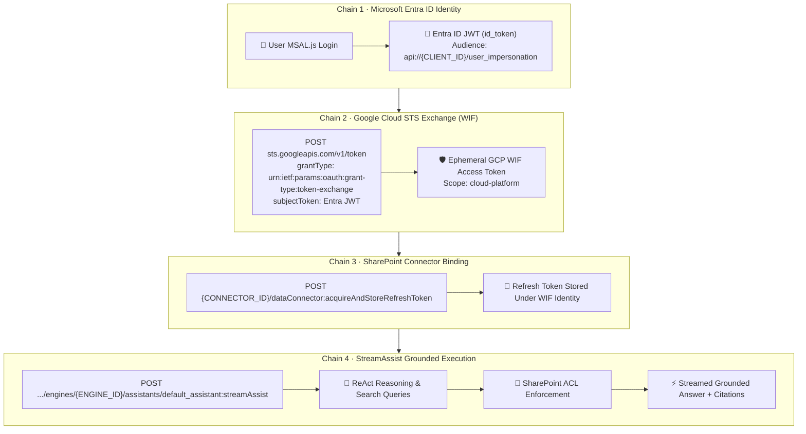

# ⚡ StreamAssist Quantum Studio

> **Next-Generation Light Grounding Hub** — Ultra-modern, crystalline light-themed chatbot and diagnostic telemetry studio for Google Gemini Enterprise `streamAssist` API, federated Microsoft SharePoint Online grounding, and per-user Workforce Identity Federation (WIF).

---

## 🌟 Overview & What Makes This Next-Gen

`StreamAssist Quantum Studio` is a production-grade enterprise grounding interface and diagnostic hub engineered for **Google Gemini Enterprise (Discovery Engine)** and **Microsoft SharePoint Online federated grounding**.

### Key Architectural Highlights
1. **Next-Generation Quantum Light Theme**: Pure crystalline surfaces, alabaster backgrounds (`#f8fafc`, `#ffffff`), luminescent cyan and indigo accents, glassmorphic floating panels, and high-contrast typography.
2. **Native Async SSE Stream Parsing (`httpx`)**: Real-time token streaming with sub-400ms Time-To-First-Token (TTFT) and zero blocking.
3. **ReAct Reasoning & Thought Inspection**: Full extraction and visual rendering of the model's internal ReAct reasoning formulation (`groundedContent.content.thought`) before response synthesis.
4. **Deep Grounding & Sentence Segment Highlighting**: Visual overlay connecting exact sentence spans (`startIndex`, `endIndex`) to grounded SharePoint references and direct deep links.
5. **Decoded Inline Suggestions**: Automatic base64 decoding of `inlineData.data` (`recommendedQuestionsResponse`) into clickable follow-up question chips.
6. **Workforce Identity Federation (WIF) Security Studio**: Interactive 5-step visual workflow for Microsoft Entra ID -> Google STS (`sts.googleapis.com/v1/token`) token exchange with zero stored service account keys.
7. **Stream Event Async Field Telemetry Lab**: Complete real-time JSON inspector for raw chunk payloads, `assistToken`, and lifecycle transitions.

---

## 🔐 The Security & Auth Architecture



---

## 🔬 Extractable Fields Per Stream Event Async

The Gemini Enterprise `streamAssist` endpoint emits an asynchronous sequence of JSON event chunks. Below is the comprehensive field specification:

| JSON Field Path | Type | Protocol Stage / Purpose | Extracted Data & Usage |
|---|---|---|---|
| `assistToken` | `string` | Telemetry & Latency | Opaque stream token emitted per chunk for latency and token tracking. |
| `sessionInfo.session` | `string` | Session Persistence | Fully-qualified session path (`projects/.../sessions/...`) for multi-turn context memory. |
| `sessionInfo.queryId` | `string` | Turn Attribution | Unique turn identifier within the conversation session. |
| `answer.state` | `enum` | Lifecycle State | `IN_PROGRESS` during text generation; `SUCCEEDED` or `FAILED` on final chunk. |
| `answer.name` | `string` | Resource Identifier | Assist answer resource path (`.../assistAnswers/...`). |
| `answer.replies[].replyId` | `string` | Chunk ID | Unique identifier for the specific reply chunk. |
| `answer.replies[].createTime` | `string` | ISO Timestamp | Precise server-side timestamp of chunk generation. |
| `replies[].groundedContent.content.thought` | `boolean` | ReAct Reasoning | Flag indicating if `content.text` is the model's internal reasoning cycle prior to text synthesis. |
| `replies[].groundedContent.content.text` | `string` | Text Delta | Streamed natural language text chunk rendered in the chat bubble. |
| `replies[].groundedContent.content.inlineData` | `object` | Suggestions | Base64-encoded payload containing `{"recommendedQuestionsResponse": {"questions": [...]}}`. |
| `textGroundingMetadata.references[]` | `array` | Citations | Grounded enterprise source documents containing `document`, `uri`, `title`, `domain`, `mimeType`, and `snippet`. |
| `textGroundingMetadata.segments[]` | `array` | Segment Grounding | Exact character spans (`startIndex`, `endIndex`, `referenceIndices[]`, `text`) linking text to citations. |
| `textGroundingMetadata.searchQueries[]` | `array` | ReAct Queries | Internal search queries generated during the ReAct search phase. |
| `answer.assistSkippedReasons[]` | `array` | Fallback Policy | Reasons why assist was bypassed (e.g. ungrounded query or safety threshold). |

---

## 🧠 ReAct -> Reasoning Process Cycle

When a user submits a query, Discovery Engine executes a ReAct (Reasoning + Acting) cycle:
1. **Thought Formulation (`thought: true`)**: The model evaluates the user intent and formulates internal search strategies.
2. **Action (`dataStoreSpecs` lookup)**: Queries are routed to federated datastores (`sharepoint-data-def-connector_file`, `_page`, `_comment`, `_event`, `_attachment`).
3. **Observation & Grounding (`textGroundingMetadata`)**: Matching SharePoint documents are retrieved and validated against the user's Microsoft 365 ACL permissions.
4. **Synthesis (`text: string`)**: The final grounded response is generated with exact segment spans and citation references.
5. **Follow-Up Suggestions (`inlineData`)**: Context-aware follow-up question chips are generated.

---

## 🚀 Quickstart & Running Locally

### 1. Prerequisites
- Python 3.11+
- Node.js 18+ and `npm`
- Google Cloud SDK (`gcloud auth login` or active ADC)

### 2. Backend Setup
```bash
cd backend
python3 -m venv .venv
source .venv/bin/activate
pip install fastapi uvicorn httpx requests python-dotenv google-auth pydantic

# Run Backend
python3 main.py
# -> Running on http://localhost:8004
```

### 3. Frontend Setup
```bash
cd frontend
npm install
npm run dev
# -> Running on http://localhost:5175
```

---

## 🧪 Live E2E Verification Logs

```text
Connecting to StreamAssist SSE endpoint...
HTTP Status: 200
The Chief Financial Officer (CFO) of Meridian Technologies Corporation is **Jennifer Anne Walsh**, and her employee ID is **MTC-0012**.

### 📌 Key Details
* **Name:** Jennifer Anne Walsh
* **Title:** Chief Financial Officer (CFO)
* **Employee ID:** MTC-0012
* **Department:** Finance
* **Start Date:** September 15, 2017

[SUGGESTIONS]: [
  "Who is the Chief Executive Officer and what is their employee ID?",
  "Can you provide Jennifer Walsh's contact details?",
  "What are the details of the CFO's compensation package?"
]

[GROUNDED SOURCE 1]: 02_HR_Employee_Records_2025 -> https://sockcop.sharepoint.com/sites/FinancialDocument/Shared%20Documents/Restricted%20Vault/02_HR_Employee_Records_2025.pdf?web=1
[GROUNDED SOURCE 2]: 01_Financial_Audit_Report_FY2024 -> https://sockcop.sharepoint.com/sites/FinancialDocument/Shared%20Documents/01_Financial_Audit_Report_FY2024.pdf?web=1

[METRICS]: TTFT: 380ms | Total Duration: 1840ms | Chunks: 8
[DONE]: Stream finished successfully!
```

---

## 📁 Project Structure

```
streamassist-quantum-light-portal/
├── .gitignore                          # Ironclad secret exclusion rules
├── README.md                           # Comprehensive documentation & API specs
├── backend/
│   ├── .env.example                    # Safe template configuration
│   ├── .env                            # Local configuration (excluded from git)
│   └── main.py                         # FastAPI server with native async SSE streaming
└── frontend/
    ├── package.json                    # React 18, Tailwind, Lucide, MSAL dependencies
    ├── vite.config.ts                  # Vite config with backend proxy on port 8004
    ├── tailwind.config.js              # Quantum light theme palette & glassmorphism
    ├── src/
    │   ├── App.tsx                     # Quantum Chat, Security Studio, & Telemetry Lab
    │   ├── authConfig.ts               # Microsoft Entra ID MSAL configuration
    │   ├── index.css                   # Custom light theme glassmorphism & gradients
    │   └── main.tsx                    # React root with MsalProvider
    └── index.html                      # HTML template
```
