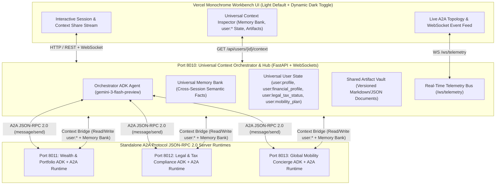

# Universal User Context Mesh — Google ADK 2.9 + A2A Protocol JSON-RPC 2.0 + Memory Bank

An enterprise multi-agent runtime architecture built with **Google Agent Development Kit (ADK)** (`gemini-3-flash-preview`) and the **Agent-to-Agent (A2A) JSON-RPC 2.0 Protocol** where **3 specialized A2A Agent Runtimes** and **1 Central Orchestrator** share a **Universal User Context** across separate sessions in real time.

---

## 🏗️ Architecture & Runtime Topology



---

## ✨ Key Capabilities Demonstrated

1. **Universal User Context Across Separate Sessions (`user:*` Namespace & Memory Bank)**
   - Tell the **Wealth Agent (`:8011`)** in Session #1 about a new `$4.2M secondary equity sale` and a `$5M CHF currency allocation`.
   - Switch to a **brand-new session** with the **Legal & Tax Agent (`:8012`)** and ask *"What are my California exit tax & Swiss treaty obligations?"* without repeating any numbers.
   - Watch the Legal Agent automatically receive **Cross-Agent Universal Memory Injection**, cite the exact `$18.7M liquid net worth` and `$5M CHF` move discovered by the Wealth Agent, and update `user:legal_tax_status`.
2. **True A2A JSON-RPC 2.0 Discovery & Wire Tracing**
   - Each agent exposes `/.well-known/agent-card.json` on its own port (`8011`, `8012`, `8013`).
   - Click any runtime pill or message trace in the UI to inspect the live A2A Agent Card and raw JSON-RPC 2.0 request/response envelopes.
3. **1-Click Autonomous Multi-Agent Session-Share Roundtable**
   - Click **"⚡ Launch Live Multi-Agent Roundtable"** in the UI to watch all 4 runtimes collaborate autonomously across 4 sessions (`wealth_agent` -> `legal_tax_agent` -> `mobility_agent` -> `orchestrator_agent`), streaming every state mutation, memory injection, and versioned artifact (`portfolio_analysis.md`, `tax_compliance_memo.md`, `relocation_dossier.md`, `executive_master_plan.md`) in real time.
4. **Vercel Monochrome Architecture UI + Claude-Code Shrinking & Shining Ink Loader**
   - Strictly adheres to the Vercel Monochrome Light-Mode-by-Default design system with dynamic `☀️ Light` / `🌙 Dark` theme toggle and theme-aware `.shrinking-shining-ink` loader.

---

## 🚀 Quickstart

```bash
cd ~/IdeaProjects/vertex-ai-samples/semiautonomous-agents/universal-context-mesh

# 1. Install dependencies into .venv
uv sync

# 2. Launch all 4 ADK + A2A Agent Runtimes & Workbench UI
.venv/bin/python run_all.py
```

Open **`http://localhost:8010`** in your browser.

### Run Automated End-to-End (E2E) Verification

```bash
.venv/bin/python test_e2e.py
```
