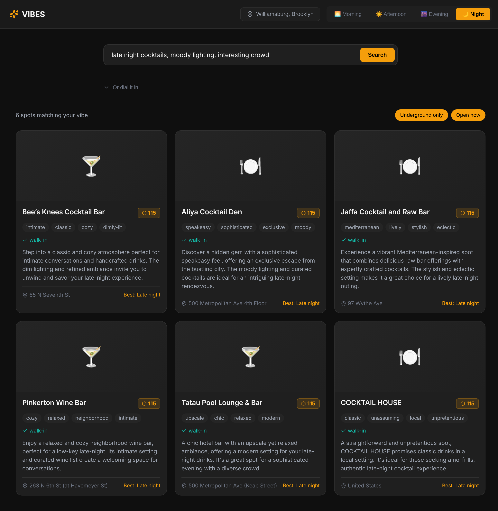

# Vibes NYC

**No star ratings. No tourist traps. Just the right place for how you feel.**

A mood-to-venue matching engine for underground local spots in NYC. Vibes lets you describe how you want to feel — "cozy morning, contemporary, good coffee, interesting crowd" — and returns ranked venues with vibe fingerprints and underground scores, not generic star ratings.



## Quick Start

### Prerequisites
- Python 3.11+
- Node.js 18+
- GCP project with Vertex AI enabled
- Foursquare API credentials (free at https://foursquare.com/developers)

### Setup

```bash
# Clone and navigate
cd semiautonomous-agents/vibes_nyc

# Configure environment
cp .env.example .env
# Edit .env: set PROJECT_ID, FOURSQUARE_CLIENT_ID, FOURSQUARE_CLIENT_SECRET

# Backend (Terminal 1)
cd backend
uv sync
uv run uvicorn main:app --reload --port 8888

# Frontend (Terminal 2)
cd frontend
npm install
npm run dev
# → http://localhost:5173
```

## API Stack (100% Free)

| API | Cost | Purpose |
|-----|------|---------|
| **Foursquare Places v2** | Free (200K/month) | Venue search, categories, locations |
| **Nominatim** | Free (1 req/sec) | Neighborhood → lat/lon geocoding |
| **Vertex AI (Gemini 2.5)** | Free tier | Vibe analysis, mood translation, scoring |

## Features

- **Natural Language Search**: Describe your vibe in plain English
- **Vibe Dials**: Tune energy, accessibility, crowd, aesthetic, sound
- **Underground Score**: 0-100 rating penalizing chains and tourist traps
- **Walk-in Friendly**: Prioritizes accessible spots over reservations-only
- **NYC Neighborhoods**: Works for any area, not just Manhattan

## Architecture

```
Frontend (React/Vite) → FastAPI Backend → VenueResearchAgent (ADK/Gemini 2.5)
                                              ├── Foursquare Places API
                                              └── Nominatim (geocoding)
```

## Project Structure

```
vibes_nyc/
├── agent/
│   ├── agent.py             # VenueResearchAgent (ADK)
│   ├── foursquare_client.py # Foursquare Places API client
│   └── nominatim_client.py  # Free geocoding
├── backend/
│   ├── main.py            # FastAPI endpoints
│   └── vibe_engine.py     # Underground score algorithm
├── frontend/
│   ├── src/
│   │   ├── App.tsx        # Main layout
│   │   ├── VenueCard.tsx  # Venue display card
│   │   ├── VibeDials.tsx  # Search input + sliders
│   │   └── index.css      # Dark moody design system
│   └── package.json
├── docs/
│   ├── PRODUCT-PLAN.md    # Full specification
│   └── CHECKLIST.md       # Implementation progress
└── .env.example
```
