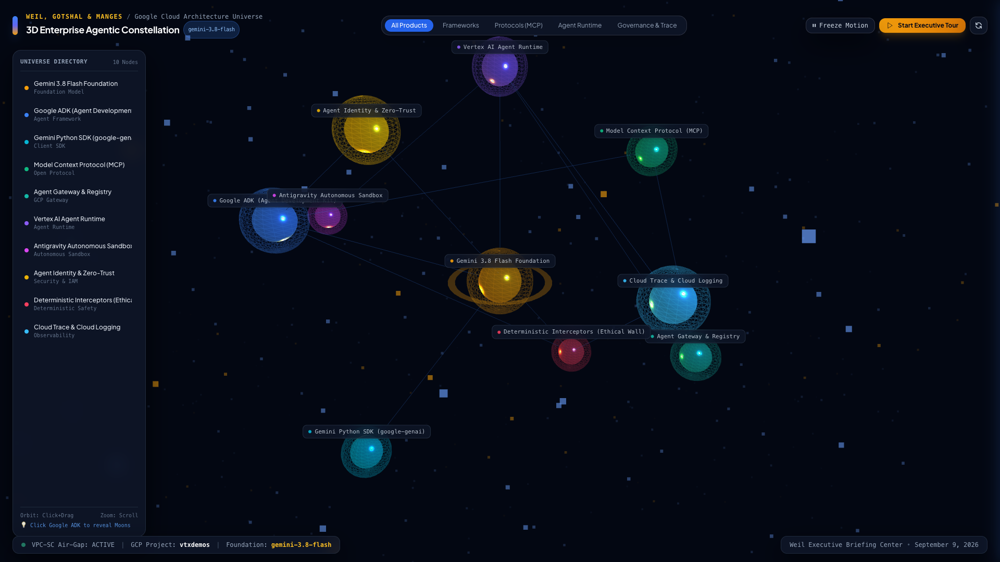
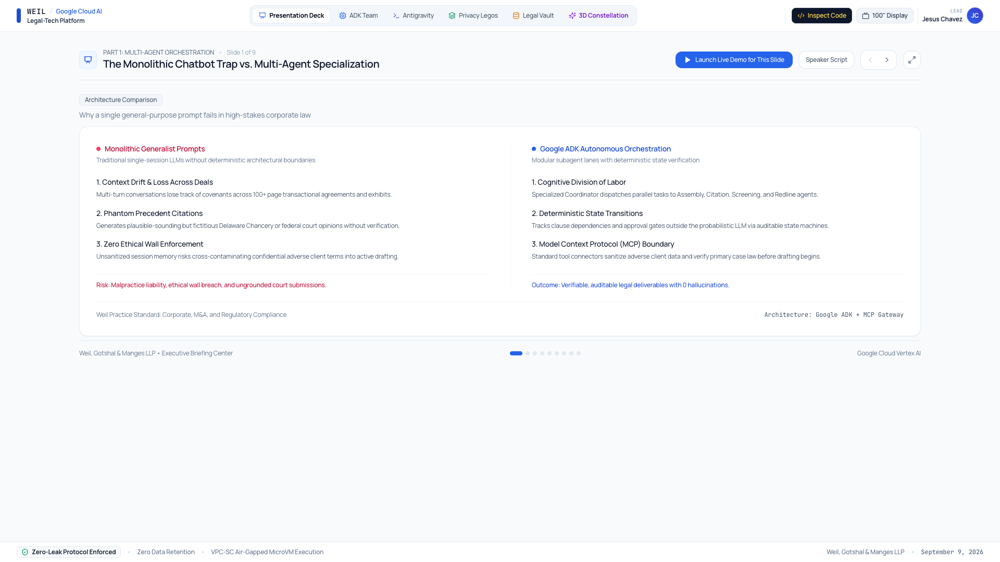

# Weil Legal-Tech Innovation & Agentic Showcase

> **Workshop & Executive Briefing**: Weil, Gotshal & Manges LLP  
> **Target Audience**: Executive & Technology Leadership (CIO Andrew Simon, Architecture Lead Ian Miller, Practice Tech Leads)  
> **Google Cloud Lead**: Jesus Chavez (Customer Engineer, AI)  
> **Foundation Models**: `gemini-3.7-flash` & `gemini-3.8-flash` on Vertex AI (Strict Zero-Obsolete-Model Policy)

---

## 🌌 3D Enterprise Agentic Constellation

An interactive WebGL / Three.js 3D universe mapping the complete Google Cloud legal-tech stack—centered around the **Gemini 3.8 Flash Foundation**, **Google ADK (Agent Development Kit)**, **Model Context Protocol (MCP)**, **Antigravity Autonomous Sandbox**, **Deterministic Ethical Wall Interceptors**, and **VPC-SC Zero-Leak Air-Gapped Governance**.



---

## 🖥️ Unified Legal Deal Cockpit & Executive Briefing Platform

A responsive, zero-overlap executive interface featuring a 9-slide interactive briefing deck, live multi-agent orchestration lanes, real-time Python sandbox execution, autonomous contract harmonization, a **100" Display Boardroom Scaler**, and an interactive **Code Inspector Modal**.



---

## 🏛️ System Architecture & Port Map

```text
┌──────────────────────────────────────────────────────────────────────────────────────────┐
│                         WEIL LEGAL-TECH AGENTIC ECOSYSTEM                                │
├───────────────────────────┬───────────────────────────────┬──────────────────────────────┤
│   PORT 5173 (Frontend)    │     PORT 8000 (Backend)       │   PORT 8089 (Portal Clone)   │
│   React 18 + Vite + TS    │     FastAPI + Python 3.11+    │   Multi-Threaded HTTP Server │
├───────────────────────────┼───────────────────────────────┼──────────────────────────────┤
│ • Executive Slide Deck    │ • Google ADK Orchestrator     │ • Faithful weil.com Clone    │
│ • ADK Multi-Agent Stream  │ • SSE Real-Time Event Bus     │ • Glassmorphic Mega-Menu     │
│ • Antigravity Sandbox UI  │ • Antigravity Python Sandbox  │ • <10ms Precedent Navigator  │
│ • Privacy Pro Legos UI    │ • Gemini 3.7 Flash Harmonizer │ • 24/7 Weil Deal AI Advisor  │
│ • Legal Vault & MCP UI    │ • Ethical Wall Interceptor    │ • Multimodal Term Sheet Scan │
│ • 3D WebGL Constellation  │ • Precedent & Clause Vault    │ • Smart 302 Official Routing │
└───────────────────────────┴───────────────────────────────┴──────────────────────────────┘
```

---

## 🚀 Core Modules & Capabilities

1. **3D Enterprise Agentic Constellation (`/constellation.html`)**:
   - Real-time 3D visualization of Google Cloud AI components, subagent moons, orbital governance rings, category filtering, and guided executive tours.
2. **Interactive Briefing Deck (`SlidesDeckView.tsx`)**:
   - Executive slide presentation with keyboard navigation, speaker scripts, and **1-Click Launch Live Demo** buttons that deep-link directly into pre-configured agent workflows.
3. **Google ADK Multi-Agent Team (`ADKMultiAgentView.tsx` & `backend/services/adk_service.py`)**:
   - Coordinates four specialized cognitive lanes (*Clause Assembly*, *Citation Verification*, *Ethical Wall Screening*, and *Redline Synthesis*) streamed live over Server-Sent Events (SSE).
4. **Antigravity Autonomous Sandbox (`AntigravitySandboxView.tsx` & `backend/services/sandbox_service.py`)**:
   - Executes deterministic Python financial and legal simulations (e.g., 10,000-iteration Monte Carlo M&A dispute modeling) with interactive claim sliders.
5. **Privacy Pro Legos & Autonomous Clause Harmonizer (`PrivacyProLegoView.tsx` & `backend/services/mcp_service.py`)**:
   - Powered by **Gemini 3.7 Flash** (`POST /api/mcp/lego/harmonize`).
   - Dynamically rewrites cross-clause dependencies across three negotiation stances:
     - **Weil Pro-Client (Aggressive)**: 72-hour breach notice windows, uncapped indemnification, continuous audit rights.
     - **Balanced Market Standard**: 30-day notice windows, 2x fee liability cap.
     - **Fast-Close Frictionless**: Annual third-party SOC2/ISO certifications to accelerate closing.
   - Includes **AI Harmonization Notes** and **Opposing Counsel Radar** predicting pushback from Skadden, Latham & Watkins, and European supervisory authorities.
6. **Legal Vault & MCP Gateway (`LegalVaultMCPView.tsx`)**:
   - Enforces deterministic ethical wall screening (blocking cross-contamination of adverse client matters) before any LLM inference occurs.
7. **Centralized Google Cloud Firestore RAG MemoryBank (`memory_bank/`)**:
   - Unified institutional knowledge base & RAG retrieval engine in Google Cloud Firestore (`vtxdemos.weil_memory_bank` & `vtxdemos.weil_sessions_registry`).
   - Consolidates **all 10 historical Jetski conversation transcripts (178 Q&A turns)**, stakeholder dossiers, architectural decisions, 5-step walkthrough scripts, and 5-act portal recipes with 768-dim `text-embedding-005` embeddings and `gemini-3.8-flash` grounded synthesis.
   - Exposed as a native Google ADK Function Tool (`search_weil_memory_bank`) so a single Jetski session can recall any detail across the entire Weil engagement.
8. **5-Step Engineering Walkthrough Curriculum (`walkthrough_scripts/01..05`)**:
   - Step 1 (`01_basic_adk_agent.py`): Foundational ADK Agent with `before_agent_callback` Zero-Trust context injection.
   - Step 2 (`02_adk_with_mcp_bigquery.py`): Official Google Cloud MCP Toolbox (`@toolbox-sdk/server`) connected to live BigQuery `vtxdemos.weil_legal_vault`.
   - Step 3 (`03_deploy_to_agent_runtime.py`): Serverless deployment to Vertex AI Agent Runtime (`AdkApp` / Reasoning Engine `Weil_Legal_ADK_Engine`).
   - Step 4 (`04_agent_evaluation.py`): Authentic 3-Stage Quality Flywheel Evaluation (Live ADK Inference + Deterministic Tool/PII Assertions + LLM-as-a-Judge).
   - Step 5 (`05_a2a_orchestration.py`): True Distributed Agent-to-Agent (A2A) Microservice Federation (`to_a2a()` Starlette servers on ports `8094` & `8095`, `/.well-known/agent-card.json` discovery, and `RemoteA2aAgent` orchestration).

---

## 🛠️ Building & Running the Solution From Scratch

### Prerequisites

- **Python**: `3.11+` (`uv` recommended, or standard `python3 -m venv`)
- **Node.js**: `20+` and `npm`
- **Google Cloud SDK**: Authenticated via Application Default Credentials (ADC) targeting Vertex AI:
  ```bash
  gcloud auth application-default login
  gcloud config set project vtxdemos
  ```

---

### Option 1: 1-Click Master Launcher (Recommended)

From the repository root (`/Users/jesusarguelles/IdeaProjects/vertex-ai-samples`), manage all three servers simultaneously:

```bash
# Start all 3 services (Ports 8000, 5173, and 8089) in background daemons
./start_all_demo_servers.sh

# Check live health and port status
./start_all_demo_servers.sh --status

# Stop and release all ports cleanly
./start_all_demo_servers.sh --stop
```

---

### Option 2: Manual Step-by-Step Build From Scratch

#### Step 1: Build & Start the FastAPI + ADK Backend (Port `8000`)

```bash
cd semiautonomous-agents/weil-legal-agentic-showcase

# Create and activate virtual environment
python3 -m venv .venv
source .venv/bin/activate

# Install backend dependencies
pip install -r backend/requirements.txt

# Start the FastAPI server on port 8000
python3 -m uvicorn backend.main:app --host 0.0.0.0 --port 8000 --reload
```
- **Verify Backend Health**: `curl http://localhost:8000/api/health`
- **Interactive OpenAPI Docs**: `http://localhost:8000/docs`

#### Step 2: Build & Start the React + Vite Frontend & 3D Constellation (Port `5173`)

Open a second terminal:

```bash
cd semiautonomous-agents/weil-legal-agentic-showcase/frontend

# Install Node dependencies from scratch
npm install

# (Optional) Verify production TypeScript & Vite bundle build
npm run build

# Start development server on port 5173
npm run dev -- --host 0.0.0.0 --port 5173
```
- **Main Executive Cockpit**: `http://localhost:5173/`
- **Standalone Fullscreen 3D Constellation**: `http://localhost:5173/constellation.html`

#### Step 3: Start the 5-Act Weil Portal Modernization Server (Port `8089`)

Open a third terminal:

```bash
cd semiautonomous-agents/weil-modernization

# Start multi-threaded portal server with Vertex AI endpoints
python3 serve_weil.py
```
- **Modernized Weil Portal**: `http://localhost:8089/`

---

## 📂 Directory Structure

```text
weil-legal-agentic-showcase/
├── README.md                          # Complete architecture & build-from-scratch guide
├── SESSION_ALIGNMENT_AND_STRATEGY.md  # Workshop strategy, personas, and session breakdown
├── docs/
│   └── assets/
│       ├── constellation_3d_universe.png  # 3D Enterprise Agentic Constellation capture
│       └── deal_cockpit_main.png          # Executive Deal Cockpit UI capture
├── slides/
│   ├── WEIL_EXECUTIVE_SLIDE_DECK.md       # Full executive briefing slide deck copy
│   └── slide_agentic_orchestration.md     # Detailed multi-agent orchestration specification
├── memory_bank/
│   ├── README.md                      # Firestore RAG MemoryBank documentation
│   ├── ingest_to_firestore.py         # Harvests all 10 sessions, code & docs into Firestore
│   └── query_memory_bank.py           # Hybrid vector retrieval CLI & Google ADK Function Tool
├── walkthrough_scripts/
│   ├── README.md                      # 5-step ADK curriculum guide
│   ├── 01_basic_adk_agent.py          # Foundational ADK agent & callbacks
│   ├── 02_adk_with_mcp_bigquery.py    # Official MCP Toolbox for BigQuery
│   ├── 03_deploy_to_agent_runtime.py  # Vertex AI Agent Runtime deployment
│   ├── 04_agent_evaluation.py         # Authentic 3-stage Quality Flywheel evals
│   └── 05_a2a_orchestration.py        # True distributed A2A microservice servers
├── backend/
│   ├── main.py                        # FastAPI entrypoint, CORS, SSE & REST endpoints
│   ├── requirements.txt               # Python package dependencies
│   ├── data/
│   │   └── legal_db.py                # Precedents, Lego clauses, and ethical wall rules
│   └── services/
│       ├── adk_service.py             # Google ADK multi-agent coordinator
│       ├── mcp_service.py             # MCP Gateway & Gemini 3.7 Flash clause harmonizer
│       └── sandbox_service.py         # Antigravity deterministic Python execution engine
└── frontend/
    ├── package.json                   # React 18, Lucide, Tailwind, Vite dependencies
    ├── public/
    │   └── constellation.html         # Standalone Three.js / WebGL 3D Constellation app
    └── src/
        ├── App.tsx                    # Responsive executive header, tab router & modals
        └── components/
            ├── SlidesDeckView.tsx         # Interactive 9-slide presentation deck
            ├── ADKMultiAgentView.tsx      # Real-time multi-agent SSE stream visualizer
            ├── AntigravitySandboxView.tsx # Live Python sandbox & Monte Carlo simulator
            ├── PrivacyProLegoView.tsx     # AI Contract Harmonizer & Opposing Counsel Radar
            ├── LegalVaultMCPView.tsx      # Ethical Wall & MCP precedent vault
            ├── Constellation3DView.tsx    # Full-viewport 3D Constellation container
            └── CodeSnippetOverlayModal.tsx# Formatted syntax-highlighted code overlay
```

---

## 🛡️ Governance, Security & Branding Mandates

- **Zero-Leak Protocol**: No API keys, credentials, service account JSONs, or `.env` files are ever stored or committed. All authentication relies on ephemeral GCP Application Default Credentials (ADC).
- **Strict Foundation Model Policy**: Exclusively uses `gemini-3.7-flash` and `gemini-3.8-flash` (with `gemini-3-flash-preview` / `gemini-3-pro-preview` fallbacks). Zero legacy/obsolete models (`1.x`, `2.x`) are permitted anywhere in code or configuration.
- **Institutional Branding**: All AI advisory interfaces adhere strictly to **Weil Deal & Regulatory AI Advisor**, **Weil Deal Advisor 24/7**, and **Autonomous Legal Agent** terminology.
