# Marketplace AI - Semantic Search with Gemini and Vertex AI

This application demonstrates a marketplace platform with an intelligent semantic search powered by Google Cloud's Vertex AI and Gemini. It leverages multiple Google Cloud services to provide a scalable and efficient solution for retrieving and displaying relevant product listings.

**Features:**

* **Semantic Search:** Utilizes Vertex AI's Search to understand user intent and retrieve the most relevant listings based on meaning, not just keywords.
* **Gemini-Enhanced Listings:** Employs Gemini to:
    * Clean and refine product descriptions.
    * Generate concise and informative titles.
    * Categorize listings for easy browsing.
    * Create three types of questions for each listing:
        * **Category 1:** Contextual questions based on listing details.
        * **Category 2:** General questions users might ask (answerable via Google Search).
        * **Category 3:**  Questions about similar or complementary products.
* **Scalable Infrastructure:** Deployed on Google Kubernetes Engine (GKE) for robust performance and scalability.
* **Global Reach:** Leverages Google Cloud CDN and Global Load Balancer to ensure fast and reliable content delivery worldwide.
* **Efficient Storage:** Uses Cloud Storage to store product images and other media assets.
* **Modern Frontend:** Built with Flutter for a cross-platform, user-friendly interface.
* **Powerful Backend:** Python-based backend interacts with Vertex AI Search and Gemini APIs.

[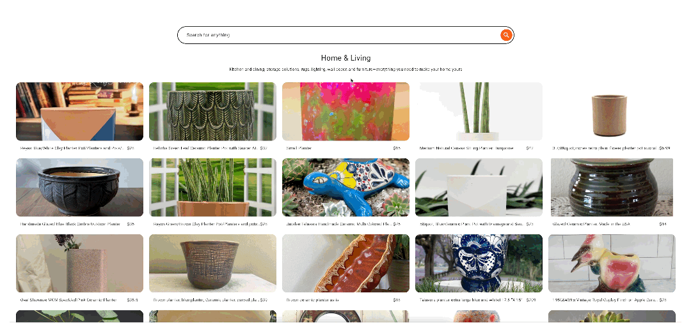](https://youtu.be/aPdlyhKgJU8)

## Architecture
### Components:

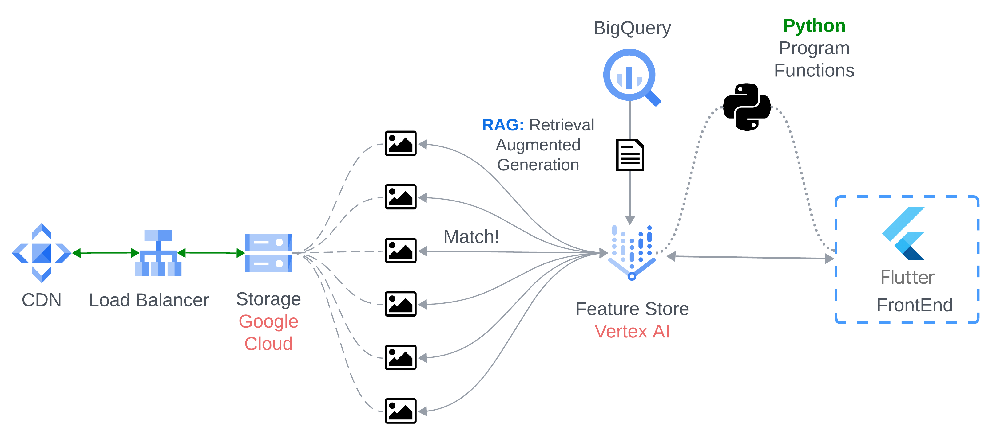

1. **Frontend (Flutter):**
    - Provides a user interface for browsing and searching listings.
    - Sends search queries to the backend.
    - Displays search results and product details.

2. **Backend (Python):**
    - Receives search queries from the frontend.
    - Uses Vertex AI Search to perform semantic search on the product catalog.
    - Retrieves relevant listings from Cloud Storage.
    - Utilizes Gemini to generate descriptions, titles, categories, and questions for each listing.
    - Sends enriched listing data to the frontend.

3. **Google Cloud Platform:**
    - **Vertex AI Search:**  Powers the semantic search functionality.
    - **Gemini:**  Provides advanced language processing for listing enhancement.
    - **GKE:** Hosts the application for scalability and reliability.
    - **Cloud CDN:**  Caches static content (images, etc.) for faster delivery.
    - **Global Load Balancer:** Distributes traffic across multiple regions for global availability.
    - **Cloud Storage:** Stores product images and other media assets.

## Note 
Version 1 for Category 3 Retrieval (optional):

*"Different solutions can be used for Embeddings Retrieval"*
- There are many versions of this project, for the Search Engine and Category 3 Questions, 
I did not use the most accurate in this version (the latest) because of priorities that needs to be accomplished before.
However the first version came with a different retrieval strategy where I combined images and text, 
using different embeddings space and rank them:

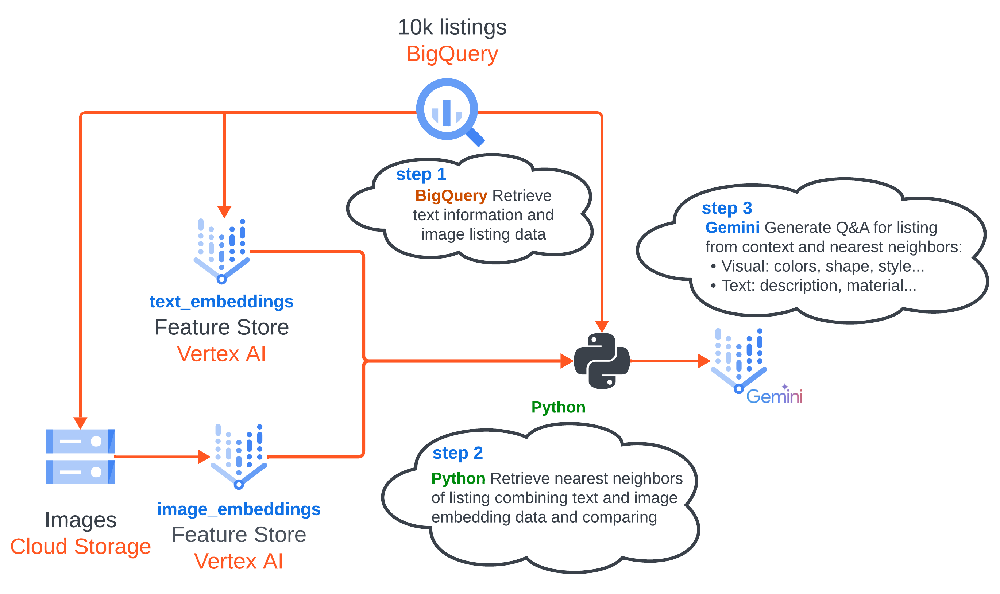

**Getting Started:**

There are 2 main components in the solution: Semantic Search (Retrieval) and preloaded recommendations Q&A. There are 2 notebooks for processing everything
before deploy the application into GKE.

1. **Prerequisites:**
    - Google Cloud Project with billing enabled.
    - Familiarity with Bash and Jupyter Notebooks.
    - Select a workspace: [Vertex Colab Enterprise](https://cloud.google.com/vertex-ai/docs/colab/create-runtime), [Workbench Instance](https://cloud.google.com/vertex-ai/docs/workbench/instances/introduction),
   or any preference IDE like oss code, vscode, intellij, jupyterlab, etc.

2. **Preprocessing:**

A Bigquery table with metadata like listings id, description and images were given to us:

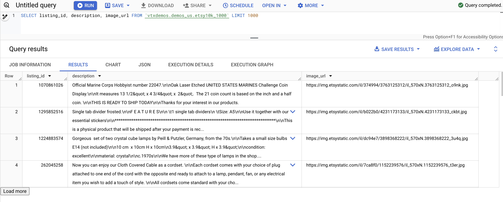

This demo uses alternative images due to Cross-Origin Resource Sharing (CORS) permissions on the original images. 
The following notebook shows you how to copy these images to your Google Cloud Storage and create a [Google Cloud Load Balancer](https://cloud.google.com/load-balancing?hl=en) 
using Google Cloud Load Balancer for faster image rendering.

Once the images are being loaded to [Google Cloud Storage](https://cloud.google.com/storage?hl=en), create a Load Balancer and Enable a CDN:

After your images are stored in [Google Cloud Storage](https://cloud.google.com/storage?hl=en), 
optimize their delivery with a Load Balancer and CDN:

- **Create a Load Balancer**: In the Google Cloud Console, navigate to the "Network services" section and select "Load balancing." Create a new HTTP(S) Load Balancer with appropriate configurations for your needs.
- **Enable CDN**:  Within your Load Balancer settings, enable "Cloud CDN." This integrates your load balancer with Google's global edge network, caching your images on servers closer to your users.

### **Setting Up Your Load Balancer**

To get started, head over to the Google Cloud Console and navigate to "Network services." 
From there, select "Load balancing" and create a new HTTP(S) Load Balancer. 
Make sure to configure it according to your specific requirements.

[Create Load Balancer Details](https://cloud.google.com/load-balancing/docs/https/ext-https-lb-simple)

> **[Important]** Before creating the LB, in your DNS settings, create an alias record that points your domain or subdomain 
to the static IP address allocated for your load balancer. This ensures seamless traffic direction once the load balancer is active.

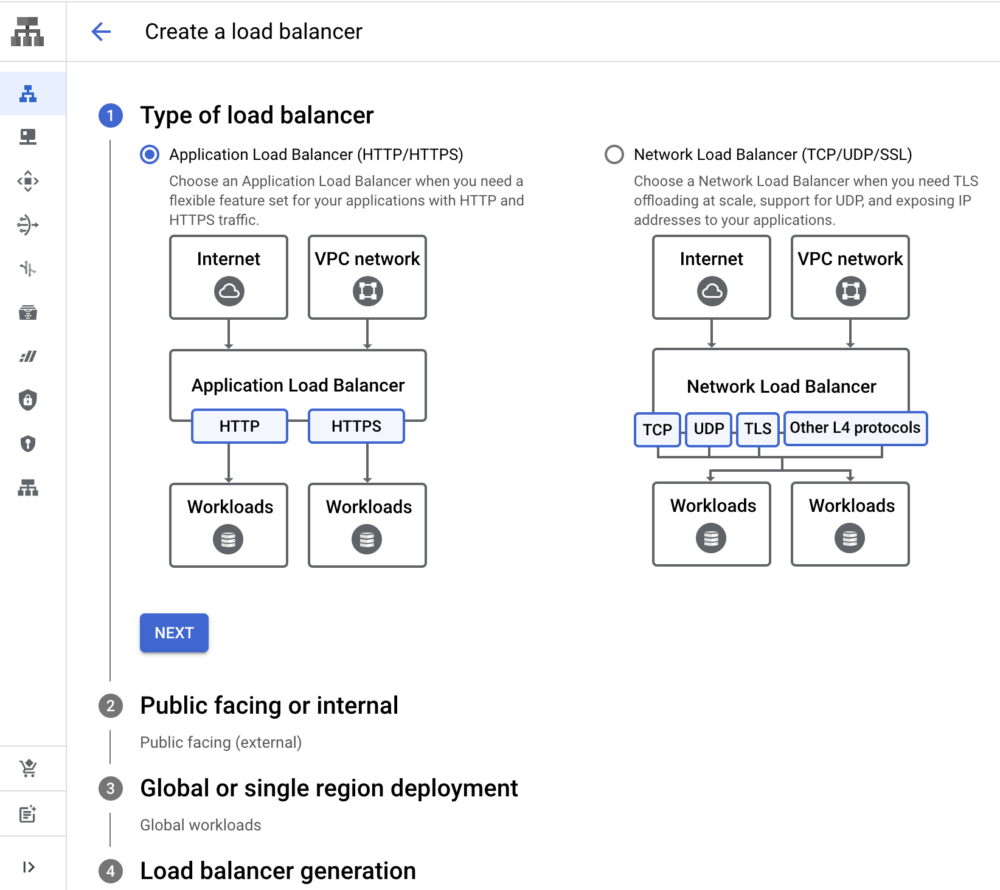

#### *Key Considerations*:

- **HTTPS**: Enable HTTPS to ensure secure communication. You can use Google Cloud Managed Certificates or integrate with an existing provider like [Cloudflare](https://www.cloudflare.com/).
- **Backend Configuration**: Point your load balancer to the Google Cloud Storage bucket where you've stored your images. This connection allows the load balancer to distribute incoming traffic effectively.

##### 1.1 Create a Load Balancer:

In the Google Cloud Console, navigate to the "Network services" section and select "Load balancing." Create a new HTTP(S) Load Balancer with appropriate configurations for your needs.

##### 1.2 TLS Certificates (Cloudflare is optional):

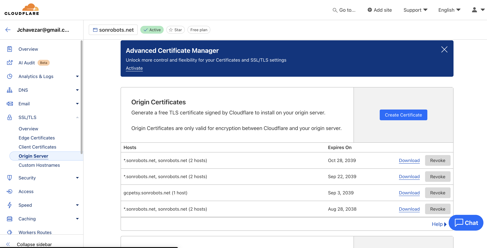

> We can always use Google Cloud Domain and Certificates Managed by GCP.

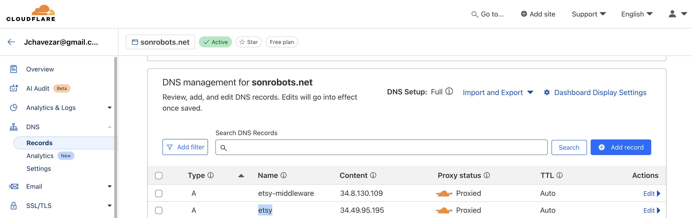

3. Before UX/UI deployment we need to follow all the instructions in the notebook 
to create a new BigQuery table with all the preloaded questions and answers and the new image links from the cdn.

- Refer to the instructions provided in the notebook.
- Create a new BigQuery table.
- Populate the table with the following:
  - Preloaded questions and answers
  - Image links sourced from the CDN (Content Delivery Network)

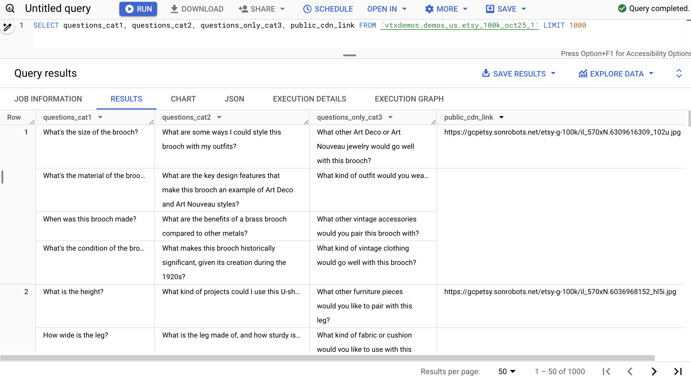

4. From the table create an Agent Builder Vertex AI Search for the retrieval.
- Create App > Select Search > Generic (name it) > Create Data Store > BigQuery (select your table)

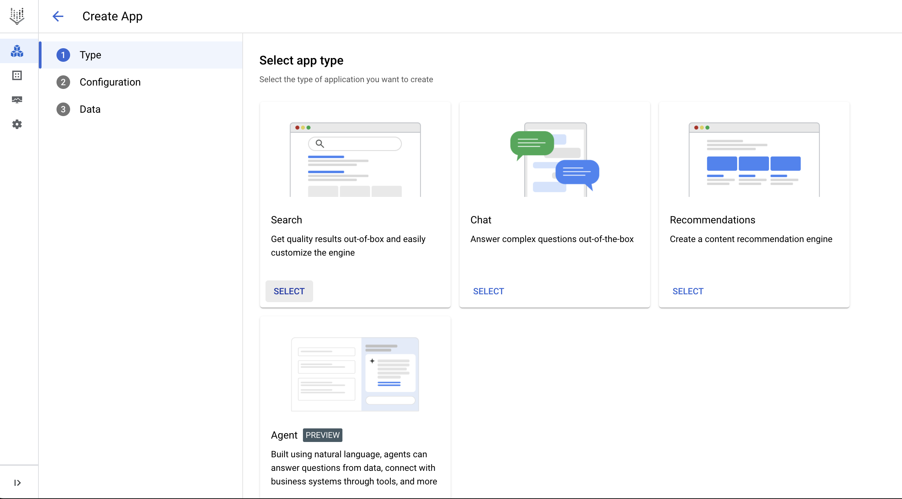
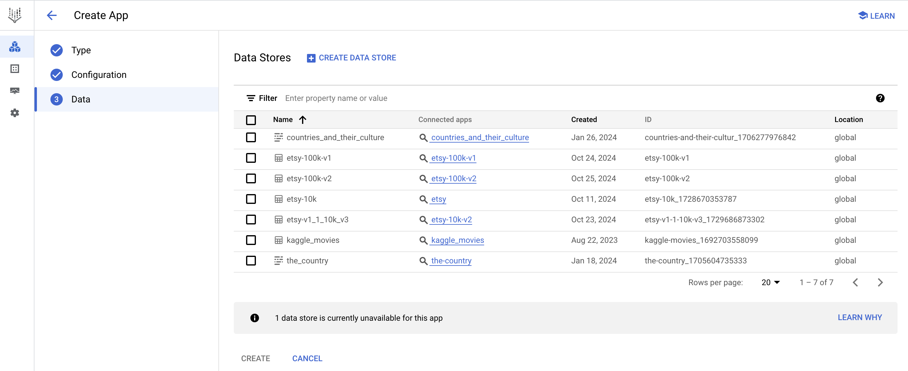
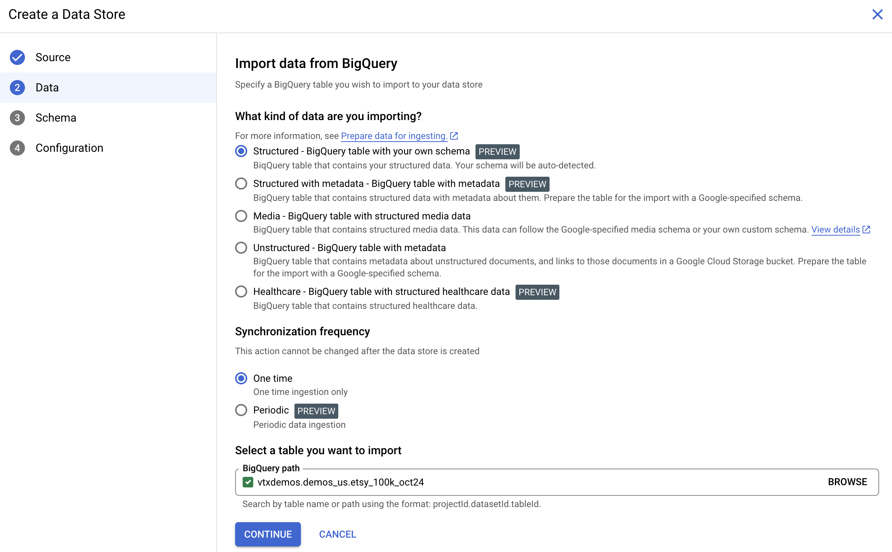

5. **UX/UI Deploy:**
    - Configure GKE cluster (I used autopilot).
    - Deploy frontend and backend applications to GKE.
      - Kubernetes Declaration Files are here in the repo:
        - Create a GKE deployment: [back-gke-def.yaml](back-gke-def.yaml),
        [front-gke-def.yaml](front-gke-def.yaml).
        - Create the service to expose the ports: [back-gke-service.yaml](back-gke-service.yaml),
        [front-gke-service.yaml](front-gke-service.yaml).
        - Create backendconfig file: [backend-gke.yaml](backend-gke.yaml).
        - Create and Ingress (l7 load balancer with certificates) for each pod:
          , [ingress-back.yaml](ingress-back.yaml), [ingress-front.yaml](ingress-front.yaml)
    - I used the same cloudflare certificates and add the public static ip address to my DNS as before.
      (instructions to add them to gke [here](https://cloud.google.com/kubernetes-engine/docs/how-to/ingress-multi-ssl))

6. **Running the Application:**

    - Access the frontend application through the Global Load Balancer.
    - Perform searches and explore product listings.

**Future Enhancements:**

* **Personalized Recommendations:** Utilize user data and browsing history to suggest relevant products.
* **Advanced Filtering and Faceting:** Allow users to refine search results based on various criteria.
* **Integration with other Google Cloud services:** Explore integrating with services like Vision API for image analysis and Recommendations AI for personalized suggestions.